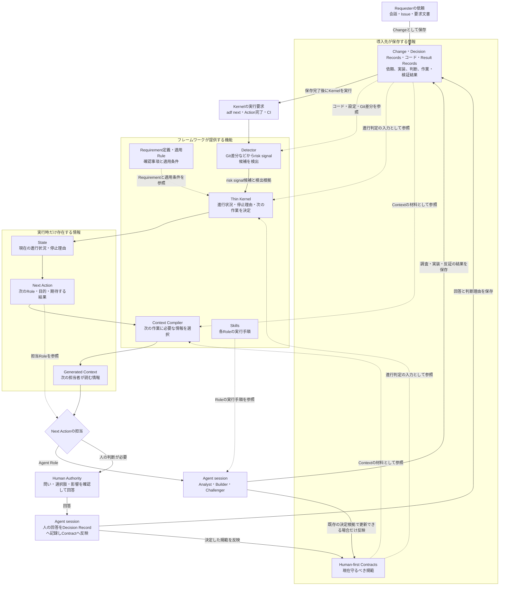
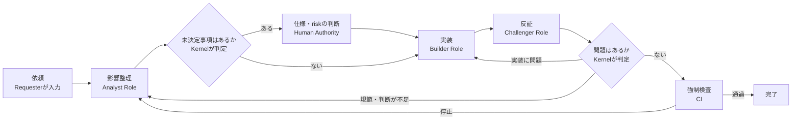
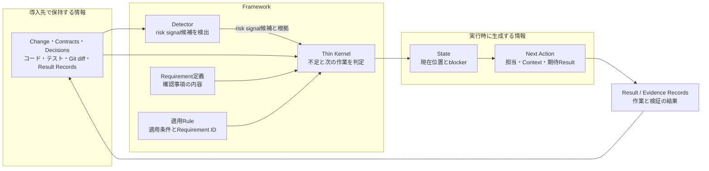
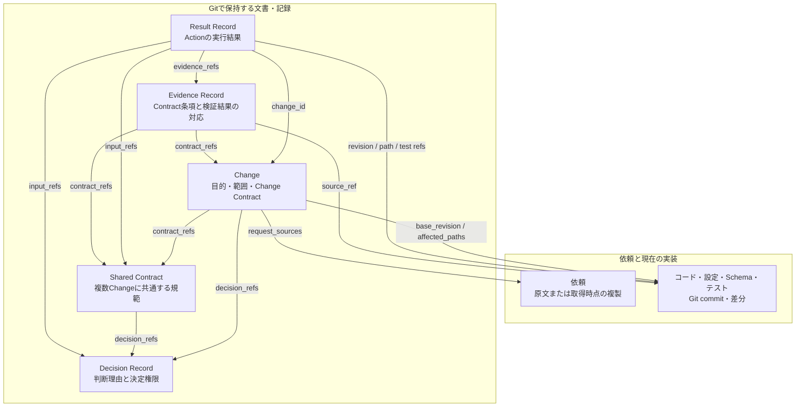
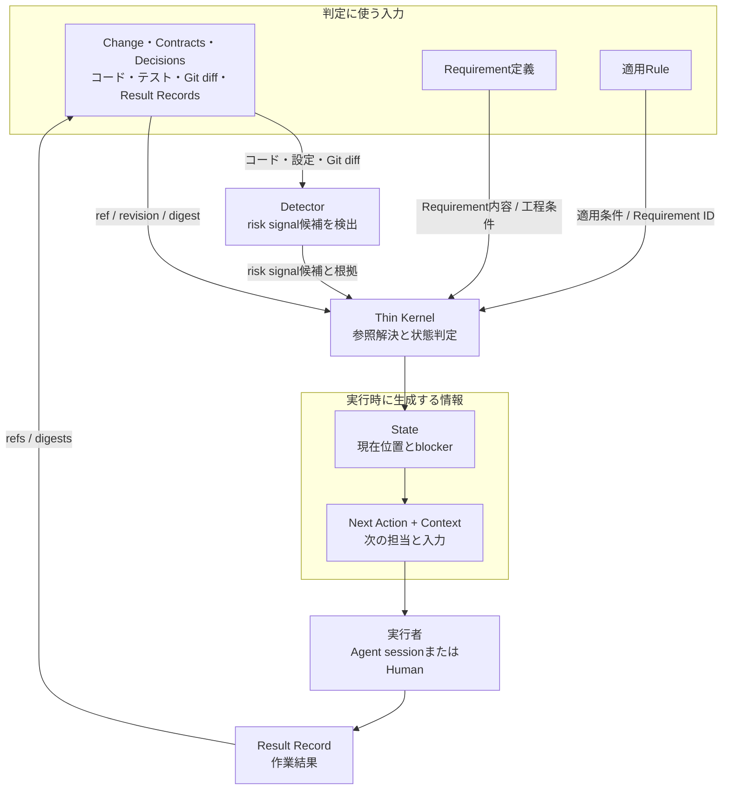

# Agentic Development Framework 見直しメモ

> 状態: 検討中
>
> この文書は、フレームワーク見直しのための検討メモであり、現在有効な規範や確定済みのDecision Recordではない。
> 現行仕様は`README.md`、`docs/concepts.ja.md`、`docs/implementation.md`を正本とする。

## 1. 見直しの目的

Agentic Development Frameworkを、特定のコードベースに固有の開発手順ではなく、AIエージェントを利用する多様な開発環境へ頒布・適用できるフレームワークとして再検討する。

今回の見直しでは、特に次を対象とする。

- エージェントが規範どおりに動く確率を高める
- 人とエージェントへ、必要十分なコンテキストを渡す
- セッション、担当者、サブエージェントをまたいで判断と整合性を継承する
- 導入、更新、段階適用の負担を小さくする
- 人がフレームワークの全体像と現在状態を理解しやすくする

## 2. 合意した問題定義

AIエージェントや複数の開発者が並行して変更を行う開発では、要求に含まれない意味上・設計上の判断が、個々の実装過程で暗黙に確定されやすい。

その判断が、適切な権限を持つ人の合意や共有可能な規範として残らず、複数の変更経路を横断した整合性検証にも使われない。その結果、実装ごとの局所最適化、仕様の分岐、データ不整合、潜在的不具合が蓄積する。

本フレームワークは、重要な未決定事項を実装前および実装中に検出し、適切な権限を持つ人へ判断を求める。確定した判断を継続的に参照・検証・更新できる文書として残すことで、エージェントを活用しながらシステム全体の整合性を維持する。

中心となる問題は次である。

> 実装の自動化に対して、意味上の判断と全体整合性の制御が不足している。

### 2.1 問題の層

1. **判断の欠落**
   - ドメイン、所有権、多重度、状態遷移、失敗時挙動などが、検討すべき論点として認識されない。
2. **判断権限の逸脱**
   - 未決定事項を、エージェントや個々の開発者が実装都合や既存コードから暗黙に決める。
3. **全体整合性の喪失**
   - 判断が変更、セッション、担当者を越えて伝播せず、操作間、機能間、データライフサイクル全体で矛盾する。
4. **学習の非蓄積**
   - 不具合や設計判断が、再利用できるContract、テスト、検査規則として残らない。

## 3. 今回追加された問題

### 3.1 エージェントの遵守は確率的である

規範やSkillを用意しても、エージェントが常に発見し、正しく解釈し、適切な時点で適用する保証はない。

特に、長い手順を複数のSkillへ分割し、呼び出し順と成果物の受け渡しをエージェントの記憶に依存すると、各段階の成功率が高くても、フロー全体の遵守率は低下する。したがって、重要な制御をプロンプトだけに依存させてはならない。

必要なのは「必ず従うエージェント」ではなく、次の多層防御である。

- 必要な規範を発見しやすくする
- 必要な規範だけを自動的に提示する
- 次に行う操作を実行基盤が決定論的に示す
- 未充足なら作業を止める条件は、CLIやCIで機械的に検査する
- 意味上の誤りは独立した反証で検出する
- 遵守率と見逃しを継続的に計測する

### 3.2 コンテキストの不足と過剰が同時に起きる

全情報を渡すと、重要な規範が埋もれ、コストと誤読が増える。一方、Skillやサブエージェントへ細かく分離しすぎると、判断に必要な全体関係が失われる。

この問題は、文書をどこへ置くかだけでは解決しない。変更ごと、役割ごとに必要な情報を選択し、参照元と参照時点を確認できる「実行時コンテキスト」を組み立てる必要がある。

### 3.3 現行形式は人と更新機構に負担がある

現行方針には、次の摩擦がある。

- 階層Contractを導入時に整備する負担が大きい
- YAMLは機械処理しやすい一方、人が規範の全体像を読み取りにくい
- Contract種別、Assessment、Challenge、lockなど、理解すべき成果物が多い
- 複数Skillの役割と実行順を把握しにくい
- Kitの構造変更時に、導入先のSchemaや既存成果物の移行が必要になる
- Skill、CLI、AGENTS管理ブロックを導入先へコピーする方式では、フレームワークの更新対象と導入先が編集する情報が同じ場所に置かれ、所有者が分かりにくい
- 現在どの段階で、なぜ止まり、次に何をすべきかを人が把握しにくい

Contractが表現できる内容や各概念の関係を変更する場合は、導入先の規範を新形式へ移す作業を避けられない。一方、配布方法や一時データの形式だけを変更した場合まで、導入先の規範を修正する必要はない構造にできる。

## 4. ゼロベースで置く設計原則

### 4.1 エージェントに手順を記憶させない

エージェントへの入口は短く安定させる。実行基盤が現在の進行状況を読み、必要なContext、許可された操作、次へ進むための条件を提示する。

Skillはフロー全体の状態管理ではなく、調査、設計、実装、反証などの意味的作業へ集中させる。

### 4.2 規範の正本と機械処理形式を分離する

人が通読する表示と、機械検査する構造を分ける。Human-first Markdownを正本とし、typed blockから機械用の内部表現を生成する。検索用の索引、文書間の参照関係図、参照時点の内容を識別するhash、データと操作の関係図、エージェント向けContextはこの内部表現から生成する。

ただし、自由形式の文章を機械が意味解釈して規範へ変換する構造にはしない。機械処理するmetadataとContract条項には、後述する固定構文とSchemaを定める。構文が曖昧な場合や、本文とmetadataが矛盾する場合は、内容を推測せず検査を失敗させる。

Contractは「YAMLファイルの種類」ではなく、「現在守るべき明示的な主張」という意味的役割として扱う。

### 4.3 コンテキストを実行時に生成する

固定の巨大プロンプトや、Skillごとに手作業で参照先を列挙する方式は採らない。変更の影響範囲と担当するRoleに応じて、必要なContextを生成する。

生成するContextには、本文だけでなく次の情報も含める。

- なぜ選ばれたか
- どの文書、コード、外部情報に由来するか
- 現在有効か
- 何が未確認か
- どの条件を満たさなければ次へ進めないか
- どの条件は反証対象か

### 4.4 意味判断と決定論的処理を分離する

CLIは意味的な正解を選ばない。ただし、状態遷移、必須入力、参照先の読込み、参照後に入力が変更されていないこと、重複、検証記録の存在など、同じ入力なら同じ結果を返せる検査はエージェントへ委ねない。

### 4.5 リスクに比例して制御を追加する

すべての変更に同じContractとChallengeを要求しない。永続データの更新、同じcommitで確定できない処理、認可、並行処理、取消不能な処理など、変更の特徴（risk signal）に応じて、確認すべきContractと次へ進むための条件を選ぶ。

### 4.6 導入先が所有する情報を最小化する

導入先が所有するものは、導入先固有の規範、判断、設定、Evidenceに限定する。実行エンジン、汎用Skill、Schema、表示処理、Context生成処理はフレームワーク側でバージョン管理する。

## 5. 提案するフレームワーク像

現時点の中心仮説は、**Thin Kernel + Human-first Contracts + Generated Context**である。

### 5.1 全体構造と動作

3要素は、同じ種類の構成要素ではない。

- **Human-first Contracts**は、導入先がGitで保存する「現在守るべき規範」である
- **Thin Kernel**は、保存された情報を読み、現在の進行状況と次の作業を決める実行プログラムである
- **Generated Context**は、次の作業を担当する人またはAgentのために、その都度生成する入力情報である

Requirement定義と適用Ruleは、Thin Kernelの判定を設定するフレームワーク内部の宣言データである。導入先の利用者が日常的に作成する第4の文書ではない。

3要素を含むフレームワーク全体の動作は、次のようになる。実線は次の処理の起動または結果の保存、破線は処理を起動せず情報だけを参照する関係を表す。



Change、Contract、Decision、コード、ResultからContext Compilerへ向かう破線は、Contextの材料として読むことだけを示す。これらの情報がContext Compilerを直接起動することはない。Context Compilerは、Thin KernelがNext Actionを生成し、そのNext Actionが実線で渡された場合だけ起動する。

人の判断は、Thin KernelがHuman Authorityを担当とするNext Actionを生成した場合に入る。これは、AnalystまたはChallengerが、既存のContractやDecisionだけでは確定できない問いをResult Recordへ残した後の再判定で発生する。人には未決定の問い、選択肢、各案の影響、確認済みの事実を提示する。人は文書を直接編集せず回答だけを行い、Agentが回答と判断理由をDecision Recordへ記録し、決定内容をContractへ反映する。反映後にThin Kernelが再判定するまで、影響を受ける実装は開始または継続できない。

一回の処理は、次の順序で進む。

1. Requesterの依頼をChangeとして保存する
2. Thin KernelがChange、Contract、Decision、過去のResult、機械検出されたrisk signal候補、Requirement定義、適用Ruleを読み、未充足のRequirementを調べる
3. Thin Kernelが現在の進行状況、停止理由、次に担当するRoleをNext Actionとして決める
4. Context Compilerが、そのActionに必要な情報だけを選び、Generated Contextを作る
5. Next Actionの担当に応じて、次のどちらかを行う
   - Agent Roleの場合: Agent sessionが調査、実装、反証のいずれかを行い、結果を保存する
   - Human Authorityの場合: 人が問い、選択肢、各案の影響を確認して回答し、Agentが回答と判断理由をDecision Recordへ記録して、決定内容をContractへ反映する
6. Thin Kernelが更新後の情報を読み直し、次のActionまたは完了を決める
7. CI adapterも同じApplicationを呼び出し、その内部で同じThin KernelをGit差分に対して実行して、必要な確認を経ていない変更のmergeを止める

概要を把握した後は、次の順で詳細を参照する。

| 知りたいこと | 参照先 |
|---|---|
| Thin Kernelが何を判定するか | 5.2 Thin Kernel |
| Contractをどの形式で保存するか | 5.3 Human-first Contracts |
| Roleごとに何を渡すか | 5.4 Generated Context（Context Compiler） |
| 変更に応じて確認事項をどう選ぶか | 5.5 Requirement選択機構 |
| RequirementとRuleを誰が保守するか | 5.5.7 所有者とRuleの昇格 |
| 開発作業がどの順序で進むか | 5.6 開発工程 |
| 実装をどのModuleに分け、何を受け渡すか | 5.10 Module構成とInput / Output |
| 各文書・生成物をGit管理するか | 5.11 保存先とGit管理方針 |
| 最初のPrototypeで使うSchemaと状態遷移 | 14. 最小縦断Prototype |
| 用語の実体、保存方法、詳細な参照関係 | 12. 全体概念と利用フロー |

### 5.2 Thin Kernel

導入先に常設する入口を、次の4点に限定する。

- フレームワーク利用を指示する短い`AGENTS.md`ブロック
- 使用するフレームワークのバージョンと導入先固有の設定だけを持つ小さな設定ファイル
- プロジェクト固有ContractとDecisionへの入口
- 実行エンジンを起動する単一コマンド

実行エンジンは、内部的には次を担当する。

- 現在の進行状況を再計算する
- 変更の特徴（risk signal）を検出し、次へ進むために必要な条件を選ぶ
- 関連ContractとDecisionを検索する
- RoleごとのContextを生成する
- 次に実行できるActionを一つ以上提示する
- 作業を止める条件と、参照後に変更された入力がないかを検査する

人やエージェントが`Changeの整理 → Contractの確認 → Challengerによる反証 → Builderによる実装`という順序を暗記するのではなく、`adf next <change-id>`が現在の進行状況と次に行う作業を返す。

### 5.3 Human-first Contracts

ContractはHuman-first Markdownを正本とし、Frameworkが機械判定する内容を一つのtyped fenced blockへ置く。検証可能な短い主張ごとに条項ID（clause ID）を付ける。Contract全体の`applies_to`は既存条項の既定値とし、必要な場合は条項ごとの`applies_to`で上書きする。

概念例:

````markdown
# 支払い確定

背景、例、図、操作フローは通常のMarkdown本文へ置く。

```adf-contract
schema_version: "1"
id: contract.order-payment
applies_to: [operation.capture-payment, data.orders, data.payments]
clauses:
  - id: PAY-001
    text: 支払い処理を再試行した後は、支払い結果と注文の確定状態が必ず一致する
    applies_to: [data.orders, data.payments]
  - id: PAY-002
    text: 同じ冪等キーによる再試行で、外部決済を重複実行しない
    applies_to: [operation.capture-payment]
```
````

判断理由はDecisionへ分離し、現在の規範から参照する。機械用YAMLやJSONが必要なら、この正本から生成する。

Markdown正本では、次を必須にする。

- typed blockのfield、型、必須条件をSchemaで検査する
- 機械検証する規範は、固定形式の条項IDを持つtyped clauseに限定する
- 通常の説明文、例、図を、Contract条項として暗黙に解釈しない
- 条項IDの重複、参照切れ、適用対象の不明、metadataと本文の矛盾をlintで検出する
- Requirementの対象と条項の有効な`applies_to`が重なる条項本文だけをGenerated Contextへ投影する
- Markdownから生成した内部表現を人向けに表示し、意図した条項として読み取られたか確認できるようにする
- parserのバージョンと生成した内部表現のdigestをResult Recordへ残す
- parserが理解できない記述を黙って無視せず、修正が必要な箇所として表示する

YAML Recordは移行中の互換入力として同じ内部表現へ変換するが、新規Recordの推奨形式にはしない。

### 5.4 Generated Context（Context Compiler）

Generated Contextは、次のActionを担当する人またはAgentへ渡すために、その都度生成する情報である。Context Compilerは、Generated Contextを作るフレームワーク内部の機能を指す。

変更開始時に、Issue、変更予定のファイル、コード上の責務境界、Contractのmetadataから関連情報の候補を抽出する。そのうえで、エージェントが意味上の関連性を評価し、Contextへ含める情報を確定する。

各Roleへは、同じ全情報ではなく、担当作業に必要なContextだけを渡す。

| 役割 | 主なコンテキスト |
|---|---|
| Analyst | 要求、既存の責務境界、類似実装、関連候補、未確認事項 |
| 人の判断を準備するAnalyst | 未決定の問い、選択肢、各案の影響、既存のContractとDecisionが示す決定権限 |
| Builder | 確定済み規範、変更範囲、禁止事項、検証条件 |
| Challenger | 元の依頼、決定権限の根拠、確定済みの規範、加工していないGit差分、検証結果。Builderが作成した説明用の要約は含めない |
| Human Authority | 判断が必要な問い、選択肢ごとの差、各案の影響、Agentの推奨、判断後も残るrisk |

Contextは手編集する正本にしない。参照元のIDとhashに加え、担当者が読む必要のある選択済みContract clauseの本文を保持する。条項本文には条項refとdigestを対応付け、入力が変わった場合に再生成できるようにする。

#### Context選定の安全策

Context Compilerが必要な情報を取りこぼすと、担当者はその情報が存在すること自体を認識できない。これを防ぐため、次を必須にする。

- Contextへ含めた情報だけでなく、検出した候補、除外理由、選定に使ったruleを記録する
- 関連性を確定できない候補は自動除外せず、Analystの確認対象にする
- Challengerには、選定済みContextに加えて、元の依頼と加工していないGit差分を渡す
- CIは実際のGit差分からrisk signal候補を再検出し、Analystの確認結果にない候補があれば停止する
- Contract、Decision、コードの参照後に内容が変わった場合は、既存Contextを使用せず再生成する
- Context候補の採用率、後から判明した不足、不要だった情報を計測する

#### 判定とContextの追跡性

StateとGenerated Contextは正本にしないが、Kernelの判断過程まで破棄してはならない。Action完了時に、次をResult Recordへ保存する。

- Kernel、Requirement定義、適用Rule、Context Compiler、Skillのバージョン
- StateとNext Actionの生成に使った入力refとdigest
- 検出したrisk signal候補と、適用・除外・未確認の結果
- 適用したRequirementと、充足・停止判定の理由
- Contextへ含めた情報、除外した候補、その理由
- AgentまたはHumanへ実際に渡したContextのdigest
- Next Actionを選んだ理由と、ほかのActionを選ばなかった理由

`adf explain <change-id>`は現在の判定だけでなく、Result IDを指定して過去の判定根拠を再表示できるようにする。外部情報を再現に使う場合は、URIだけでなく取得時点のsnapshotまたはdigestを保存する。

### 5.5 Requirement選択機構

この機構の目的は、Packを配布することではない。変更の特徴と確認済みの事実から、実装前・merge前に必要な確認を、再現可能かつ説明可能な形で選ぶことである。

#### 5.5.1 分離する責務

従来のPolicy Pack案には、確認事項、適用条件、選択処理、配布単位が混在していた。次のように分離する。

Contractは「このプロダクトで何が正しいか」を保持する。Requirementは「その正しさを確定・実装・検証するために今回何を確認するか」を表し、適用Ruleは「どの確認済み事実でそのRequirementが必要になるか」だけを表す。Requirement定義と適用Ruleはプロダクト固有の正解を持たない。

| 要素 | 何を定めるか | 実体 |
|---|---|---|
| Requirement定義 | 何を、どの時点までに、誰が確認し、どの結果を残すか | 原則としてフレームワークまたは組織が管理する宣言データ。必要な場合だけRepository固有分を置く |
| 適用Rule | どの確認済みrisk signalや事実に、どのRequirementを適用するか | 原則としてフレームワークまたは組織が管理する宣言データ。必要な場合だけRepository固有分を置く |
| Detector | コード、設定、Schema、Git差分からrisk signal候補と根拠を見つける | フレームワークが提供する検出処理。意味は確定しない |
| Resolver | 確認済みの入力へ適用Ruleを評価し、Requirement集合を作る | Thin Kernel内の固定アルゴリズム |
| Framework Release | Kernel、Skill、Schema、Requirement定義、適用Ruleを導入先へ届ける | 署名・version・digestを持つ配布物 |

Framework Releaseは運搬の単位であり、Requirement選択上の意味を持たない。`data-integrity`などの分類名は人向けの索引やtagとして使えるが、分類ごとにPackを有効化したり、Pack間の優先順位を決めたりしない。

#### 5.5.2 推奨構成

Requirement定義と適用Ruleを、変更されないIDを持つ小さな宣言データとして管理する。Kernelはそれらを読み込み、正規化したRule Indexを生成してから評価する。Rule Indexはcacheであり正本ではない。

```yaml
requirements:
  - id: requirement.operation-boundaries-confirmed
    purpose: "同じcommitで確定する処理と、その外側の処理を明らかにする"
    before: build
    role: Analyst
    result_schema: result.operation-boundaries
    context:
      include: [change, matching-contracts, affected-code]

activation_rules:
  - id: rule.non-atomic-effect
    when:
      all:
        - signal: distributed-effect
          status: confirmed
    require:
      - requirement.operation-boundaries-confirmed
      - requirement.distributed-failure-semantics-confirmed
```

これは概念例であり、ファイルの分割方法やYAML採用を確定するものではない。重要なのは、Requirementの内容と適用条件を別のIDで参照でき、Kernelが自由文を意味解釈しなくても評価できることである。

適用Ruleで利用できる条件は、確認済みrisk signal、Changeのmetadata、Contractへの参照、Resultの有無・状態など、Schemaで型を定めた事実に限定する。任意コード、自然言語判定、rule内からの外部アクセスは許可しない。

DetectorとRuleが共有するSignalは、Signal CatalogへID、生成Detectorとversion、必須binding名を定義する。Detectorは候補をCatalogへ照合し、Rule Compilerは未知Signalと、そのSignalが生成しない`binding.*`参照を拒否する。CatalogのSignalまたはbindingを変更する場合は生成Detectorのversionも更新し、Framework lockで固定する。repository factのkindはDetector内部の入力語彙であり、Ruleから直接参照しない。Contract条項の意味的な十分性もSignalへ展開せず、AnalystまたはChallengerが担当するRequirementとして扱う。

Detectorが出力した未確認のrisk signal候補が一件でもあれば、常時適用する`risk-signals-reviewed` RequirementによってAnalystへ戻す。Analystは根拠付きで`confirmed`または`excluded`にする。`excluded`はDetectorの誤検出またはbinding不一致による非該当だけを意味し、実在するsignalのrisk受容やRequirement省略には使用しない。

`excluded`はAnalystの提出だけでは確定しない。候補fingerprintごとに独立したChallenger確認を要求し、Challengerへsignal、binding、検出根拠参照、除外理由・根拠参照とDisposition Resultを渡す。Challengerが除外を支持しない、または判断不能とした候補は安全側に倒して`confirmed`として適用Ruleを評価する。signalが実在するがRequirementを省略する場合は、`confirmed`のまま5.5.3のDecision経路を使う。

#### 5.5.3 Ruleの合成

複数の適用Ruleは、優先順位ではなく次の固定規則で合成する。

- 適用されたすべてのRequirement IDの和集合を取る
- 同じRequirement IDと同じ定義digestは一件へまとめる
- 同じRequirement IDに異なる定義があれば、どちらかを暗黙に優先せず設定エラーとして停止する
- 複数signalの組合せでのみ必要な確認は、`all`条件を持つ独立した適用Ruleとして追加する
- 標準Rule、組織Rule、Repository固有Ruleは出所を記録し、組織・Repository側から標準Requirementを暗黙に削除できない
- Requirementを省略する必要がある場合は、対象ID、適用範囲、理由、決定権限、期限をDecision Recordに残す。省略可能と定義されていないRequirementは解除できない

たとえばDB更新とSQS送信を同じChangeで行う場合、Data IntegrityとDistributed Effectsに関係するRuleを両方評価し、Requirementの和集合を作る。共通の`operation-boundaries-confirmed`は一件だけになり、両方が揃った場合だけ必要な追加確認は組合せRuleから選ばれる。Pack間の優先順位や呼出順は発生しない。

#### 5.5.4 拡張と配布

通常の規範追加はRequirement定義と適用Ruleの追加で行い、実行コードを持つpluginにはしない。言語やクラウド製品に固有のコード検出が必要な場合だけDetectorをpluginとして追加できるが、pluginがRequirementを直接追加・削除することは認めない。pluginは根拠付きのrisk signal候補を返し、その後の選択は共通Resolverが行う。

フレームワークと組織が配るRequirement定義・適用Ruleは、提供元ごとのRelease versionとdigestを固定する。Repository固有の定義・RuleはGit revisionとdigestで固定する。Kernelは配布時のまとまりではなく、正規化後のRequirement IDと適用Rule IDだけで評価する。

#### 5.5.5 既存案の位置づけ

| 既存案 | 採否 | 位置づけ |
|---|---|---|
| Policy Pack | 不採用 | 分野別の説明・配布・適用を一つの単位へまとめない |
| Kernel内蔵rule | 一部採用 | KernelにはSchema検査とResolverだけを実装し、業務領域別Ruleは埋め込まない |
| 共通rule table | 生成物として採用 | 分割管理した定義からRule Indexを生成する。巨大なtableを直接編集しない |
| plugin | Detectorに限定 | 高度な候補検出にだけ使い、Requirement選択や解除は行わせない |

この構成では、Ruleを一件追加しても既存のContract形式を変更する必要がない。`adf explain`は、確認済みの事実、適用したRule ID、選ばれたRequirement ID、Rule提供元のversionとdigestを順に表示できる。13章と15章では、この構成を前提にData IntegrityとDistributed EffectsのRequirement定義と適用Ruleを具体化する。

#### 5.5.6 複雑なケースでの確認

| ケース | Resolverの動作 | 結果 |
|---|---|---|
| DBだけを更新する | `persistent-data-write`を使うRuleからData IntegrityのRequirementを選ぶ | Distributed Effectsの確認は増えない |
| DB更新後にSQSへ送信する | Data IntegrityとDistributed EffectsのRuleを両方評価し、Requirement IDの和集合を取る | 共通の操作境界確認は一件だけになり、片方だけ成功する場合の追加確認も選ばれる |
| 管理下のRedisへ再生成可能なcacheを書き込む | `distributed-effect`の共通Requirementを適用する。正本データ、復元不能、欠落不許容などの高risk Signalが確認された場合だけ追加Requirementを選ぶ | 低risk属性を理由に既存Requirementを差し引かず、RuleをRequirement追加だけの単調な構造に保つ |
| 個人情報を扱う組織固有ルールを追加する | 組織Ruleが標準Requirement集合へ保持・削除・監査のRequirementを加える | 標準Ruleを変更せず、組織固有の確認を追加できる |
| DetectorがHTTP clientを見つけたが状態変更ではない | 未確認候補がある間は`risk-signals-reviewed`でAnalystへ戻し、根拠付きの非該当判定を候補単位でChallengerへ確認させる | 誤検出を自動で高risk扱いせず、Analystだけの判断で無視したまま進むこともない |
| 二つの組織Ruleが同じRequirement IDを異なる内容で定義する | Rule Index生成時にdigest不一致を検出する | 優先順位で隠さず、設定エラーとして停止する |
| Frameworkを更新してRuleが増える | 導入先がFramework Releaseのversionを明示的に変更した時点でRule Indexを再生成する | Contractは書き換えず、新規・進行中ChangeのStateだけを再評価する。使用した旧Ruleのdigestは過去のResult Recordに残る |
| networkに接続できないCIで再判定する | 固定済みFramework Releaseと組織提供Releaseをlocal cacheまたはoffline bundleから読む | 同じ入力、version、digestから同じRequirement集合を再生成できる |

この構成にも費用はある。Requirement IDとRule IDの管理、閉じた条件式のSchema、組合せRuleの増加、Detectorの誤検出を継続的に保守する必要がある。ただし、これらはRule Indexのlint、到達不能Rule・未参照Requirement・条件重複の検査、シナリオテスト、`explain`の実行履歴によって機械的に観測できる。Pack内部の暗黙の順序や、pluginコードの任意動作として隠れるよりも、問題箇所を特定しやすい。

#### 5.5.7 所有者とRuleの昇格

採用チームが通常保守する中心は、そのシステム固有のContractとDecisionである。フレームワーク採用の条件として、各チームへRequirement定義と適用Ruleの継続的な保守を要求しない。

| 対象 | 主な保守者 | 採用チームに必要な対応 |
|---|---|---|
| 標準Requirement・適用Rule | フレームワーク保守者 | 使用するFramework Releaseのversionを選ぶ |
| 組織固有Requirement・適用Rule | Platform、Security、品質管理などの横断チーム | 組織で必要な場合だけ、提供されたReleaseを追加する |
| Repository固有Requirement・適用Rule | 対象Repositoryの開発チーム | 固有の開発工程を繰り返し要求する場合だけ追加する |
| Contract・Decision | 開発チームとプロダクト上の決定権限を持つ人 | システム固有の正しさと判断理由を保守する |
| Detector | フレームワーク保守者または技術基盤の保守者 | 通常はversionを選択して利用する |

追加先は、次の基準で決める。

| 記録したい内容 | 追加先 |
|---|---|
| システム固有の正しい状態、振る舞い、制約 | Contract |
| その正しさを選んだ理由と決定権限 | Decision Record |
| 特定の事実がある変更で、毎回必要になる確認 | Requirement定義 |
| どの確認済み事実でRequirementを必要とするか | 適用Rule |
| コードや設定からrisk signal候補を機械的に見つける方法 | Detector |

一つのChangeだけで必要な確認は、Change ContractやResultへ記録する。複数のChangeで同じ確認漏れが繰り返された場合に限りRepository固有Requirement・Ruleの候補とし、複数Repositoryで共通すれば組織へ、一般化できればフレームワーク標準へ昇格する。

```text
一つのChangeで必要になった確認
  ↓ 同じRepositoryで繰り返し必要
Repository固有Requirement・Rule
  ↓ 複数Repositoryで共通
組織Requirement・Rule
  ↓ 組織を問わず一般化可能
Framework標準Requirement・Rule
```

昇格時には、元の事例、見逃した場合の影響、適用条件、誤適用となる反例、期待するResult、既存Ruleとの重複をシナリオテストとして添える。単に「有用そう」という理由だけでは共通Ruleへ昇格しない。

### 5.6 開発工程

開発作業は、多数の文書を順番に作る手順ではなく、次の工程として扱う。

```text
Frame
  ↓
Decide ── 未決定 ──▶ Human Decision
  ↓
Execute
  ↓
Verify
  ↓
Learn
```

- **Frame（整理）**: 目的、非対象、影響範囲、risk、関連規範を確定する
- **Decide（判断）**: 実装に必要な意味上の判断と、その判断を確定できる根拠・権限を確認する
- **Execute（実装）**: 確定済みのContextに従って変更する
- **Verify（検証）**: 機械的な通過条件と独立した反証で検査する
- **Learn（反映）**: 再利用できる知識をContract、テスト、probeとして残す

Assessment、Challenge、resolved lockなどの内部データは残り得るが、利用者が直接作成・編集する必須文書にはしない。必要な場合は実行エンジンが生成して表示する。

### 5.7 規範どおりに進めるための多層制御

プロンプトの指示だけで100%の遵守を目指すのではなく、次の仕組みを重ねて、必要な手順が抜ける確率を下げる。

1. **入口を固定する**: 短い固定入口から必ずフレームワークの実行エンジンを起動できるようにする
2. **必要な情報を渡す**: 現在の作業に関係する規範を自動提示する
3. **未決定のまま進ませない**: 未決定事項がある場合や、Context生成後に入力が変わった場合は作業を止める
4. **機械検査する**: Schema、参照、テスト、Invariantなどを検査する
5. **独立して反証する**: 意味、反例、操作順序、部分失敗を別の視点から検証する
6. **結果を計測する**: 見逃し、誤検知、手戻り、遵守率を評価し改善する

未充足なら作業を止める条件は、機械的に判定でき、違反時の影響が大きいものに限定する。すべての確認事項で作業を止めると、内容を検討せず形式だけを埋める行動を誘発する。

停止条件を追加または強化する変更には、止めるべき例と止めない反例を評価シナリオとして添える。8章の重大な見逃し、実装開始後の仕様手戻り率、不要な停止率、active timeを同じ入力で比較し、主指標の改善だけを理由に負担制約を超える変更を採用しない。

### 5.8 配布と更新

更新容易性のため、次を分離する。

| 構成要素 | 所有者 | 更新方法 |
|---|---|---|
| 実行エンジン | フレームワーク | 使用するバージョンを設定で固定し、バージョン指定を変更して更新する |
| 入出力形式 | フレームワーク | 旧バージョンとの互換性と移行手順を管理する |
| Skill / Requirement定義 / 適用Rule | 原則としてフレームワークまたは組織。Repository固有分は導入先 | 配布分はversion、Repository固有分はGit revisionとdigestを固定する |
| 導入先のContract / Decision | 導入先 | フレームワーク更新時に上書きしない |
| 人向け表示 / Context | 実行エンジン | フレームワーク更新後に正本から再生成する |

基本方針は次である。

- CLIやSkillを導入先のファイルとしてコピーせず、バージョンを指定してフレームワークの配布物を参照する
- ファイル形式の変更と、Contractが表現する内容・概念間の関係の変更を区別する
- 表示形式や索引形式だけが変わる場合、導入先の正本は変更せず、表示と索引を再生成する
- Contractの意味構造が変わる場合だけ、明示的な移行作業を要求する
- 実行エンジンは移行期間中、複数バージョンの入出力形式を読み取れるようにする
- Requirement定義と適用Ruleを、Framework Releaseという配布単位から独立させる

外部配布物を参照する方式では、ネットワークや配布元を常時利用できることを前提にしない。次を必須にする。

- 実行エンジン、Skill、Requirement定義、適用Ruleを変更不能なバージョンとdigestで固定する
- 取得した配布物の署名または信頼できるchecksumを検証する
- CIと開発環境が同じ配布物を使ったことをResult RecordとCI logから確認できるようにする
- 一度取得した配布物をローカルcacheへ保存し、配布元の停止中も再実行できるようにする
- 実行エンジンと必要な依存物をまとめたoffline bundleを生成・検証できるようにする
- 使用中のバージョンを配布元から削除せず、保持期限と廃止手順を公開する
- 自動更新で判定ruleを変更せず、導入先が明示的にバージョンを変更する
- 組織固有のSkill、Requirement定義、適用Rule、Detectorについて、供給元、署名者、許可する実行権限を記録する

ローカルcacheまたはoffline bundleだけから、同じ入力に対して同じState、Next Action、Contextを再生成できることを検証する。

### 5.9 人向けの表示

人向けには、Contractの通読表示に加えて、次の表示を正本から生成する。

- 導入先全体の規範一覧
- Entity、Operation、Invariantの関係図
- 変更ごとの適用規範と除外理由
- Contract条項ごとの準拠状態（検証済み、入力変更によるstale、未検証、検証失敗）
- 人の判断が必要な問いだけを集めた一覧
- 現在の状態、停止理由、次の操作を示す`status` / `next` / `explain`
- YAMLや内部lockを読まなくても確認できる差分表示

フレームワークの説明文を読むことと、現在の作業を進めることを分離する。通常利用では`next`と`explain`から理解でき、詳細設計は必要時に参照できる形を目指す。

### 5.10 Module構成とInput / Output

実装はModuleへ分けるが、Moduleごとに別製品として導入・更新させない。最初は一つのFramework Releaseとして配布するモジュラーモノリスとし、内部の責務とテスト境界だけを明確にする。

```text
adf
├── core
│   ├── model
│   └── kernel
├── project
├── rules
├── detection
├── context
├── application
├── adapters
├── delivery
└── publisher
```

`application`は各Moduleを一つのユースケースとして呼び出す。CLI、CI、Agentごとに処理順序を実装すると判定が分岐するため、外部の入口は必ず`application`を経由する。

#### 5.10.1 Moduleの責務

| Module | Input | Output | 許可する副作用 |
|---|---|---|---|
| `core/model` | なし | 全Moduleで共有するデータ型、Schema、ID規則 | なし |
| `project` | Change ID、Git revision、読込み対象、または保存するRecord | `ProjectSnapshot`、Repository全体の`ContractHealthReport`、保存したRecordへのref、構造検査結果 | 導入先が所有する文書・Recordの読込みと、明示されたRecordの追記 |
| `rules` | Requirement定義、適用Rule、提供元、version、digest | `RuleIndex`または構成エラー | なし。Rule Indexをcacheへ保存する場合だけ例外 |
| `detection` | `ProjectSnapshot`、Git差分、Detector設定 | `DetectionReport` | なし。コード、Contract、Resultを変更しない |
| `core/kernel` | `ProjectSnapshot`、`RuleIndex`、`DetectionReport` | `KernelDecision` | なし |
| `context` | `NextAction`、`ProjectSnapshot`、Context選択条件 | `GeneratedContext` | なし。入力文書を変更しない |
| `application` | `NextRequest`または`ActionResult` | `NextResponse`または`SubmitResponse` | `project`を経由したRecord保存だけ |
| `adapters` | CLI引数、CI event、Agent出力、人の回答、ApplicationのResponse | Application用Request、外部向け表示、AgentまたはHumanの実行結果 | Builderへ許可されたコード変更、CLI表示、CI status更新 |
| `delivery` | Framework lock、信頼する署名者、取得元設定、offline bundle、明示的な更新要求 | `VerifiedRelease`、導入・切替・rollback結果、検証エラー | remote取得、local cacheへの保存。使用versionの変更は明示的な更新時だけ |
| `publisher` | Release source、base Framework lock、取得元ID、署名鍵ID、CI secret | 署名済みtar、候補Framework lock、Publish Receipt | 指定された新規出力fileの作成だけ。source、現行lock、Trust Store、remote Artifact Storeは変更しない |

Role、State、Next Actionなどの概念ごとにModuleを作るわけではない。Change、Contract、Decision、Resultは`project`が扱うデータ型であり、State、blocker、gate、Next Actionは`core/kernel`の出力値である。Analyst、Builder、Challengerは`adapters`がAgent sessionへ割り当てるRoleであり、個別の常駐サービスではない。

#### 5.10.2 Module間の呼出し

```text
外部入力
  │
  ▼
adapters
  │ NextRequest / ActionResult
  ▼
application
  ├─▶ delivery ──▶ VerifiedRelease
  ├─▶ project ───▶ ProjectSnapshot
  ├─▶ rules ─────▶ RuleIndex
  ├─▶ detection ─▶ DetectionReport
  ├─▶ core/kernel ▶ KernelDecision
  └─▶ context ───▶ GeneratedContext
  │
  ▼
NextResponse / SubmitResponse
```

外部へ公開するApplication APIは、原則として次の二つに限定する。

```text
next(NextRequest) -> NextResponse
submit(ActionResult) -> SubmitResponse
```

`next`は、Release検証、ProjectSnapshot生成、Rule Index生成、risk signal候補検出、Kernel判定、必要な場合のContext生成を順に実行する。`submit`は、Action ID、入力digest、Result Schema、Git revisionを検査し、Resultを保存した後、最新入力からKernelを再判定する。

#### 5.10.3 主なInput / Output型

| 型 | 作成Module | 主な内容 | 正本か |
|---|---|---|---|
| `NextRequest` | `adapters` | Change ID、実行理由、対象Git revision、表示形式 | いいえ |
| `ProjectSnapshot` | `project` | Change、Contract、Decision、Result、Evidence、コード・設定・Schema・テストのrefとdigest、確認済みsignal | いいえ。正本から再生成する |
| `RuleIndex` | `rules` | 正規化したRequirement定義、適用Rule、提供元、version、digest | いいえ。配布物とRepository固有Ruleから再生成する |
| `DetectionReport` | `detection` | risk signal候補、対象ID、検出根拠、Detector version、入力digest | いいえ。候補へのAnalystの判断だけResult Recordへ残す |
| `KernelDecision` | `core/kernel` | State、Requirement充足状況、blocker、Next Action、適用Ruleと判定理由 | いいえ。現在値は再計算する |
| `GeneratedContext` | `context` | Action担当者へ渡す内容、採用した参照、除外候補と理由、Context digest | いいえ |
| `ActionResult` | Agent・Human用`adapter` | Action ID、担当Role、入力Context digest、Schemaに従った結果、Finding、Evidence参照 | 保存前の入力。検証後にResult Recordになる |
| `NextResponse` | `application` | 現在の状態、停止理由、Next Action、必要ならGenerated Context | いいえ |
| `SubmitResponse` | `application` | 保存したResult ref、再判定後の状態、次のActionまたは完了 | いいえ |
| `VerifiedRelease` | `delivery` | 検証済みのKernel、Skill、Schema、Requirement、Rule、Detectorのversion・digest・local path | いいえ。Framework lockとcacheから再生成する |

Module境界を越える値は、少なくとも次の共通情報を持つ。

```yaml
schema_version: "..."
producer:
  module: "..."
  version: "..."
input_digests: []
payload_digest: "..."
diagnostics: []
```

時刻、local path、表示順など実行環境で変わる値は、意味内容のdigest計算から除外する。外部Moduleやpluginとの境界ではSchema付きデータとして受け渡し、同一process内の内部関数までJSON保存を強制しない。

#### 5.10.4 Module間で禁止する処理

- `detection`はrisk signal候補を返すだけで、`confirmed`、`excluded`、Requirement選択を決めない
- `rules`はコードやContract本文を直接探索せず、型付きの入力だけを条件として使う
- `core/kernel`はGit、ファイルシステム、network、LLMを直接呼ばない
- `context`はState、Requirement、Contractを変更しない
- `adapters`はKernelを迂回してRequirementを完了扱いにしない
- `delivery`は実行中のFramework versionやRuleを自動更新しない
- 永続化は`project`を経由し、保存前にSchema、ref、digest、stale状態を検査する

### 5.11 保存先とGit管理方針

Repository直下の`contracts/`と`decisions/`は、Frameworkを外しても残るプロダクト固有の規範と判断履歴の正本とする。`.adf/`はFrameworkの設定・lock・進行管理Record・拡張・再生成可能なcacheをまとめる名前空間とする。配下にはGit管理する導入先所有Recordとgitignoreする生成物の両方があるため、`.adf/`全体をFrameworkが自由に削除できる内部ディレクトリとは扱わない。

保存方法は、ファイル形式ではなく情報の性質で決める。

1. 導入先の正本、意味判断、別session・別担当者・CIへ渡す必要がある実行結果はGit管理する
2. 同じ入力と固定versionから決定的に再生成できるものはGit管理せず、必要ならcacheへ置く
3. 大容量、binary、短期間だけ必要な出力はCI Artifact Storeまたは組織の保存基盤へ置き、Gitにはref、digest、retentionだけを残す
4. secret、credential、全文のAgent会話、未編集のprompt・responseはGitへ保存しない

#### 5.11.1 生成物ごとの扱い

| 文書・生成物 | Defaultの保存先 | Git管理 | 理由・保存する範囲 |
|---|---|---|---|
| `AGENTS.md`のFramework入口 | Repository内 | する | すべての開発者・Agentが同じ入口を使うため |
| 導入先設定 | `.adf/config.yaml` | する | 導入方式、利用する組織Rule、Repository固有設定を共有するため。secretは含めない |
| Framework lock | `.adf/framework.lock` | する | Frameworkと組織提供物のversion、digest、署名者をCIと開発環境で固定するため |
| 信頼するRelease公開鍵 | `.adf/trusted-release-keys.yaml` | する | Release署名を検証する公開鍵、許可する論理的な取得元ID、鍵の`active`・`retired`・`revoked`状態を全開発環境・CIで揃えるため。秘密鍵は置かない |
| Framework Release取得元 | `.adf/release-sources.yaml` | する | Framework lockの論理的な取得元IDを、review済みのHTTPS base URLへ対応付けるため。credentialは含めない |
| Change / Change Contract | `.adf/changes/<change-id>/change.md` | する | 目的、範囲、Change固有の規範をsession間で共有するため |
| Shared Contract | 新規導入では`contracts/` | する | Frameworkから独立して残る、現在有効なプロダクト規範の正本であるため |
| Decision Record | 新規導入では`decisions/` | する | Frameworkから独立して残る、判断内容・理由・決定権限の履歴であるため |
| Repository固有Requirement・Rule | `.adf/extensions/requirements/`、`.adf/extensions/rules/` | 存在する場合はする | 導入先固有の開発制御であり、コード変更と同じreviewを受けるため |
| Repository固有Skill | `.adf/extensions/skills/` | 存在する場合はする | 導入先固有のAgent手順を共有するため |
| Result Record | `.adf/changes/<change-id>/results/<action-id>.<context-digest>.json` | する | Requirementの充足、signalの確認結果、Finding、入力digestを別sessionとCIが参照するため |
| Evidence Record | `.adf/changes/<change-id>/evidence/<evidence-id>.json` | する | Contract条項と検証結果の対応、検証revision、外部Artifactへのrefを共有するため |
| 依頼のsnapshot | Change内、またはChangeから参照する小さなtext | 原則する | 外部Issue等が変わっても、判断時に読んだ内容を識別するため。機密情報は外部保存してrefとdigestだけを置く |
| ProjectSnapshot | memoryまたは`.adf/cache/project/` | しない | Git上の正本とrevisionから再生成できるため |
| Rule Index | memoryまたは`.adf/cache/rules/` | しない | 固定したRequirement、Rule、version、digestから再生成できるため |
| DetectionReport | memoryまたは`.adf/cache/detection/` | しない | 同じGit差分とDetector versionから再生成できるため。Analystの採否だけResult Recordへ保存する |
| State / KernelDecision | memoryまたは`.adf/cache/state/` | しない | 現在の入力から再計算する。過去の重要な判定根拠はResult Recordへ残す |
| Next Action / NextResponse | memory、標準出力、API response | しない | 現在のStateから再生成できるため |
| Generated Context | memoryまたは一時file | しない | 重複情報と機密情報を含み得るため。採用・除外したref、理由、digestだけResult Recordへ残す |
| Human判断画面 | memory、標準出力、Web UI | しない | Next ActionとContextから再生成できるため。回答はDecision RecordとResult Recordへ保存する |
| 規範一覧、関係図、Mutation Graph、検索index | `.adf/cache/views/`または標準出力 | 原則しない | 正本から再生成できるため。公開文書として追跡する場合だけGit管理し、CIで鮮度を検査する |
| Framework Releaseの展開物 | `.adf/cache/releases/`または共通user cache | しない | `framework.lock`のversionとdigestから再取得・検証できるため |
| offline bundle | `.adf/bundles/`またはArtifact Store | しない | 大容量・binaryになり得るため。bundle manifestとdigestはFramework lockまたは配布記録へ残す |
| Release CI候補 | CI Artifact Store。local検証時は`dist/vnext/` | しない | 署名済みtar、候補Framework lock、Publish Receiptを人がreviewして公開工程へ渡す一時成果物であり、source Repositoryの正本ではないため |
| Binary Build Record・`SHA256SUMS` | Binary候補Artifactと公開Release | source Repositoryではしない | binaryのtarget、source revision、Rust version、size、SHA-256と、公開binary集合を検証するため |
| Binary Artifact Attestation | GitHub Attestations API・透明性log | source Repositoryではしない | binary digestをbuild workflow、Repository、commit、runner種別へ暗号学的に結び付け、配布後に来歴を検証するため |
| Publication Record | 公開先のGitHub Release等 | source Repositoryではしない | 公開tag、候補workflow run ID、source revision、署名者・取得元ID、公開assetのdigestを結び付ける来歴記録。Release署名の信頼元にはしない |
| test report、coverage、raw probe出力 | CI Artifact Storeまたは`.adf/cache/artifacts/` | 原則しない | 大容量または機密情報を含み得るため。Evidence RecordへURI、digest、Git revision、retentionを保存する |
| compactな検証結果 | Evidence Record内 | する | exit status、検証対象、要約など、判定に必要な小さい情報だけを保存する |
| Agentの全文会話、raw prompt・response | 保存しない。必要な監査基盤がある場合だけ外部保存 | しない | secret、個人情報、不要な推論、巨大な重複情報をGitへ入れないため |
| credential、token、local環境設定 | 環境変数、secret manager、`.adf/local/` | 絶対にしない | 秘密情報であるため |
| tmp、debug log | `.adf/tmp/`、`.adf/logs/` | しない | 実行環境固有であり、正本でも共有すべきResultでもないため |

Result Recordは全文ログではなく、Schemaで定めた小さな結果だけを一回のAction発行につき一fileで追記する。Action IDは同じ作業対象へ再分析が必要になった場合に再利用され得るため、物理fileはAction IDと発行時Context digestの組で識別する。共有indexを手編集せず、必要な一覧はResult Record群から生成する。これにより、複数Changeの同時進行によるmerge conflictとRepository肥大化を抑える。

外部ArtifactをEvidenceに使う場合、Evidence Recordには少なくとも`uri`、`digest`、`created_at`、`git_revision`、`retention_until`を記録する。監査期間中に消える保存先は、必須Evidenceの置き場所として使用しない。

#### 5.11.2 配置案

次は新規導入時のDefault配置案であり、現行Kitのpathをそのまま維持するという意味ではない。

```text
AGENTS.md                              Git管理
contracts/                             Git管理・導入先が所有
decisions/                             Git管理・導入先が所有

.adf/
├── config.yaml                        Git管理
├── framework.lock                     Git管理
├── changes/
│   └── <change-id>/
│       ├── change.md                  Git管理
│       ├── results/                   Git管理
│       └── evidence/                  Git管理
├── extensions/
│   ├── requirements/                  存在する場合はGit管理
│   ├── rules/                         存在する場合はGit管理
│   └── skills/                        存在する場合はGit管理
├── cache/                             gitignore
├── bundles/                           gitignore
├── local/                             gitignore
├── logs/                              gitignore
└── tmp/                               gitignore
```

導入時に追加する`.gitignore`の管理blockは、少なくとも次を含める。

```gitignore
# agentic-development-framework generated/local files
.adf/cache/
.adf/bundles/
.adf/local/
.adf/logs/
.adf/tmp/
```

`.adf/`全体をignoreしてはならない。`config.yaml`、`framework.lock`、Change、Result、Evidence、Repository固有extensionまで除外され、複数人・複数Agent・CIで同じ状態を共有できなくなるためである。

新規導入時は、正本の場所をGit管理する設定へ明示する。

```yaml
project_sources:
  contracts: contracts/
  decisions: decisions/
```

既存Repositoryへの導入では、すでにContract、ADR、Decision Logとして使われている正本を`.adf/`以下へ強制移動しない。導入時に既存の場所を確認し、同じ設定でRepository相対pathを指定する。

```yaml
project_sources:
  contracts: contracts/
  decisions: docs/adr/
```

`project` Moduleは設定されたpathから正本を読み、同じ`ProjectSnapshot`へ正規化する。Kernel、rules、detection、contextは物理pathの違いを扱わない。正本を複数箇所へ複製せず、ContractとDecisionのcanonical rootはそれぞれ一つにする。設定するpathはRepository rootからの相対pathに限定し、Repository外、cache、local、tmpを正本に指定できないようにする。

Frameworkのupgradeは、`contracts/`、`decisions/`、`.adf/changes/`、`.adf/extensions/`を上書き・削除しない。Frameworkの削除機能を設ける場合も、Defaultではcache、bundle、導入した実行エンジンだけを対象とする。Git管理する`config.yaml`、`framework.lock`と導入先所有データは、明示的なpurge操作なしに削除しない。

既存プロジェクトへの導入では、既存の`.gitignore`を上書きしない。Framework管理blockだけを追記し、upgradeではそのblockだけを更新する。すでに利用者が個別のignore規則を持つ場合は、追記前に競合を表示する。

## 6. 現行構造からの主な変更仮説

| 現行 | 見直し仮説 |
|---|---|
| 階層YAML Contractを正本とする | 人向けMarkdownと構造化データのどちらを正本にするか、同じ条項を往復変換して比較する |
| `contracts/`と`decisions/`をRepository直下へ固定する | 新規導入のDefaultは維持し、既存RepositoryのADR等は任意のcanonical rootを設定できる |
| 複数Skillの順序を利用者が管理する | Kernelが進行状況と次のActionを管理する |
| Levelごとにtemplate一式を導入する | 導入時にContract復元範囲を選び、変更時はrisk signalに応じてRequirementを選ぶ |
| Skill、CLI、AGENTSブロックをコピー更新する | 小さな初期設定から、バージョンとdigestを固定した実行エンジン、Skill、Requirement定義、適用Ruleを利用する |
| Assessmentやlockを直接編集・理解する | Kernelが内部状態として生成し、判定根拠はResult Recordと`explain`から追跡する |
| 関連Contractを人とエージェントが列挙する | Context生成処理が候補、採否、除外理由を示し、不明な候補はAnalystが判断する |
| READMEでフロー全体を説明する | `status`、`next`、`explain`を実行可能な案内にする |

Contract、Decision、Invariant、決定権限、独立したChallengeという意味上の中核は維持する。一方、現在と同じ数・階層のファイル、YAML Schema、Skillを、利用者が直接扱う概念として残す必要はない。

## 7. 段階導入

導入時のContract復元範囲は、導入先の性質と既存資料の整備状況に応じて選択できるようにする。これは変更ごとのrisk評価とは別の設定として保持する。

| 導入方式 | 導入時に行うこと | 主な対象 |
|---|---|---|
| Change-driven | 目的、禁止事項、正本の所在、判断権限だけを登録し、実際のChangeで触れる範囲からContractを復元する | 試作、小規模、新規開発、段階導入を優先する既存システム |
| Risk-baseline | 上記に加え、認証・認可、個人情報、金銭、削除、公開、監査、主要な永続データと接続先を先に棚卸しする | 継続運用する通常のシステム、高影響領域を持つシステム |
| Full-baseline | 主要なDomain、Architecture、Operation、Invariant、外部接続を導入時に復元する | 規制、監査、複数チーム、大規模移行、既存文書が十分にあるシステム |

`Risk-baseline`では、対象とするrisk領域を導入時に選択できるようにする。選択した方式、対象領域、選択理由、判断者、未調査領域を導入記録へ残す。未調査領域は「問題なし」と扱わず、Kernelと人向け表示で確認できるようにする。

導入CLIでは、例えば`--contract-bootstrap change-driven|risk-baseline|full-baseline`として選択し、導入先設定へ次のように保存する。field名は実装時に確定する。

```yaml
adoption:
  contract_bootstrap: risk-baseline
  baseline_risks:
    - authorization
    - personal-data
    - data-delete
  decided_by: platform-owner
  decided_at: 2026-07-24
  unreviewed_areas:
    - analytics
```

導入後は、選択した方式にかかわらず次の循環でContractを拡充する。

1. **Bootstrap**
   - 選択した導入方式に必要な情報を登録する。
2. **Change-driven discovery**
   - 実際の変更で触れる範囲だけ、既存仕様とコードからShared Contractを復元する。
3. **Risk-triggered enrichment**
   - 永続データ、同じcommitで確定できない処理、認可、並行処理などに触れたときだけ、Invariantや操作の意味を明示するよう要求する。
4. **Learning-driven promotion**
   - 手戻りや障害で得た知識を、再利用範囲に応じてShared Contractへ記録する。

これにより、導入負荷を抑える選択肢を残しながら、重要領域を変更されるまで未確認のまま放置しない導入も選べる。

### 7.1 現行Kitからの移行原則

移行は、最終形を現行Schemaや成果物へ固定するためではなく、稼働中の導入先を壊さず最終形へ到達するために段階化する。

- 現行YAML、Assessment、Challenge、resolved lockを読む互換層は、一時的な移行機能とする
- 各移行段階に、現行版と同等以上であることを確認する受入条件を置く
- 新旧形式の二重記入や二重管理を恒久運用にしない
- 新方式でauthority、変更検知、Contract coverage、Evidence、Mutation Graphを再現できた段階で、対応する旧形式を廃止する
- 最終形に不要な概念やファイルは、互換性だけを理由に公開概念として残さない
- 旧形式の読取り期間、変換方法、廃止条件、rollback方法をバージョンごとに明示する
- 移行途中でも、新しい意味判断を自動変換で作らず、人の判断が必要な項目は未決定として止める

最終形は事前に現行実装へ合わせて制限しない。ただし、現行版がすでに保証している安全性を失わないことを、移行各段階の必須条件とする。

Requirement選択機構は、次の順で移行する。

1. 現行CLI、Skill、READMEに分散しているrisk別の確認条件を、期待するRequirement集合と停止結果を持つシナリオテストとして固定する
2. Requirement定義、適用Rule、Rule IndexのSchemaとlintを実装する
3. 現行判定を変更せず、同じChangeに新Resolverをshadow実行して差分と理由を記録する
4. 現行と同等以上の確認を再現し、複雑ケースの追加テストを通過した段階で、`next`とCIの判定元を新Resolverへ切り替える
5. Skillから重複する進行順序・risk分岐を削除し、各Roleの実行手順だけを残す
6. 旧Levelや旧成果物の読取りが不要になった段階で互換層を廃止する

この移行ではContract本文を機械的に書き換えない。Requirement選択方式の変更は作業手順の変更であり、導入先の規範そのものを変更するものではないためである。

## 8. 評価指標

新構造が有効かは成果物数ではなく、主指標、制約指標、診断指標を分けて評価する。一つの数値だけを最適化して安全性または利用負担を隠さない。

### 8.1 主指標

主指標は**実装開始後の仕様手戻り率**とする。

```text
実装開始後の仕様手戻り率
  = late specification gapが一件以上あった評価対象Change数
    / 最初のready-to-buildへ到達した評価対象Change数
```

`late specification gap`は、最初の`ready-to-build`後に判明したContract不足、未決定事項、決定権限のない判断のうち、`ready-to-build`前から利用可能だったChange、Contract、Decision、コード、設定、外部仕様で確認できたものを指す。同じChangeで複数件見つかっても、主指標の分子では一件と数える。実装開始後に初めて追加された要求や変更された外部仕様は含めない。

初期目標は、同じ入力と正解ラベルを持つ評価シナリオで、現行方式の基準線から30%以上削減することとする。現行方式が0件の場合はRust版も0件を要求する。

### 8.2 制約指標

主指標だけなら、すべてのChangeを止めることで見かけ上改善できる。次を成功判定の制約にする。

| 制約 | 定義 | 初期基準 |
|---|---|---|
| 重大な見逃し | データ消失、認可違反、取消不能操作等について、実装前から確認可能だったgapが`ready-to-build`を通過した件数 | 0件 |
| 不要な停止率 | 正解ラベル上は既存Contract・Decisionだけで進行可能なのに、AnalystまたはHuman Authorityへの不要な停止が一件以上発生したChangeの割合 | 10%以下 |
| `ready-to-build`までのactive time中央値 | Change登録から最初の`ready-to-build`までのうち、Human回答待ちと外部service待ちを除いた評価実行時間 | 現行方式の120%以内 |

成功判定は、次の順序で行う。

1. 重大な見逃しが0件である
2. 主指標が初期目標を満たす
3. 不要な停止率とactive timeが制約内である

上位条件を満たさない結果を、下位指標の改善で相殺しない。

### 8.3 診断指標

次は成功・不成功の原因を調べるために記録する。単独の合否判定には使わない。

- 必要な規範をAgentが参照した割合
- 決定権限のある根拠がない判断を実装前に検出できた割合
- Humanへの質問回数と、質問が必要だった割合
- Generated Contextに含めた情報の利用率と不足率
- Context候補を誤って除外し、Challengerまたは事後分析で不足が判明した件数
- Markdown・YAML Recordから内部表現への変換で失われた条項、参照、説明の件数
- Result Recordから過去のState、Next Action、Context選定理由を再説明できた割合
- offline状態で同じ入力から同じ判定とContextを再生成できた割合
- セッションや担当者をまたぐ変更での仕様分岐件数
- 導入から最初の有効な変更までの時間
- Framework更新に必要な手作業と導入先ファイルの変更数
- 人が変更理由、適用規範、停止理由を理解するまでの時間
- 障害や手戻りから得た知見をContract、テスト、Requirement定義、Ruleとして再利用可能にした割合

### 8.4 評価方法

小さな評価用コードベースと変更シナリオを用意し、現行方式とRust版へ同じ入力を与える。各シナリオには、少なくとも次の正解ラベルを人が事前に付ける。

- 実装前から確認可能なContract gapと未決定事項
- 必要なRequirementとHuman Authorityへの問い
- 停止せず進めるべきcheckpoint
- gapを見逃した場合の重大度
- 評価対象外となる、実行中に追加された要求と外部変化

「実装前から確認可能だったか」「停止が不要だったか」は意味判断であり、Kernel自身に自己採点させない。評価シナリオの正解ラベルまたは実案件の事後レビューで確定する。基準線を測定するまでは目標値を達成したと表現せず、測定後に初期閾値の妥当性を見直す。

## 9. 解消できない問題

次は構造を変えても完全には解消できない。

- 要求自体に存在しないドメイン知識
- 決定権限を持つ人の回答待ち
- 複数の妥当な設計案からの価値判断
- 外部システムの未公開または変動する挙動
- エージェントによる意味解釈の誤り

したがって、フレームワークの目標は「自動的に正解を決めること」ではない。不明な点と未決定事項を明示し、それらをAgentや開発者が暗黙に決めたまま実装する確率を下げ、実装された場合にも後から検出できるようにすることである。

## 10. 未決定事項

- Shared ContractとChange Contractの適用範囲をどう検出・表示するか
- Context候補の抽出を、静的解析、検索、エージェント推論へどのように分担させるか
- Context不足率をどの評価用Changeと正解データで計測するか
- Result Recordへ残す判定履歴の保存期間と、秘匿情報の除外方法をどう定めるか
- completed ChangeのResult・EvidenceをGitへ保持する期間と、Repository容量の警告基準をどう定めるか
- 外部Artifact Storeに置くEvidenceの保持期間、参照切れ検査、アクセス権限をどう共通化するか
- 認証付き取得、複数mirror、resume、署名済み失効listをどこまで標準化するか
- Module境界のSchema versionとFramework Releaseの互換性規則をどこまで公開するか
- Requirement定義と適用RuleのSchema、固定条件式、例外の許可方法をどこまで共通化するか
- 未充足なら作業を止める条件を、どこまでに限定するか
- Builderとは別のAgent sessionによるChallengerを、どのriskから必須にするか
- 人向け表示をCLI、静的HTML、既存のGit UIのどれで提供するか

## 11. 次の検討候補

1. 正解ラベル付きの評価用コードベースを作り、現行方式とRust版について、実装開始後の仕様手戻り率、重大な見逃し、不要な停止率、`ready-to-build`までのactive timeの基準線を測る。
2. （Prototypeで完了）Human-first Markdownのtyped blockをSchema検証し、YAML互換入力と同じ内部表現を生成する。
3. 現行Contractから人向け表示とContextを生成し、候補、採否、除外理由と情報の欠落を検証する。
4. `status`、`next`、`explain`だけを持つThin Kernelの操作方法を設計する。
5. Requirement定義、適用Rule、生成したRule Indexを試作し、重複、競合、組織拡張、組合せ条件、offline利用を検証する。
6. Change-driven、Risk-baseline、Full-baselineの導入時間と未確認領域を比較する。
7. （Prototypeで完了）署名済みremote・offline配布物とローカルcacheを使った再現性を、手動起動のRelease CIで検証する。
8. 14章のDB＋SQSシナリオを使い、`next`と`submit`だけを公開するApplicationと各Moduleのfixtureを試作して、同じInputから同じOutputを再現できるか確認する。
9. Git管理するcompactなResult・Evidenceと、gitignoreするcache・Contextを実際の複数Changeで運用し、容量、merge conflict、秘匿情報混入を計測する。

## 12. 全体概念と利用フロー

この節は、次の順で読む。

1. 用語と表記
2. 利用者から見た開発の流れ
3. その流れをKernelがどう制御するか
4. 登場する情報の実体
5. 情報同士の参照関係
6. 実行主体と役割

### 12.1 用語と表記

最も重要な区別は、Role、Agent session、Skillが別物であることである。

```text
Analyst / Builder / Challenger
    = Role。Agent sessionに割り当てる責務

Agent session
    = Roleを実際に担当する、一回のLLM実行

Skill
    = Agent sessionへ渡す手順・確認観点・禁止事項
```

例えば、Kernelが`role: Analyst`のNext Actionを生成すると、現在のAgent sessionまたは新しいAgent sessionがAnalyst用Skillを読み、そのRoleを実行する。Analystという名前の常駐Agentや実行ファイルが存在するわけではない。

この文書では、実体の違いを次のように区別する。

| 実体区分 | 意味 |
|---|---|
| 外部入力 | 会話、Issue、要求文書など、フレームワークへ渡される元情報 |
| 導入先の永続文書 | 導入先が所有し、Gitで管理する正本 |
| 導入先の永続実装 | 導入先が所有し、Gitで管理するコード・設定・Schema・テスト |
| 導入先の保存記録 | Actionと検証の履歴。Defaultでは小さな構造化RecordをGit管理するが、プロダクト規範の正本ではない |
| Framework配布物 | フレームワーク側でバージョン管理し、導入先は使用するバージョンだけを指定する |
| 実行時生成物 | 保存文書から再生成する一時データ。正本にしない |
| 実行主体・環境 | 実際に動くプログラム、一回のLLM実行、CI環境 |
| 役割・概念 | 責務、評価軸、権限などの考え方。単独のファイルやJSONは存在しない |
| 内包項目・値 | 文書、記録、生成物の一部として存在する値。単独のファイルは持たない |

用語の定義はフレームワークに保存するが、Changeごとの値は実行時に生成する、というように複数の区分に該当する場合は`+`で併記する。

| 用語 | 実体区分 | 実体は何か | 永続化 | 具体的に何を指すか |
|---|---|---|---|---|
| 依頼入力 | 外部入力 | 会話文、Issue、要求文書 | 原文の複製、または参照先と内容識別用のdigestをChangeへ保存 | Requesterが送る要求。Requestという専用文書は作らない |
| Requester | 役割・概念 | 実在する人の役割 | 役割自体は保存しない。必要ならChangeへ依頼者を記録 | 変更を依頼し、目的、成果、非対象、受入条件を示す人 |
| Human Authority | 役割・概念 | 決定権限を持つ実在の人 | 役割自体は保存しない。回答者と判断内容をDecision Recordへ保存 | 既存規範から決まらない価値判断、例外、risk受容を決定できる人 |
| Analyst | 役割・概念 | Agent sessionへ割り当てる責務 | 保存しない。担当したRoleはResult Recordへ記録 | 影響範囲、失敗時の影響、関連規範、未決定事項を調査する責務 |
| Builder | 役割・概念 | Agent sessionへ割り当てる責務 | 保存しない。担当したRoleはResult Recordへ記録 | 確定済み規範に従ってコードとテストを変更する責務 |
| Challenger | 役割・概念 | Agent sessionへ割り当てる責務 | 保存しない。担当したRoleはResult Recordへ記録 | 元の依頼、規範、Git差分、Evidenceを使い、設計や実装が破綻する条件を探す責務 |
| Agent session | 実行主体・環境 | Roleを実行する一回のLLM実行 | 実行中の会話そのものは正本として保存しない。入力のdigestと結果をResult Recordへ保存 | Roleに応じたSkillとContextを受け取り、調査・実装・反証を行う一回の実行 |
| Skill | Framework配布物 | Agentへ渡す手順、確認観点、禁止事項を記したファイル群 | フレームワークまたは組織側でバージョン管理 | 各Roleをどの手順で実行するかを定義する |
| Thin Kernel | Framework配布物 + 実行主体・環境 | CLIまたはライブラリ | 実行プログラムとしてフレームワーク側でバージョン管理 | 保存済みの入力、Requirement定義、適用Ruleから、現在の進行状況、停止理由、次の作業を機械的に決める |
| Application Module | Framework配布物 + 実行主体・環境 | `next`と`submit`のユースケースを実行するプログラム | 実行プログラムとしてフレームワーク側でバージョン管理 | project、rules、detection、Kernel、Context Compilerの呼出順と保存処理を一か所へ集約する |
| CI | 実行主体・環境 | Applicationを呼び出すCI jobと設定 | CI設定はコードとともに管理し、判定結果は必要に応じてCI logへ保存 | 加工していないGit差分をApplicationへ渡し、内部の同じKernelでmerge条件を検査する環境 |
| Change | 導入先の永続文書 | 一つの変更を表すMarkdownと最小限のmetadata | Gitで保存 | 今回の目的、非対象、影響範囲、元の依頼への参照、riskを保持する |
| Contract | 導入先の永続文書 | 人が読む、現在有効な規範 | Gitで保存 | 決定権限のある根拠に基づいて確定され、実装と検証が守るべき内容を示す |
| Shared Contract | 導入先の永続文書 | 複数Changeから参照できるContract | Gitで保存 | `scope.kind`が`change`以外のContract |
| Change Contract | 導入先の永続文書 | Change内の専用section、またはChangeと一対一で対応するContract | Gitで保存 | `change_id`を持ち、特定のChangeだけに適用するHuman-first Markdown Contract |
| Contract clause | 内包項目・値 | Contract本文中の、変更されないIDを付けた一つの主張 | Contractの一部としてGitで保存 | EvidenceやFindingから参照できる、個別に検証可能な最小の規範 |
| Invariant | 役割・概念 + 内包項目・値 | 操作順序にかかわらず守るContract条項 | Shared Contractの条項としてGitで保存 | 複数の操作をまたいで常に成立させる条件。Invariant専用の必須ファイルは作らない |
| `applies_to` | 内包項目・値 | Contractまたはclauseのtyped blockに記す対象IDの一覧 | Contractの一部としてGitで保存 | 規範をどのデータ、操作、接続先などへ適用するかを示す。clauseで省略した場合はContract全体の値を継承する |
| data・operation・integration ID | 内包項目・値 | 導入先が所有する、人が読めて変更されないID | 定義元のContractと参照元文書へ保存 | `data.personal-information`や`integration.order-events`など、`applies_to`やChangeから参照する対象。integration IDはARNやURLではなく、環境が変わっても同じ用途を表すID |
| Decision Record | 導入先の永続文書 | 判断理由を残すMarkdown | Gitで保存 | どの選択肢を、誰が、なぜ選んだかを残す判断履歴 |
| コード・設定・Schema・テスト | 導入先の永続実装 | 変更対象となる実際のファイル | Gitで保存 | Git commitと差分により、参照した時点の内容と変更内容を特定する |
| ActionResult | 実行時生成物 | AgentまたはHumanがActionに対して返すSchema付きデータ | 保存前には永続化しない。Applicationが検証した後にResult RecordとしてGit管理 | Action ID、担当Role、入力Context digest、結果、Finding、Evidence参照を保持する |
| Result Record | 導入先の保存記録 | Action発行ごとの小さなMarkdownまたはJSON | Changeに紐づけ、Action ID＋Context digestごとの一fileでGit管理 | 実行したAction、担当Role、参照した入力とそのdigest、出力、Finding、Evidenceへの参照を残す。全文会話は含めない |
| Evidence Record | 導入先の保存記録 | Contract条項と検証結果を対応づける小さなMarkdownまたはJSON | ChangeまたはContract条項に紐づけてGit管理 | どのContract条項を、どのテスト、Git差分、実環境確認、観測結果で検証したかを残す。大きなraw出力はrefとdigestだけを持つ |
| probe | 導入先の永続実装 + 導入先の保存記録 | 実環境や基盤の挙動を確認するコマンドと実行結果 | 確認用コードとcompactなEvidence RecordはGit、大きなraw出力はArtifact Store | mockでは確認できない接続性、timeout、配信回数などを実際の環境で観測する |
| Finding | 内包項目・値 | ChallengerなどがResult Recordへ書く問題の指摘 | Result Recordの一部として保存 | Contractの不足、実装違反、Evidence不足などを表す。Findingだけで仕様を変更することはできない |
| Requirement定義 | Framework配布物 + 導入先の永続文書 | 一つの確認事項について、目的、期限となる工程、担当Role、必要なResultとContextを記した宣言データ | 標準・組織分はID、version、digest、Repository固有分はGit revisionとdigestで管理 | 何を満たす必要があるかを定める。どのChangeへ適用するかは定めない |
| 適用Rule | Framework配布物 + 導入先の永続文書 | 型付きの事実と、適用するRequirement IDの対応を記した宣言データ | 標準・組織分はID、version、digest、Repository固有分はGit revisionとdigestで管理 | 確認済みのrisk signalなどに応じて、どのRequirementを選ぶかを定める |
| ProjectSnapshot | 実行時生成物 | 特定Git revisionにおけるChange、Contract、Decision、Result、Evidence、コード等のrefとdigest | memoryまたはgitignoreしたcache。Git管理しない | Module間へ同じ読取り時点の導入先情報を渡す |
| Detector | Framework配布物 + 実行主体・環境 | コード、設定、Schema、Git差分を検査する処理 | フレームワーク側で管理。出力した候補は実行時生成 | risk signal候補と検出根拠を返す。候補の意味的な適用やRequirement選択は行わない |
| DetectionReport | 実行時生成物 | risk signal候補、対象ID、検出根拠、Detector version、入力digest | memoryまたはgitignoreしたcache。Git管理しない | Detectorの候補をKernelとAnalystへ渡す。Analystの確認結果だけResult Recordへ保存する |
| Rule Index | 実行時生成物 | Requirement定義と適用Ruleを正規化した機械処理用index | memoryまたはgitignoreしたcache。Git管理しない | 重複ID、参照、Schemaを事前検査し、Resolverが同じ入力へ同じrule集合を評価できるようにする |
| Framework Release | Framework配布物 | Kernel、Skill、Schema、標準Requirement定義、標準適用Ruleをまとめた署名済み配布物 | 配布元がversionとdigestを管理。導入先ではlockだけGit管理し、展開物はgitignoreしたcacheへ置く | offlineを含め必要な構成要素を届ける運搬単位。Requirementの適用範囲や優先順位は表さない |
| VerifiedRelease | 実行時生成物 | 署名とdigestを検証したFramework Release内のcomponent一覧とlocal path | memoryまたはgitignoreしたcache。Git管理しない | Applicationが未検証の実行エンジン、Rule、Skillを使用しないようにする |
| risk signal | 内包項目・値 | `schema-change`など、変更の特徴を表す固定ID、状態、検出根拠 | 機械検出した候補は一時データ。Analystによる確認・除外の結果はResult Recordへ保存 | 適用Ruleを評価するための型付きの事実候補 |
| Requirement | Framework配布物 + 実行時生成物 | Requirement定義と、それをChangeへ適用した実行時の一件 | 定義はRequirement定義へ保存。Changeへの適用結果は都度生成し、正本にしない | 今回のChangeで、次へ進む前に満たす必要がある個別の確認事項 |
| Requirement Instance | 実行時生成物 | Requirement ID、対象ID群、定義digestから生成する一件 | Stateの一部として都度生成し、Git管理しない。充足結果はResult Recordへ保存 | 同じRequirementを複数のdata、operation、integrationへ個別に適用し、同じ対象への重複適用を統合する単位 |
| Decision Request | 導入先の保存記録の内包項目 | 未決定の問い、既知の事実、選択肢、影響、推奨、必要な決定権限 | Result RecordのpayloadとしてGit管理。独立した正本文書は作らない | Agentが決められない問いをHuman Authorityへ渡し、Decision RecordとContract更新につなげる |
| gate | Framework配布物 + 実行時生成物 | Requirement定義の`before`と、その工程までに必要なRequirementの通過・停止判定 | 条件はRequirement定義へ保存し、判定結果は都度生成 | 複数のRequirementから実装開始やmergeを許可するか決める。人向けには「実装開始条件」「merge条件」と表示する |
| KernelDecision | 実行時生成物 | State、blocker、Next Action、適用Rule、判定理由を含むKernelの出力 | memoryまたはgitignoreしたcache。Git管理しない | Applicationへ、現在の判定と次の作業を一件の出力として返す |
| State | 実行時生成物 | Kernelが生成する進行状況のJSON | 原則保存しない。必要ならgitignoreしたcacheへ保存 | 参照した入力のdigest、適用したRule、各Requirementの充足状況、停止理由をまとめたもの |
| blocker | 内包項目・値 | StateまたはCLI表示内の理由 | 単独では保存しない。必要ならResult RecordやCI logへ残る | 次へ進めない具体的理由。未決定事項、参照後に変更された入力、Evidence不足など |
| Next Action | 実行時生成物 | CLI表示、またはAgent・Humanへ渡すJSON | 原則保存しない。実行後はAction IDをResult Recordへ記録 | 次に担当するRole、作業目的、渡すContext、期待するResultをまとめた一件の指示 |
| Context | 実行時生成物 | Action担当者へ渡す、選択済みの入力情報 | memoryまたは一時fileだけで扱いGit管理しない。実際に読んだ参照先とdigestをResult Recordへ保存 | 依頼、Contract、Decision、コード、Schema、テストなどから、そのActionに必要な部分だけを集めたもの |
| Human判断画面 | 実行時生成物 | 人向けに整形したNext ActionとContext | 画面そのものは保存しない。回答はDecision Recordへ保存 | 未決定の問い、確認済みの事実、選択肢、各案の影響、Agentの推奨、Contract変更案を表示する |
| authority | 役割・概念 + 内包項目・値 | 判断を確定できる根拠と、人に割り当てられた決定権限 | Contract、Decision Record、Result Recordへ参照として保存 | Agentの推論、Finding、コード、テストだけでは仕様やrisk受容を確定できないことを表す |
| risk | 役割・概念 + 内包項目・値 | 変更失敗時の影響、複雑さ、不可逆性の評価 | ChangeとResult Recordへ評価値と根拠を保存 | 適用RuleがRequirementや独立Challengeの必要性を選ぶための入力 |
| ref | 内包項目・値 | 変更されないID、URI、Git revision、相対path | 参照する側の文書・記録へ保存 | 別の文書、コード、外部情報を特定する値 |
| digest | 内包項目・値 | 参照時点の内容から計算するhash | refとともに、参照する側の文書・記録へ保存 | 参照後に内容が変わり、以前の調査・判定・検証をやり直す必要が生じたことを検出する |

保存区分を要約すると、次のようになる。

```text
Git管理する導入先の正本・共有設定
  Change / Contracts / Decisions / コード・設定・Schema・テスト
  AGENTS.mdの入口 / config / framework.lock

Git管理するcompactな実行履歴
  Result Records / Evidence Records

フレームワーク側でバージョン管理
  Thin Kernel / Skills / 標準・組織Requirement定義 / 標準・組織適用Rule / Framework Release

必要なRepositoryだけGitで管理
  Repository固有Requirement定義 / Repository固有適用Rule

gitignoreまたはmemoryだけで扱う再生成可能な情報
  ProjectSnapshot / Rule Index / DetectionReport / VerifiedRelease
  Changeへ適用したRequirements / KernelDecision / State / blocker
  Next Action / Context / Human判断画面 / 生成した索引・関係図

外部Artifact Storeへ置き、Gitにはrefとdigestだけを残す
  大きなtest report / coverage / raw probe出力 / offline bundle

Gitへ保存しない
  credential / token / 全文のAgent会話 / raw prompt・response

単独のファイルやJSONを持たない
  Requester / Human Authority / Analyst / Builder / Challenger
  authority / risk
```

### 12.2 利用者から見た流れ

各矢印でKernelが次のActionと必要なContextを提示する。利用者がSkillの順序を管理する必要はない。



障害や繰り返す手戻りから再利用可能な知識が見つかった場合は、Analystが規範の更新案を作り、必要ならHumanの判断へ戻す。

### 12.3 Kernel内部の流れ

Kernelは意味上の正解を決めない。確認済みの入力へ適用Ruleを機械的に評価し、Requirement定義から不足している確認事項と次のActionを生成する。



CI adapterも同じApplicationを呼び出し、内部の同じKernelを加工していないGit差分に対して実行して、定められた確認手順を経ていない変更を検出する。

### 12.4 情報の実体

Requestという独立文書は置かない。この文書でいう「依頼」は、Requesterが会話文、Issue URL、要求文書などを入力する行為と、その入力内容を指す。Applicationが`project` Moduleを通じて、入力内容の複製、または参照先とhashをChangeへ保存する。

| 名前 | 何を指すか | 形式 | 作成者 |
|---|---|---|---|
| Change | 今回の目的、非対象、影響範囲 | Git管理するMarkdownと最小限のmetadata。Change Contractの節を含められる | Applicationが`project` Moduleを通じて作成し、AnalystのResultに基づいて更新 |
| Shared Contract | 複数Changeから参照する現在の規範 | Git管理するHuman-first Markdownとtyped block | Agentが草案を作り、authorityのある内容だけを確定 |
| Change Contract | 特定Changeだけに適用する成果、受入条件、Shared Contractとは異なる扱い | `change_id`を持つHuman-first Markdown Contract | Agentが草案を作り、決定権限のある根拠に基づく内容だけを確定 |
| Decision Record | Contractの内容を選んだ理由と決定権限 | Git管理する人向けMarkdown | 人または既存のContract・Decisionに基づく判断をAgentが記録 |
| コード・設定・Schema・テスト | 現在の実装内容 | Git管理ファイルとGit diff | Builderを含む開発者・Agent |
| Result Record | 各Actionで参照した入力と実行結果 | Git管理する一Action発行一fileのcompactなMarkdownまたはJSON。テスト、Git差分、Evidence Recordへの参照を含む | Actionを担当した人またはAgentの出力をApplicationが検証して保存 |
| Evidence Record | Contract条項と検証結果の対応 | Git管理するcompactなMarkdownまたはJSON。大きなテスト結果や実環境確認はrefとdigestだけを含む | Agentまたは検証ツールの出力をApplicationが検証して保存 |
| Requirement定義 | 一つの確認事項の目的、担当Role、期限となる工程、必要なResultとContext | 標準・組織分はReleaseに含まれ、Repository固有分はGitで保持する宣言データ | 原則としてフレームワークまたは組織の保守担当者。Repository固有分だけ開発チーム |
| 適用Rule | 確認済みのrisk signalなどとRequirement IDの対応 | 標準・組織分はReleaseに含まれ、Repository固有分はGitで保持する宣言データ | 原則としてフレームワークまたは組織の保守担当者。Repository固有分だけ開発チーム |
| State | 現在位置と不足条件 | Kernelが生成し、memoryまたはgitignoreしたcacheだけで扱う一時データ | Kernel |
| Next Action | 次の担当、Context、期待するResult | 保存せず、CLI表示またはAgent向けJSONとして渡す | Kernel |

Result RecordとEvidence Recordは次のように分ける。

- Result Record: 「どのActionを、誰が、どの入力で実行し、何を返したか」の記録
- Evidence Record: 「どのContract条項を、どのテスト、Git差分、実環境確認、観測で確認したか」の対応記録
- テストレポート、Git差分、実環境確認の出力そのもの: Evidence Recordが参照する検証結果

配置の全体は5.11.2に定める。主要な保存先だけを再掲する。

```text
contracts/                         新規導入時のShared Contracts
decisions/                         新規導入時のDecision Records
.adf/changes/<id>/change.md    Change + Change Contract section
.adf/changes/<id>/results/     Git管理するResult Records
.adf/changes/<id>/evidence/    Git管理するEvidence Records
.adf/cache/                     gitignoreする再生成可能な情報
```

既存Repositoryでは、`.adf/config.yaml`の`project_sources`が指す既存のContract・Decision rootを使用し、二重管理しない。

Changeへ依頼を取り込む例:

```yaml
id: delete-account
request_sources:
  - kind: issue
    ref: https://example.invalid/issues/123
    digest: "..."
objective: "利用者が自身のアカウントを削除できる"
```

Change、Contract、Decision、コードは相互に代用しない。

- コードに実装されているだけでは、正しいContractとは限らない
- Changeで必要になっただけでは、Shared Contractとは限らない
- Decisionに理由が記録されていても、現在有効なContractへ反映されているとは限らない
- Contractに記載されているだけでは、コードが準拠しているとは限らない

### 12.5 情報同士の参照関係

Contractは、`scope`により次の2つへ分類する。

- `scope.kind != change`: 複数Changeから参照できる`Shared Contract`
- `scope.kind == change`: 特定Changeだけに適用する`Change Contract`

次の図で`A → B`は、「AがBへの参照を保持する」ことを表す。図は参照関係に絞り、各情報の内容と存在理由は直後の表に分ける。



| 情報 | 主な内容 | なぜ必要か |
|---|---|---|
| 依頼 | 依頼原文、外部参照、取得時のdigest | 元の要求を保存し、参照した外部情報が後から変わったことを検知するため |
| Change + Change Contract | ID、依頼への参照、目的、非対象、影響範囲、risk、Change固有の条項、受入条件、Shared Contractとは異なる扱い | 何を変更し、そのChangeでは何を正しい結果とするかを、別のAgent sessionや担当者とも共有するため |
| Shared Contract | Contract ID、条項ID、適用範囲、現在の規範、担当者、状態、必要なEvidence | 複数のChangeが共通して守る現在の規範を、一か所から参照できるようにするため |
| Decision Record | Decision ID、問い、選択肢、選択結果、理由、決定権限、日時、置き換えたDecision | 規範を誰がどの権限で、なぜ選んだかを追跡するため |
| コード・設定・Schema・テスト | Git管理された各ファイル、commit、差分 | 現在動く実装と、今回実際に変更した範囲を確認するため |
| Result Record | Result ID、Action ID、Change ID、担当Role、参照した入力とdigest、出力、Finding、Evidenceへの参照 | 誰が何を読み、どの作業を行い、何を返したかを保存し、Kernelが次の進行状況を判定できるようにするため |
| Evidence Record | Evidence ID、Contract・条項への参照、検証方法、コマンド、結果、検証結果への参照 | Contract条項を満たしたこと、または違反したことを、後から同じ根拠で確認できるようにするため |

実行時にはKernelがこれらの参照を解決し、参照先の内容とdigestからStateとNext Actionを生成する。



| 実行時の要素 | 主な内容 | なぜ必要か |
|---|---|---|
| Detector | コード、設定、Schema、Git差分から得たrisk signal候補と検出根拠 | 変更の特徴を機械的に再検出し、Analystが確認すべき候補を見落としにくくするため |
| Requirement定義 | 確認目的、担当Role、期限となる工程、必要なResultとContext | 同じ確認事項を複数のrisk領域から再利用し、内容を一か所で管理するため |
| 適用Rule | 確認済みの事実、選択するRequirement ID | どの事実から何が必要になったかを再現し、説明できるようにするため |
| Thin Kernel | 参照先の読込み、digest照合、Requirement評価、次のAction選択 | 進行状況の管理をAgentの記憶や裁量に依存させないため |
| State | 入力のdigest、適用したRule、各Requirementの充足状況、停止理由 | 現在の進行状況と停止理由を、同じ入力からいつでも再計算できるようにするため |
| Next Action + Context | Action ID、対象Role、使用するSkillへの参照、目的、入力情報への参照、期待するResult、実行条件 | 担当者へ、一件の作業に必要な指示と入力だけを渡すため |
| Agent session / Human | AgentにはRole・Skill・Contextを渡し、人には問い・選択肢・影響・必要な決定権限を示す | 調査、判断、実装、反証のうち、人またはAgentでなければ行えない意味上の作業を実行するため |
| Result Record | Action・Change ID、入力のdigest、出力、Finding、Evidenceへの参照 | 実行内容を保存し、Kernelが次の進行状況を判定できるようにするため |

現行の文書・生成物との対応は次のとおり。

| 現行の文書・生成物 | ゼロベース案での位置づけ |
|---|---|
| Project / Domain / Capability / Architecture Contract | Shared Contract |
| Data Invariant / Operation Contract | Shared Contract。Data Integrity用の適用Ruleが必要性を判定する |
| Feature Contract | Change Contract。Change内の条項、受入条件、Shared Contractへの参照、Shared Contractとは異なる扱い |
| Decision | Decision Record |
| `change.yaml` | Change |
| `contract-assessment.yaml` | Analyst Result Recordと、Kernelが生成するRequirement / Stateへ分離 |
| `contract-challenge.yaml` | Challenger Result Record |
| resolved lock | StateとNext Actionが参照した入力の一覧とdigestとして生成 |
| Evidence index / challenge | Evidence RecordsとChallenger Result Record |
| Mutation Graph | Shared Contractとコード・Schemaから生成する実行時データ |
| active changes | Change群からKernelが生成する索引 |

想定する参照フィールドは次のとおり。ここに示すフィールド名は例であり、実装時に確定する。

| 参照元 | field例 | 参照先 | 参照方法 |
|---|---|---|---|
| Change | `request_sources[]` | 会話、Issue、要求文書 | URI、または取得時点の複製とdigest |
| Change | `contract_refs[]` | Shared Contracts | 変更されないContract IDと、バージョンまたはdigest |
| Change | `decision_refs[]` | Decision Records | 変更されないDecision ID |
| Change | `base_revision`、`affected_paths[]` | コード・設定・Schema・テスト | Git commitとGit管理下の相対path |
| Shared Contract | `decision_refs[]` | Decision Records | 変更されないDecision ID |
| Result Record | `change_id` | Change | 変更されないChange ID |
| Result Record | `input_refs[]` | Actionが読んだContract、Decision、コード、設定、Schema、テスト、Git差分 | 文書IDまたはGit revisionと、内容のdigest |
| Result Record | `evidence_refs[]` | Evidence Records | 変更されないEvidence ID |
| Evidence Record | `contract_refs[]` | Shared Contract内の検証対象 | Contract IDと条項ID |
| Evidence Record | `contract_refs[]` | Change Contract内の検証対象 | Change Contract IDと条項ID |
| Evidence Record | `source_ref` | テスト結果、Git差分、実環境確認、外部の観測結果 | Git revisionとpath、検証結果のID、またはURIとdigest |
| State | `generated_from[]` | Stateの生成に使ったすべての入力 | 入力への参照とdigest |
| Next Action | `context.sources[]` | Agent sessionまたはHumanへ渡す入力 | 入力への参照とdigest |

参照方式は次の原則にする。

- Git管理文書はファイルパスだけに依存せず、移動しても変わらないIDで参照する
- 外部情報はURIだけでなく、取得時点の内容の複製またはdigestを保持する
- コード、設定、Schema、テストはGit revisionと相対pathの組で参照時点を固定し、変動しやすい行番号だけに依存しない
- Contractの個別の主張には、文面を編集しても同じ主張を追跡できる条項IDを付ける
- Result Recordには、実際に読んだ入力への参照とdigestを残す
- StateとContextは実行時生成物なので正本にせず、入力digestから再生成する

### 12.6 実行主体と役割

| 担当 | 行うこと | 行わないこと |
|---|---|---|
| Requester | 目的、期待する成果、非対象、受入条件を示す | すべての設計判断を事前に記述する必要はない |
| Analyst Role | 影響範囲、risk、関連Contract・Decision、未決定事項を調査する | 決定権限のある根拠がない仕様を確定しない |
| Human Authority | 未決定の価値判断、例外、risk受容を決める | 機械検査できる全項目を手作業で確認しない |
| Builder Role | 確定済みContractに従ってコードとテストを変更する | 新しい仕様判断や検証条件の緩和を行わない |
| Challenger Role | 要求、Contract、Decision、加工していないGit差分、Evidence Recordsから独立して反証する | Builderの説明を前提にせず、仕様を新しく決めない |
| Agent session | Next Actionで指定されたRoleを、指定されたContextとSkillで実行する | 自身に割り当てられていないRoleや判断権限を暗黙に引き受けない |
| Skill | 各Roleの実行手順、確認観点、禁止事項をAgent sessionへ与える | StateやRoleの割り当てを独自に決めない |
| Thin Kernel | State、blocker、Next Actionを生成する | 意味的な正解を選ばない |
| CI | Applicationを呼び出し、内部の同じKernelを実際のGit diffへ適用してmerge可否を検査する | プロダクト判断を行わない |

Analyst、Builder、Challengerは役割名であり、常に別々のAgentを3体起動する意味ではない。影響が小さいChangeでは、一つのAgent sessionが複数のRoleを順番に担当できる。影響が大きいChangeでは、適用Ruleが独立ChallengeのRequirementを選び、KernelがBuilderとは別のAgent sessionへChallenger Roleと専用Contextを割り当てる。

通常の入口は次の一つとする。

```sh
adf next <change-id>
```

詳細が必要な場合だけ、`adf explain <change-id>`で確認済みのrisk signal、適用したRule、選ばれたRequirement、停止理由、参照元を表示する。

## 13. Data Integrity向けRequirementと適用Rule

### 13.1 Rule群の責務

この章は、永続データを変更する際に必要なRequirementと、そのRequirementを選ぶ適用Ruleを定義する。`data-integrity`は人向けの分類tagであり、独立したPack、配布単位、優先順位を表さない。

- どの変更でこのrule群を適用するか
- 実装前に何を調査し、どのContractを確定するか
- どの条件でHuman Authorityへ判断を戻すか
- 実装後に何を検証し、どの検証記録を残すか
- いつChallengerによる反証を要求するか
- 何が不足していれば実装開始またはmergeを止めるか

このrule群は、保持期間、正本、許可する状態遷移、整合性方式などのプロダクト固有の正解を持たない。それらはShared Contract、Change Contract、Decision Recordに置く。

Requirement定義と適用Ruleはフレームワークまたは組織が個別にバージョン管理し、Framework Releaseへ同梱して配布できる。

### 13.2 適用条件

rule群の適用判定に使う変更の特徴を「risk signal」と呼び、次の固定IDで表す。

| risk signal ID | どのような変更か | 主な確認箇所 |
|---|---|---|
| `persistent-data-write` | DBや永続オブジェクトストレージへ書き込む | SQLなどのクエリ、DBアクセス用インターフェース、Agentによるコード分析 |
| `schema-change` | テーブル、列、インデックス、制約、永続化形式を変更する | migration、Schemaの差分 |
| `data-delete` | 永続データを削除、失効、匿名化する | 削除クエリ、API、定期処理、Agentによるコード分析 |
| `migration-or-backfill` | 既存データを変換、移送、補完する | migration、バッチ、定期処理 |
| `multiple-writers` | 同じデータを複数のAPI、定期処理、consumerが更新する | コード上の参照、既存Contract、Agentによるコード分析 |
| `concurrent-write` | 同時更新、処理順序の逆転、更新前の値を使った書込みが結果へ影響する | transaction、queue、lock、Agentによるコード分析 |
| `derived-or-replicated-data` | cache、検索インデックス、分析基盤などへデータを複製する | event consumer、同期処理、Agentによるコード分析 |

機械検出は候補を生成するだけであり、意味を確定しない。Analystは候補ごとに、適用または除外と、その根拠となるコード・Schema・Contractへの参照をResult Recordへ残す。

CIは加工していないGit差分から候補検出を再実行する。実装によって新しいrisk signal候補が増え、その候補をAnalystが確認していなければ、CIはmergeを止めてAnalystによる再調査を要求する。

### 13.3 Requirement定義と適用Ruleの概念例

次はRequirement定義と適用Ruleを並べて示した概念例であり、導入先の利用者が直接記入する文書ではない。実際には別々に管理でき、KernelがRule Indexへ正規化する。

```yaml
requirements:
  - id: affected-data-confirmed
    before: build
    role: Analyst

  - id: data-contracts-ready
    before: build
    role: Analyst

  - id: data-design-challenged
    before: build
    role: Challenger

  - id: data-evidence-recorded
    before: merge
    role: Builder

  - id: data-implementation-challenged
    before: merge
    role: Challenger

activation_rules:
  - id: rule.data-integrity
    when:
      any_confirmed_signal:
        - persistent-data-write
        - schema-change
        - data-delete
        - migration-or-backfill
        - multiple-writers
        - concurrent-write
        - derived-or-replicated-data
    require:
      - affected-data-confirmed
      - data-contracts-ready
      - data-design-challenged
      - data-evidence-recorded
      - data-implementation-challenged
```

Requirement定義は、満たすために実行するActionと、Result Recordに必要な参照先、記録項目、再調査が必要になる条件を定める。適用Ruleは確認済みのrisk signalからRequirement IDを選ぶだけであり、その内容を重複して持たない。Requirementごとに専用のResult Record形式は作らない。

### 13.4 実装前のRequirement

#### `affected-data-confirmed`

Analystは、Changeとコード・Schemaから次を調査する。

- 追加、読取り、更新、削除の対象となるデータID
- 各データを変更する操作ID
- 実際に変更するコード、クエリ、migration、定期処理、consumer
- 同じデータを変更する既存のAPI、定期処理、consumer
- 正本となるデータと、cache、検索インデックス、分析基盤、ほかのシステムへの同期先
- 同じtransactionでまとめて成功・失敗させる範囲と、その範囲外で実行される処理
- 機械検出したrisk signal候補を適用または除外した理由

Kernelが機械的に検査できるのは、必要項目と参照先が存在すること、参照後に入力が変更されていないこと、未確認のrisk signal候補が残っていないことである。調査対象に意味上の漏れがないかは、AnalystとChallengerが確認する。

#### `data-contracts-ready`

データを書き換える各操作について、適用するContractの条項が次の内容を定めているか確認する。

- 実行前に満たす条件と、実行できる利用者・tenant
- 読み取るデータと変更するデータ
- 同じtransactionでまとめて成功または失敗させる範囲
- 操作直後に必ず成立する条件
- 非同期でデータを一致させる場合の、最終的に成立すべき状態と期限
- 重複実行、再試行、timeout、取消し、一部だけ成功した場合の扱い
- 同時実行、処理順序の逆転、更新前に読み取った値を使う場合の扱い
- 削除、保持、復元、再作成の扱い
- migration、既存データの補完、新旧バージョンが同時稼働する期間の扱い

該当しない項目は、空欄ではなく非該当の理由を残す。既存Contractから一意に決まらない項目は、Agentが補完せず、Human Authorityへ戻す。

#### `data-design-challenged`

Challengerは、Builderの説明ではなく、依頼、Change、Contract、Decision、コード・Schemaの参照を読む。少なくとも次を反証する。

- 影響するデータ、書込み処理、読取り処理、同期先の漏れ
- 個別の操作では守れても、操作順序や組合せによって破られる条件
- Contract同士の矛盾と、Change固有判断による暗黙の上書き
- 決定権限のある根拠なしに選ばれた整合性方式、削除、保持、例外
- migration中に新旧のコードとデータが混在する場合
- risk signal候補が不適切に除外されていないか

通常の永続データ更新では、実装前にChallengerによる反証を要求する。`data-delete`、`migration-or-backfill`、`multiple-writers`、`concurrent-write`のいずれかに該当する場合、または導入先が失敗時の影響が大きいと指定したデータを扱う場合は、Builderとは別のAgent sessionによる反証を必須とする。

### 13.5 Human Authorityへ戻す条件

AnalystまたはChallengerが次の未決定事項を発見した場合、Kernelは実装開始を許可しない。

- 同じ操作について、どの処理までを同じtransactionに含めるか複数の妥当な案がある
- 常に同期して一致させるか、期限内に非同期で一致させるかが決まっていない
- 重複実行、再試行、一部だけ成功した場合の業務上の結果が決まっていない
- 削除、保持、匿名化、復元に関する規範がない、または規範同士が矛盾する
- 複数の書込み処理が競合した場合の優先順位や解決方法が決まっていない
- migration中に許容する停止時間、互換性、データ消失のriskが決まっていない
- Shared Contractとは異なる扱いを今回のChangeに認める必要がある
- 解消できないriskを誰がどの条件で受容するか決める必要がある

これらは、該当する語を見つけただけで無条件にHuman Authorityへ戻す規則ではない。適用Ruleが選んだRequirementをAnalystまたはChallengerが確認し、既存のContract・Decisionから一意に解決できない場合だけ停止する。各停止条件には、未決定のため止める例と、既存規範から解決できるため止めない反例を評価シナリオとして持つ。

Agentは、判断が必要な問い、選択肢、各案の影響、既存Contractとコードから確認した事実、判断権限を持つ人を提示する。人が回答した内容はDecision Recordへ残し、現在守るべき内容をContractへ反映する。

#### Humanへ提示する判断画面

判断者にChange、Contract、コード、Result Recordの一式をそのまま読ませない。KernelはAnalystのResult Recordから、判断が必要な一点だけを次の順で表示する。

1. **何を決めるか**: 一文で答えられる問い
2. **なぜ今必要か**: この判断がないと進められない実装
3. **確認済みの事実**: 判断に必要な事実だけを3〜5件
4. **選択肢**: 原則2〜3件
5. **選択肢ごとの差**: 利用者の挙動、データ整合性、移行、運用、可逆性
6. **Agentの推奨**: 推奨案、理由、未確認事項
7. **決定後のContract差分**: 追加または変更する条項
8. **必要な判断者**: どの担当者または役割の決定権限が必要か

推奨は判断材料であり、決定そのものではない。Agentが一案へ絞れない場合は、無理に推奨せず、絞れない理由と、追加調査によって解消できる不明点を示す。

表示の概念例:

```text
判断が必要

問い
  アカウント削除後、検索インデックスから何分以内に個人情報を消す必要があるか

止まっている作業
  account-deleteの実装。検索結果から個人情報が消える期限が未決定のため、テストの合格条件を確定できない

確認済みの事実
  - DB上の個人情報は同じtransactionで削除できる
  - 検索インデックスはそのtransactionに含められず、別の処理で更新される
  - 現在の再同期処理は通常2分、障害時は最大10分かかる

選択肢
  A. 5分以内
     利用者への反映は速い。再同期処理の監視と優先実行が必要
     変更後の条項: アカウント削除の受付後5分以内に、検索インデックスから個人情報を消す

  B. 15分以内
     現行基盤で実現しやすい。削除後も最大15分は検索結果へ残る
     変更後の条項: アカウント削除の受付後15分以内に、検索インデックスから個人情報を消す

Agentの推奨
  A。通常時の実測に余裕を持ちつつ、利用者が削除後に再検索できる時間を短くできる
  未確認: 大規模障害時に5分を保証する追加運用コスト

必要な判断者
  個人情報の取扱いについて決定権限を持つ担当者

回答
  A / B / 追加調査を依頼 / 選択肢を修正
```

判断者はYAMLやDecision Recordを直接編集しない。回答後、Agentが次を行う。

1. 回答内容、回答者、日時、判断対象をDecision Recordへ記録する
2. 選択された内容をShared ContractまたはChange Contractの条項へ反映する
3. 選択されなかった案と、各案の主な利点・欠点をDecision Recordへ残す
4. Challengerが、回答とContract差分が一致しているか確認する
5. Kernelが新しいContract digestから進行判定結果を再計算する

判断画面は新しい正本や必須ファイルではなく、Next ActionとContextから生成するHuman向け表示である。すべてのRequirementで共通の表示形式を使い、Data Integrityに関するRequirementは次の比較項目を追加する。

- 操作成功直後に成立するデータ状態
- timeout、再試行、一部だけ成功した場合に利用者から見える結果
- 重複実行、並行実行、処理順序が逆転した場合の結果
- migration中に新旧バージョンが同時稼働する場合の影響
- データ消失、復元、削除、保持への影響
- 実装後に変更し直せるか、不可逆か

複数の未決定事項を一つの承認へまとめない。独立して判断できる問いは一件ずつ提示し、前の回答によって後続の選択肢が変わる場合は順番に提示する。ただし、同じ事実を毎回読ませず、既に確認済みのDecisionと差分だけを表示する。

Kernelは、問い、選択肢、各案の影響、事実の参照先、必要な決定権限、Contractの変更案が揃うまで、人向けの判断画面を生成しない。不足がある場合はAnalystへ追加調査を要求する。判断画面の生成後にContract、コード、Schemaが変わった場合は、古い情報に基づく画面を破棄し、最新の入力から生成し直す。

### 13.6 実装後のEvidence

`data-evidence-recorded`は、適用するContractの各条項と次の検証結果を対応づける。

| 変更内容 | 原則として必要な検証記録 |
|---|---|
| DB制約で守る条件 | Schemaまたはmigrationの参照、制約違反となる入力を拒否したテスト結果 |
| transactionで守る条件 | 成功時、途中失敗時、rollback時の状態を確認したテスト結果 |
| 重複実行・再試行 | 同じ入力を複数回実行したテスト結果 |
| 並行書込み | 並行実行、または更新前に読み取った値を使う処理を再現したテスト結果 |
| 非同期で一致させるデータ | 期限内に一致することと、同期失敗後に修復できることの確認結果 |
| 削除・保持 | 削除対象と保持対象を確認したテストまたはクエリの結果 |
| migration・既存データの補完 | 代表データの変換結果、新旧バージョンの同時稼働、再実行の結果 |

テスト名やコマンドが存在するだけでは、検証済みとはみなさない。Evidence Recordには、対象の条項ID、実行したコマンド、終了結果、検証したGit revision、テストレポートまたは観測結果への参照を残す。

Requirementの保証種別は分ける。`attestation`は、指定Roleが発行済みContextに対して根拠付きの充足申告を提出したことを意味し、内容の意味的正しさを保証しない。`evidence-backed`は、現在revisionとRequirement Instanceへ対応する成功Evidence Recordがあり、対象Contract条項を覆うことまでをKernelが確認する。Contractの内容が業務上十分かという判断と、その条項に対応するテストが成功したかという検証を一つのRequirementへ混在させない。

Evidence Recordの項目が揃うことだけでは、記載されたコマンドが実際に走ったとは保証できない。`evidence-backed`は記録と対応関係の保証であり、実行主体の保証ではない。CIでの実行まで保証する場合は、CI／runnerがEvidenceへ署名し、Project Adapterが導入先のTrust Storeを使って署名、対象revision、実行workflow、Artifact digestを検証した後でKernelへ渡す。署名検証がないEvidenceを「CI実行確認済み」と表示してはならない。

### 13.7 実装後のChallenger

`data-implementation-challenged`では、Challengerが加工していないGit差分とEvidence Recordsを使って次を確認する。

- 実際の変更範囲が、Analystの申告したデータ、操作、ファイルに収まっているか
- 新しい書込み処理、クエリ、migration、consumer、同じcommitでは確定できない処理が増えていないか
- 作成、更新、削除、再試行、取消しを異なる順序で実行してもContractを守れるか
- 重複実行、並行実行、timeout、commit前後の処理停止によってInvariantを破らないか
- migration中に旧コードと新コードが同時稼働しても読み書きできるか
- 各Contract条項に、同じ条件で再確認できるEvidenceがあるか

反例を発見した場合は、最短の再現手順と、違反した条項IDをFindingとしてResult Recordへ残す。Findingは問題の指摘であり、仕様を変更する決定にはならない。

### 13.8 KernelとCIが進行を許可する条件

#### 実装開始前

- risk signal候補がすべて確認済み
- 影響するデータ、操作、コード、Schemaへの参照が存在する
- データを書き換える各操作に、適用するContract条項がある
- ContractとDecisionが現在有効であり、確認後に内容が変更されていない
- 未解決の問い、Contract同士の矛盾、未承認のShared Contract例外がない
- 必要な実装前Challengeが完了し、その後に入力が変更されておらず、進行を止める未解決のFindingがない

#### merge前

- 加工していないGit差分から、新しい未確認のrisk signalが検出されない
- 実装によって増えたデータ、操作、ファイルが再調査されている
- 必要なテストと実環境確認が成功している
- 適用するContractの各条項にEvidence Recordがある
- 必要な実装後Challengeが完了し、その後に入力が変更されておらず、進行を止める未解決のFindingがない
- 解消せず受容するriskについて、受容した人と見直し期限が記録されている

Kernelは設計や実装が意味的に正しいかを判定しない。必要なResult、参照先、入力内容の一致、Contract条項に対する検証範囲、承認、Evidenceが揃っているかだけを機械的な進行条件とする。

### 13.9 Next Actionの選択順

Data Integrity向けの適用RuleによってRequirementが選ばれた場合、Kernelは不足している最初の条件から次の担当を決める。

```text
risk signal候補が未確認
  → Analyst

適用Contractまたは意味判断が不足
  → Analyst
  → 既存のContractやDecisionから決まらなければHuman Authority

実装前Challengeがない、またはChallenge後に入力が変更された
  → Challenger

実装とEvidenceが不足
  → Builder

実装後Challengeがない、またはChallenge後に入力が変更された
  → Challenger

すべて充足
  → CIがmergeを許可
```

## 14. 最小縦断Prototype

この章は、Thin Kernel、Requirement選択、Human Authority、Result、Evidenceが実装可能かを、DB更新とSQS送信を含む一つのChangeで検証するための最小仕様を定める。ここで示すYAMLは論理Schemaの説明用であり、Contract等の正本形式をYAMLへ確定するものではない。

### 14.1 対象シナリオ

`operation.place-order`は、`data.orders`へ注文を保存し、同じDB transactionでは確定できない`integration.order-events`のSQSへmessageを送信する。

```text
利用者が注文を確定
  ↓
orders DBへ注文を保存
  ↓ 同じcommitでは確定できない
SQSへOrderPlaced messageを送信
```

元の依頼では、DB保存後にSQS送信が失敗またはtimeoutした場合に、利用者へ成功・失敗・処理中のどれを返すかが決まっていないものとする。この未決定事項をAgentが暗黙に補完せず、Human Authorityへ戻し、DecisionとContractへ反映した後に実装へ進めることを検証する。

対象に含めるものは次のとおり。

- `persistent-data-write`、`distributed-effect`、`message-or-event-publish`の検出と確認
- Data IntegrityとDistributed EffectsのRule合成
- 共通Requirementの重複排除
- Contract gapとHuman Authority
- 実装前・実装後Challenge
- Git差分変更後のsignal再検出とResultのstale判定
- EvidenceとCIのmerge判定

最初のPrototypeでは、認証・認可、migration、複数Repository、Framework配布、組織Rule、実環境のSQS接続は対象外とする。SQSの挙動は固定したPlatform Evidence fixtureから読み、networkへ依存せず再現する。

### 14.2 Requirement Instance

同じRequirementが、複数のdata、operation、integrationへ別々に適用される場合がある。そのため、実行時のRequirementはRequirement IDだけでなく、対象IDを含む`RequirementInstance`として扱う。

```yaml
requirement_id: operation-boundaries-confirmed
subject_refs:
  - operation.place-order
instance_key: "operation-boundaries-confirmed|operation.place-order"
selected_by:
  - rule.data-integrity
  - rule.distributed-effects
definition_digest: "..."
```

`instance_key`は、Requirement IDとsort済みの`subject_refs`から決定的に生成する。同じ`instance_key`と同じ`definition_digest`は一件へ統合する。Requirement IDが同じでも対象が異なれば別Instanceとし、同じInstanceに異なる定義digestがあれば構成エラーとして停止する。

risk signal候補は、対象間の関係をRuleへ渡せるように、型付きのbindingを持つ。

```yaml
signal: distributed-effect
status: unreviewed
bindings:
  operation: operation.place-order
  integration: integration.order-events
evidence_refs:
  - code:src/orders/place_order.py@<revision>
```

適用Ruleは、bindingからRequirementの対象を指定する。

```yaml
id: rule.distributed-operation-boundary
when:
  signal: distributed-effect
  status: confirmed
instantiate:
  requirement: operation-boundaries-confirmed
  subjects:
    - binding.operation
```

これにより、Data Integrity RuleとDistributed Effects Ruleの両方が同じoperationを対象にしても、一つの`operation-boundaries-confirmed|operation.place-order`へ統合できる。

### 14.3 Git管理する最小Schema

#### Change

```yaml
schema_version: "1"
id: change.place-order
status: active
title: "注文確定時にOrderPlacedを送信する"
request_sources:
  - ref: issue:123
    digest: "..."
objective: "注文を保存し、後続処理へOrderPlacedを通知する"
non_goals: []
base_revision: "<git-revision>"
declared_scope:
  operations: [operation.place-order]
  data: [data.orders]
  integrations: [integration.order-events]
  paths:
    - src/orders/
contract_refs: []
decision_refs: []
```

Changeは`.adf/changes/change.place-order/change.md`へGit管理する。`declared_scope`はAnalystの確認前の申告であり、Detectorや実際のGit差分より強い事実として扱わない。

#### Contract

次の例はHuman判断をContractへ反映した後の状態を示す。初期状態では`submission-result`条項が存在せず、その不足をAnalystがDecision Requestとして報告する。

```yaml
schema_version: "1"
id: contract.order-placement
status: accepted
scope:
  kind: shared
applies_to:
  - operation.place-order
  - data.orders
  - integration.order-events
clauses:
  - id: orders-source-of-truth
    statement: "注文DBを注文状態の正本とする"
    authority_refs:
      - decision.order-model
  - id: order-created-once
    statement: "同じ注文受付IDから有効な注文を複数作成しない"
    authority_refs:
      - decision.order-model
  - id: submission-result
    statement: "注文保存後にevent送信を確定できない場合、注文をacceptedとして送信状態を処理中にする"
    authority_refs:
      - decision.order-event-failure
```

Contractは論理的に、ID、適用対象、個別参照できる条項、条項を確定したauthorityを持つ。人向け説明、例、図を同じ文書に含められるが、Kernelが評価するのはSchemaで明示した項目だけとする。

#### Decision Record

```yaml
schema_version: "1"
id: decision.order-event-failure
status: accepted
resolves: question.order-event-failure
question: "注文保存後にOrderPlaced送信を確定できない場合、利用者へ何を返すか"
selected_option: accepted-and-processing
reason: "注文DBを正本とし、送信はoutboxから再試行するため"
authority:
  kind: human
  actor_ref: team:order-product-owner
decided_at: "..."
resulting_contract_refs:
  - contract.order-placement#submission-result
supersedes: []
```

Decision Recordだけでは現在の規範にならない。現在値として必要な判断はContract clauseへ反映し、Decision Recordからその変更先を参照する。

#### Result Record

```yaml
schema_version: "1"
id: result.review-order-boundaries.1
change_id: change.place-order
action_id: action.review-order-boundaries.1
role: Analyst
requirement_instances:
  - operation-boundaries-confirmed|operation.place-order
producer:
  module: adapter.agent
  version: "..."
input_refs:
  - ref: change.place-order
    digest: "..."
  - ref: code:src/orders/place_order.py@<revision>
    digest: "..."
input_context_digest: "..."
execution_status: completed
outcomes:
  - instance_key: operation-boundaries-confirmed|operation.place-order
    status: satisfied
    input_refs:
      - ref: change.place-order
        digest: "..."
      - ref: contract.order-placement
        digest: "..."
      - ref: code:src/orders/place_order.py@<revision>
        digest: "..."
payload:
  result_schema: result.operation-boundaries
  data:
    transaction_scope: [data.orders]
    outside_transaction: [integration.order-events]
decision_requests: []
findings: []
evidence_refs: []
output_revision: "<git-revision>"
```

一つのActionが同じRoleの複数Requirement Instanceを処理できるため、`requirement_instances`と`outcomes`は配列とする。Action直下の`input_refs`は、発行後に入力が変わっていないかを`submit`時に検査するための全入力の和集合である。各`outcome.input_refs`は、そのRequirement Instanceの結論が実際に依存した入力だけを持ち、Kernelのstale判定に使う。`execution_status: completed`はActionの実行が完了したことだけを示し、各Requirementが満たされたかは`outcomes`で判定する。

未決定事項を見つけた場合は、Result Record内にDecision Requestを置く。

```yaml
decision_requests:
  - id: question.order-event-failure
    status: open
    question: "注文保存後にSQS送信を確定できない場合、利用者へ何を返すか"
    known_fact_refs:
      - contract.order-placement#orders-source-of-truth
      - evidence.sqs-delivery-fixture
    options:
      - id: fail-order
        impact: "送信結果を確定できるまで注文自体を失敗として扱う"
      - id: accepted-and-processing
        impact: "注文は成功とし、送信状態を処理中として再試行する"
    recommendation:
      option_id: accepted-and-processing
      reason: "DBとSQSを同じcommitで確定できないため"
    required_authority: team:order-product-owner
```

Decision Requestは独立した正本文書にしない。Humanの回答後にDecision RecordとContractへ反映され、Result Record内の問いは判断に至った入力履歴として残る。

Humanの回答は、Human用Actionに対するResult Recordとして追記する。

```yaml
payload:
  result_schema: result.human-answer
  answers:
    - question_id: question.order-event-failure
      selected_option: accepted-and-processing
      actor_ref: team:order-product-owner
      answered_at: "..."
```

元のDecision Requestは書き換えない。Kernelは、同じ`question_id`へのfreshなHuman回答があるか、さらにその問いを`resolves`で参照するaccepted Decision Recordと反映先Contract clauseがあるかを確認する。

#### Evidence Record

```yaml
schema_version: "1"
id: evidence.place-order-timeout
change_id: change.place-order
requirement_instances:
  - distributed-effect-evidence-recorded|integration.order-events
contract_clause_refs:
  - contract.order-placement#submission-result
git_revision: "<git-revision>"
method: test
condition: "SQS送信後に応答を受け取れずtimeoutする"
outcome: passed
summary: "注文はacceptedとなり、未送信outboxが再試行対象として残る"
artifact:
  uri: "ci-artifact://..."
  digest: "..."
  retention_until: "..."
observed_at: "..."
```

Gitには判定に必要な小さな結果を保存し、raw test logはArtifact Storeへ置く。`outcome: passed`だけでは不十分であり、対象条項、revision、失敗条件、観測結果を必須にする。

#### Requirement定義

```yaml
schema_version: "1"
id: operation-boundaries-confirmed
purpose: "同じcommitで確定する処理と、その外側の処理を確認する"
phase: before-build
role: Analyst
result_schema: result.operation-boundaries
depends_on:
  - risk-signals-reviewed
context:
  include:
    - change
    - confirmed-signals
    - matching-contracts
    - affected-code
waiver:
  allowed: false
```

#### 適用Rule

```yaml
schema_version: "1"
id: rule.distributed-operation-boundary
when:
  all:
    - signal: distributed-effect
      status: confirmed
instantiate:
  requirement: operation-boundaries-confirmed
  subjects:
    - binding.operation
```

Requirement定義は必要な結果を定め、適用Ruleはどの対象へ必要かだけを定める。Skillの具体的な調査手順やContractのプロダクト固有の正解を、どちらにも含めない。

### 14.4 実行時だけの最小I/O

| 型 | Prototypeで必須にする内容 |
|---|---|
| `ProjectSnapshot` | Git revision、Change、Contract、Decision、Result、Evidence、コード差分のrefとdigest、確認済みsignal disposition |
| `DetectionReport` | candidate ID、signal ID、binding、evidence ref、evidence digest、Detector ID・version、candidate fingerprint |
| `RuleIndex` | Requirement定義、適用Rule、参照関係、提供元、各digest、lint結果 |
| `RequirementInstance` | instance key、Requirement ID、subject refs、選択Rule、definition digest、現在status |
| `KernelDecision` | State、Requirement Instance一覧、blocker、Next Action、判定trace |
| `GeneratedContext` | Action、全入力の和集合、Requirement Instanceごとのsource manifest、除外候補と理由、content、Context digest |
| `ActionResult` | Action ID、Role、Context digest、Requirementごとのoutcome・input refs、payload、Finding、Evidence ref |

`DetectionReport`のcandidate fingerprintは、Detector ID・version、signal ID、sort済みbindingから生成する。検出根拠のref・digestは別のevidence digestとして保持する。Analystの`confirmed`または`excluded`はcandidate fingerprintへ紐づける。`confirmed`は同じ論理候補なら根拠更新後も再利用する。`excluded`は根拠digestが変わった場合に再確認し、新しいfingerprintは常に未確認として扱う。

### 14.5 Prototype用RequirementとRule

常時適用するRequirementは次の一件から始める。

| Requirement | 対象 | phase | Role |
|---|---|---|---|
| `risk-signals-reviewed` | Change | before-build | Analyst |

確認済みsignalから、次のRequirement Instanceを生成する。

| signal | Requirement | subject binding |
|---|---|---|
| `persistent-data-write` | `affected-data-confirmed` | `data` |
| `persistent-data-write` | `operation-boundaries-confirmed` | `operation` |
| `persistent-data-write` | `data-contracts-ready` | `operation` |
| `distributed-effect` | `operation-boundaries-confirmed` | `operation` |
| `distributed-effect` | `distributed-effect-contracts-ready` | `integration` |
| `distributed-effect` | `platform-behavior-verified` | `integration` |
| `persistent-data-write`または`distributed-effect` | `design-challenged` | `operation` |
| build後に`persistent-data-write`が存在 | `data-evidence-recorded` | `operation` |
| build後に`persistent-data-write`が存在 | `data-implementation-challenged` | `operation` |
| build後に`distributed-effect`が存在 | `distributed-effect-evidence-recorded` | `integration` |
| build後に`distributed-effect`が存在 | `distributed-effect-implementation-challenged` | `operation` |

このシナリオでは、`operation-boundaries-confirmed|operation.place-order`が二つのRuleから選ばれるが、一件へ統合されることを必須テストにする。

### 14.6 Kernelの評価順

Kernelは次の順序を固定し、途中で意味上の正解を推測しない。

1. ProjectSnapshot、Rule Index、参照、Schema、digestを構造検査する
2. DetectionReportのcandidateと、Result Recordにあるcandidate dispositionをfingerprintで対応づける
3. 未確認candidateがあれば`risk-signals-reviewed`を未充足にする
4. `excluded`候補ごとに独立したChallenger確認を要求し、支持されない候補を`confirmed`として扱う
5. `confirmed` signalへ適用Ruleを評価し、Requirement Instanceを生成・重複排除する
6. 各Instanceについて、Schemaが一致し、必要な入力digestが現在値と一致するResultを探す。post-buildでは、freshな`result.build`が入力として固定した実装前Resultもbuild baselineとして扱う
7. Decision Requestに対するfreshなHuman回答がなければ、Human Authority用Actionを生成する
8. Human回答済みだが、その`question_id`を解決するDecision・Contractへ未反映なら、Analyst用の記録Actionを生成する
9. `depends_on`とphaseから、現在実行可能な未充足Instanceを求める
10. 同じphase・Roleで同時に実行できるInstanceを一つのNext Actionへまとめる
11. すべてのbefore-build Requirementが充足した場合だけBuilder Actionを生成し、実装前ResultをContextへ含める
12. build後は加工していないGit差分からcandidateを再生成し、新しい未確認candidateがあればAnalystへ戻す
13. すべてのbefore-merge RequirementとEvidenceが充足した場合だけ`ready-to-merge`を返す

依存関係にcycleがある場合、同じphaseで複数Roleが順序を決められない場合、Result SchemaがRequirement定義と一致しない場合は、Agentへ解決させずFramework構成エラーとして停止する。

### 14.7 StateとNext Action

Stateは保存するstatusではなく、現在の入力から導出する。

| 導出状態 | 条件 | Next Action |
|---|---|---|
| `invalid` | Schema、参照、Rule、依存関係が不正 | なし。構成エラーを表示 |
| `needs-analysis` | 未確認signal、またはAnalyst Requirementが未充足 | Analyst |
| `needs-human-decision` | 必要な事実と選択肢が揃ったopen Decision Requestがある | Human Authority |
| `needs-decision-recording` | Human回答後、Decision・Contractへの反映が未完了 | Analyst |
| `needs-pre-build-challenge` | 設計Requirementは揃ったが実装前Challengeが未充足 | Challenger |
| `ready-to-build` | before-build Requirementがすべて充足 | Builder |
| `needs-post-build-analysis` | build後の差分に新しいsignal候補がある | Analyst |
| `needs-evidence` | 実装はあるが必要なEvidenceがない | Builder |
| `needs-post-build-challenge` | Evidenceはあるが実装後Challengeが未充足 | Challenger |
| `ready-to-merge` | before-merge Requirementがすべて充足 | CIへmerge可能を返す |
| `complete` | mergeまたはChange完了が記録済み | なし |

`ready-to-build`は永続的な承認ではない。Builder Actionへ渡したContext digest、Contract、Decision、Rule Indexが変われば、ApplicationはActionResultを受理せず最新Stateからやり直す。

### 14.8 stale判定

Result Recordは、Action担当者が実際に読んだ`input_refs`とdigestをRequirementごとのoutcomeに持つ。KernelはRequirement定義が要求する入力種別がすべて記録され、そのoutcomeの各digestが現在値と一致する場合だけ、そのResultでRequirementを充足する。同じResult Record内の別outcomeがstaleでも、入力を共有していないoutcomeは維持する。

| 変更 | 影響 |
|---|---|
| 同じcandidate fingerprintが再検出された | `confirmed`を再利用する。`excluded`はevidence digestが同じ場合だけ再利用する |
| 新しいcandidate fingerprintが追加された | `risk-signals-reviewed`を未充足に戻す |
| 参照したContract clauseが変わった | そのContractを読んだAnalysis・Challengeをstaleにする |
| Human判断前のknown factが変わった | 古いHuman Actionを受理せず、判断画面を再生成する |
| Requirement定義のdigestが変わった | 旧definition digestに対するResultでは充足しない |
| 適用Ruleが増えた | 新しく選ばれたInstanceを未充足として追加する。無関係な既存Resultは維持する |
| build後にGit差分が変わった | 差分に依存するEvidence・実装後Challengeをstaleにする |
| Contextへ含めたsourceが変わった | 旧Context digestに対するActionResultを受理しない |
| cacheを削除した | Git管理情報と固定Releaseから同じStateを再生成する |

単一のChange全体を一つのlock digestで無効化しない。Result Record単位でも一律に無効化せず、outcomeごとに実際の入力refとdigestを比較し、影響を受けたRequirementの結論だけをstaleにする。ただし、新しいrisk signal候補の確認は、ほかのResultがfreshでも実装・mergeより優先する。

Signal candidateのdispositionは通常のRequirement outcomeと異なり、論理的なcandidate fingerprintとevidence digestを分けて扱う。fingerprintにはDetector ID・version、signal、bindingを含め、根拠ref・digestはevidence digestへ含める。同じChangeの現在のDetection Reportに同じfingerprintが存在する限り、過去の`confirmed`を再利用する。`excluded`は、そのResultが読んだ根拠ref・digestが現在値と一致する場合だけ再利用する。コード差分全体のdigestが変わっても同じconfirmed candidateを再確認せず、新しいfingerprintと根拠が変わったexcluded candidateだけを`review-risk-signals` Actionへ含める。発行されたActionに含まれないfingerprintへのDispositionは受理しない。

Builderは`ready-to-build`で発行されたContextを使い、Repository更新後に変更artifactを`output_refs`として`result.build`を提出する。このResultの入力には実装前に充足したResultが含まれ、出力には実装後のartifact digestが含まれる。Kernelはpost-buildでfreshな`result.build`が固定したbefore-build outcomeをbuild baselineとして扱い、実装後コードに対して通常の設計分析をやり直さない。新しい論理candidateまたは新しいRequirement Instanceが増えた場合だけ`needs-post-build-analysis`へ進む。

### 14.9 期待する縦断結果

```text
1. Change作成
   → DB writeとSQS publishのcandidateが未確認
   → Analyst: risk-signals-reviewed

2. Analystが3 signalをconfirmed
   → Data IntegrityとDistributed EffectsのRequirementを合成
   → operation-boundaries-confirmedは一件へ統合

3. Analystがoperation boundaryと既存Contractを確認
   → SQS送信失敗時の利用者向け結果が未決定
   → Human Authority

4. Humanがaccepted-and-processingを選択
   → AnalystがDecision RecordとContract clauseへ反映

5. Kernelが再評価
   → Challengerによる実装前反証

6. Challenge通過
   → Builderがoutboxを含む実装とテストを作成

7. Applicationが最新Git差分を再検出
   → 新しいcandidateがなければEvidence作成
   → 新しいcandidateがあればAnalystへ戻る

8. Evidence完成
   → Challengerがtimeout、重複、commit前後の停止を反証

9. すべてfresh
   → ready-to-merge
```

### 14.10 Prototypeの合格条件

- 同じGit管理入力、Framework lock、Detector versionから、同じRequirement Instance集合とKernelDecisionを生成できる
- Kernel実行中にLLM、network、Git書込みを行わない
- 二つのRuleが選ぶ同じoperationのRequirementを一件へ統合できる
- SQS送信失敗時の利用者向け結果をAgentが決めず、Human Authorityへ戻せる
- Human回答だけでは進まず、Decision RecordとContract clauseへの反映を確認できる
- 新しいsignal candidateだけを再確認し、無関係なResultを不必要にstaleにしない
- Contract、Rule、Context、Git差分の変更に応じて、影響するResultだけをstaleにできる
- `explain`でcandidate → disposition → Rule → Requirement Instance → Result → blockerを追跡できる
- `.adf/cache/`を削除しても同じStateを再生成できる
- Git clone、Framework lock、Git管理RecordだけからCIが`ready-to-merge`を再現できる
- Git管理RecordにGenerated Context全文、raw Agent会話、secretを含めない

これにより、利用者がData Integrity用Skillの呼出順を管理しなくても、Kernelが同じ確認順序を再現できる。

### 14.11 shadow実装の現状

Rust実装をRepository直下に置く。実行方法と各ファイルの責務は`docs/implementation.md`を正本とする。この実装は、本文の用語とI/Oが実際に接続できるかを調べるためのものであり、Frameworkの公開APIや保存形式ではない。

2026-07-29時点で、DB更新＋SQS送信fixtureを使い、次を自動テストしている。

- 同一入力から同一KernelDecisionとGenerated Context digestを生成する
- Data IntegrityとDistributed Effectsが選ぶ同一operationのRequirement Instanceを一件へ統合する
- SQS失敗時の受付結果をHuman Authorityへ戻す
- Human回答だけでは再開せず、accepted Decisionと、そのDecisionを根拠にしたContract clauseを要求する
- 実装前Challenge、実装後Evidence、実装後Challengeを経て`ready-to-merge`へ進む
- 参照したContractが変わるとResultをstaleとして再分析する
- Requirement定義のContext selectorから、対象IDに一致するContract・Decision・コードだけを選ぶ
- 条項固有の`applies_to`を親Contractからの継承付きで解決し、Requirementの対象に一致する条項本文とdigestだけをGenerated Contextへ投影する
- 同じActionのoutcomeごとにinput refsを分離し、一つのContract変更で無関係なoutcomeをstaleにしない
- 適用対象外のContract変更では既存Resultをstaleにしない
- 同じcandidate fingerprintのDispositionを再利用し、新しいcandidateだけをrisk reviewへ提示する
- Detection Reportへ解析scope・解析済みartifact・coverage gapを含め、未報告または未完了なら`blocked-detection`で停止する
- 未知のtyped fact kindを候補なしとして無視せず、Detector入力エラーとして拒否する
- 組込みSignal CatalogでSignal ID、生成Detectorとversion、必須bindingを定義し、未知Signalと不正なRule bindingをcompile時に拒否する
- risk review Actionへ提示されていないcandidateのDispositionを拒否する
- candidate、Disposition、Rule、Requirement、Result、stale source、Human Authority、Next Actionを`explain`で追跡する
- Framework protocol、Detector、Rule source・Rule IndexをFramework lockで固定し、不一致時はKernel実行前に停止する
- Git管理配置を模したFilesystem Project StoreからSnapshotを生成し、プロセス再起動後も同じStateを再現する
- ResultをAction IDごとの新規fileとして排他的に追記し、Contract・Decisionを原子的に更新する
- Shared Contract更新に読取り時のdigestを要求し、正本の排他lock内でstale更新を拒否する
- 初期化時に既存Recordを上書きせず、Repository外やcache等を正本rootに指定できないようにする
- Project Snapshot、Rule Index、Detection Report、KernelDecisionをDisposable cacheへ出力し、cache削除・破損後も同じ判定を再生成する
- cache書込み失敗をKernel blockerにせず、Applicationのdiagnosticとして分離する
- cleanなGit cloneでtracked Recordとコードartifactから再評価し、`ready-to-merge`を再現する
- Git top-level、HEAD revision、未commit変更、artifactのtracked状態をCI評価前に検査する
- Change・Contract・DecisionをHuman-first Markdownとして読み、構造化blockだけをKernel入力・更新対象にする
- MarkdownとYAMLから同じ内部model・Snapshot digestを生成し、移行中の混在を許容する
- Change・Contract・Decision・Result・Evidenceを共通のJSON Schema bundleで検証し、保存前とKernel入力生成前に不正Recordを拒否する
- Result種別ごとのpayloadと許可Roleを検証し、Requirement定義が未知またはRole不一致のResult Schemaを参照した場合はcompile時に停止する
- `status: satisfied`だけのoutcomeを拒否し、結論の要約と、発行Context内に実在する根拠参照を要求する
- Schema bundleのversionとdigestをFramework lockへ固定する
- JSONだけのgolden fixtureでcanonical bytes・digest、Schema valid/invalid、KernelDecision、Context digestを固定する
- Human Authority、Decision・Contract反映、stale再分析、Challenge、Evidence、`ready-to-merge`までをgolden lifecycleとして再生する
- Action発行後の入力変更を拒否し、書込みActionが明示した`output_refs`だけ更新後digestを受理する
- 不正なGenerated Context digestを持つResultを拒否する

一方、次はまだ合格していない。

- 実コードからのsignal検出。現在はfixtureへ明示した型付きfactだけを変換する
- Git差分から機械的に作る解析対象集合。現在のcoverageはmanifestに宣言済みのartifactだけを対象とし、artifact自体の記載漏れは検出できない
- symbol・物理resourceを導入先の安定IDへ対応付けるBinding Recordと、そのauthority・鮮度規則
- コードsymbol、Evidence条件まで絞るContext selector
- 最終配布名`adf`へのCLI統合、Result IDを指定した過去時点の`explain`
- 組織提供Releaseの合成、認証付き取得、複数mirror、署名済み失効list
- Project・組織固有Result Schemaの安全な追加方法とSchema migration
- 複数processを実際に同時起動する保存競合テスト。現在は共通goldenで同じ旧digestからの逐次競合を検証する
- 検証済みcache readによる高速化。現在は安全性を優先しwrite-throughだけ
- 実コードからの自動fact検出と、Git diffからのbuild phase導出
- GitHub Actions等のremote CI Adapter、status/check出力

Prototypeにはテスト用InMemory Adapterと、Git管理配置を再現するFilesystem Adapterがある。後者はChange、Contract、Decision、Result、Evidenceを永続化するが、発行済みAction自体は保存せず、正本とFramework lockから再生成する。

### 14.12 実装言語と配布方式

旧CLIとshadow prototypeはPythonで実装されており、当時はPython 3.10以上とPyYAML 6系が必要だった。これはFrameworkの概念上の要件ではなく実装上の要件であり、Rust実装へ移行した現在は不要である。

広く頒布するvNextでは、Thin Kernel、CLI、Rule Compiler、Context manifest生成、local Project AdapterをRustの単一実行バイナリとして配布する方針を第一候補とする。利用者はコンパイラやPythonを導入せず、対象OS・CPU向けにbuild済みのバイナリを実行する。Contract、Decision、Rule、Requirement、Schema、Skill、Docsは人とAgentが読めるテキストとしてバイナリ外に置き、Framework Releaseとしてversionを固定する。

| 観点 | Python Runtime方式 | Rustバイナリ方式 |
|---|---|---|
| 初期開発と仕様変更 | 実装・検証が速い | 型・所有権・build設定の分だけ初期コストが高い |
| 利用者の導入 | Python version、仮想環境、依存packageの管理が必要 | 対応バイナリ一個で実行できる |
| 実行再現性 | OSのPythonや依存解決の差を受けやすい | 同じRelease artifactを配布しやすい |
| Kernelの境界 | 動的な辞書操作を厳格に検査する追加実装が必要 | enumと型でState・Result・Rule境界を表現しやすい |
| 拡張実装 | Python moduleを直接追加しやすい | JSON等の外部process protocol、WASM、別バイナリなど明示的な境界が必要 |
| 対応Platform | Pythonがあればsourceを実行できる | OS・CPUごとのbuild、署名、配布試験が必要 |
| Contributorの参加 | 比較的参加しやすい | Rust toolchainと学習コストが必要 |

Rustを選ぶ主目的は処理速度ではなく、導入時のRuntime依存をなくすこと、Kernelの入力・出力を型で制限すること、同じ実行物をCIと開発者へ配布することである。一方、RuleやContractの意味判断、Agent実行、Repository固有のコード解析までKernelへ組み込まない。これらはtext dataまたは明示的なAdapter protocolを介し、KernelのReleaseと独立して更新できるようにする。

OSS配布では次の形を想定する。

1. source codeとbuild手順を公開する
2. Release CIがLinux、macOS、Windowsの主要CPU向けバイナリをbuildする
3. 各artifactへchecksum、署名、SBOM、対応Schema versionを付ける
4. `agentic-init`相当の小さなbootstrapがOS・CPUを判定し、指定versionをdownloadして検証する
5. ProjectはFramework lockでバイナリ、Rule、Schema、Skillのversionを固定する
6. update時は一時pathへdownload・検証した後、kit管理バイナリと管理対象assetだけを置き換える
7. package managerは導入経路として利用できるが、GitHub等の公式Release artifactを基準にする

この場合、通常の利用者にRust toolchainは不要である。sourceからbuildするContributor、未対応Platformの利用者、配布物を自前検証したい組織だけがRustを必要とする。

vNextの実装言語はRustへ一本化する。Python prototypeは既存fixtureの由来を確認する互換資料として残せるが、新規設計を先行実装する場所や、Rust変更の受入条件にはしない。以後は次の順序で変更する。

1. 言語非依存のModule I/O、JSON Schema、canonical digest、State遷移を文書とfixtureで定める
2. Rust実装、Schema、Rule、Skill、文書、Rustテストを同じ変更で更新する
3. 既存protocolを変更する場合はgolden fixtureとFramework lockを更新する
4. 対応PlatformのRelease・update・rollbackを検証後、Rustバイナリを標準経路にする

これにより、二つの実装の同期を設計上の制約にせず、最終利用者へPythonを要求しない。

2026-07-29時点では、``にcanonicalization、Schema、Project Snapshot Builder、Rule Compiler、typed fact Detector、Signal Catalog、Thin Kernel、Context Compiler、Framework lock、Result submit、ProjectStore interface、InMemory／Filesystem Application lifecycle、Explain Reportを実装している。既存の共有`golden/v1/manifest.json`はprotocol互換の回帰fixtureとしてRust版から検証する。

- Unicodeをescapeしないcanonical JSON
- object keyの決定的な並び順
- JSON stringと制御文字のescape
- canonical UTF-8 bytesのSHA-256 digest
- 浮動小数点の明示的拒否
- golden root外へ出る相対pathの拒否
- 5種類のRecord Schemaと6種類のResult payload Schema
- Schema bundleのcanonical digest
- Result Schemaと許可Roleの対応
- valid/invalid判定とinvalid field path
- Requirement定義の正規化とdefinition digest
- Rule sourceの記載順に依存しないRule Index digest
- 重複ID、不正な列挙値、Schema・Role不一致、未知参照、dependency cycleの拒否
- `db_write`と`message_publish`からのSignalCandidate生成
- fact・evidence参照順に依存しないcandidate fingerprintとDetection Report digest
- 未対応factの無視と、既知factの不正なbinding・evidence参照型の拒否
- confirmed candidateからのRequirement Instance生成と重複排除
- Result Schema・Role・definition digest・freshnessによる充足判定
- Human Authorityを含むbuild前後のStateと決定的Action ID生成
- Requirement selectorからの具体的なsource ID選択
- batch Action共通manifestとRequirement Instance別manifestの分離
- risk review、Human回答、実装Actionを含むGenerated Context digest
- Record Schema検証と対象ChangeへのRecord絞込み
- Record配列順に依存しないSnapshot正規化
- Contract clauseとRepository artifactを含むartifact digest・Snapshot digest
- 実行protocol、Detector、Schema bundle、Rule source・Indexを含むFramework lock生成
- lock全体のcanonical digestと、missing・unexpected・値不一致fieldの厳密な検出
- 発行Contextと提出内容のAction・digest・Role・Result Schema照合
- Action発行後の入力変更、output refs、候補・outcome・根拠参照の検証
- outcome単位のinput・freshness refs付与と内容由来Result ID生成
- `next`での正本再読込みからContext発行までのModule呼出順
- `submit`での発行Context解決、Result追記、Action消費、再評価
- Human判断、Decision・Contract反映、build前後を含む12操作のlifecycle再生
- YAML・Human-first Markdown Recordからの同一Snapshot生成
- 初期化時の非上書き、Resultのexclusive create、Recordのatomic replace
- unsafe source root拒否と、Store再オープン後のSnapshot再現
- ApplicationをInMemory／Filesystemで共用するProjectStore interface
- YAML・Markdown各10 checkpointでのApplication再生成とAction・Context再現
- 再分析でAction IDが再利用された場合のContext digest別Result追記

CLIは次の開発者向けcommandを持つ。

```sh
cargo run \
  --locked \
  -- verify-canonicalization testdata/golden/v1

cargo run \
  --locked \
  -- verify-schema testdata/golden/v1

cargo run \
  --locked \
  -- verify-rules testdata/golden/v1

cargo run \
  --locked \
  -- verify-detection testdata/golden/v1

cargo run \
  --locked \
  -- verify-kernel testdata/golden/v1

cargo run \
  --locked \
  -- verify-context testdata/golden/v1

cargo run \
  --locked \
  -- verify-project testdata/golden/v1

cargo run \
  --locked \
  -- verify-lock testdata/golden/v1

cargo run \
  --locked \
  -- verify-submission testdata/golden/v1

cargo run \
  --locked \
  -- verify-application testdata/golden/v1

cargo run \
  --locked \
  -- verify-store testdata/golden/v1

cargo run \
  --locked \
  -- verify-persistent testdata/golden/v1

cargo run \
  --locked \
  -- verify-explain testdata/golden/v1
```

依存crateは`Cargo.lock`で固定する。`target/`は再生成可能なbuild outputなのでGit管理しない。Rust toolchainはPrototypeへ貢献し、sourceからtest・buildする開発者にだけ必要であり、将来のKit利用者にはRelease CIが生成したバイナリを配布する。

Rust Schema validatorは汎用JSON Schema engineではない。現在のFramework bundleが使用する`const`、`enum`、`type`、`minLength`、`pattern`、`minItems`、`uniqueItems`、`items`、`required`、`properties`、`additionalProperties`、`anyOf`だけを実装する。未対応keywordを暗黙にFramework Schemaへ追加してはならず、Schema bundle変更時はRust validatorとgolden caseを同時に更新する。

Rust Rule Compilerが自動判定するのは、ID、phase、Role、Result Schemaとの対応、context selector、Requirement依存、Rule参照といった機械的な構造だけである。Requirementが業務上十分か、どのRuleを追加すべきか、対象システムにその規範を適用すべきかは決定しない。入力順が違う2変種と構成エラー12種を共有goldenで固定している。

Rust DetectorはProject Adapterが明示した型付きRepository factをSignalCandidateへ変換するだけで、コードを解析せず、候補を確定せず、Requirementを選択しない。`db_write`と`message_publish`だけを既知factとして扱い、未知kindは入力エラーにする。Detection Reportはcoverage status、scope、解析済みartifact、gapを持ち、未報告時は`coverage-not-reported`を生成する。fact順・coverage有無を含む正常系4変種と構造エラー5種を共有goldenで固定している。

Rust Thin KernelはProject Snapshot、Rule Index、Detection Reportだけを入力とする純粋関数である。coverage未完了を`blocked-detection`で優先停止した後、Signal review、除外候補ごとの独立Challenge、Requirement依存、Result freshness、Human Authority、build前後のgateを評価し、State、Requirement Instance、Next Actionを返す。Challengerが支持しない除外は`confirmed`としてfail closedに扱う。coverage停止を含む共有goldenに加え、除外の支持・差戻しをRust単体テストで固定している。保存、Agent実行、Context生成は行わない。

現行protocolではSignal review完了時のbaseline Requirement自動充足が`risk-signals-reviewed`というRequirement IDに結び付いている。Rust版は互換性のため同じ挙動を持つ。これをRule metadataへ一般化する場合は、暗黙に変更せずKernel protocol versionを更新する。

Rust Context CompilerはNext Action、Project Snapshot、Detection Reportから、作業主体へ渡すGenerated Contextを再生成する。`change`、`affected-code`、`matching-contracts`、`matching-decisions`、`dependency-results`、`matching-evidence`と全件selectorを具体的なsource IDへ解決する。batch Actionでは提出時検証用の共通manifestに加え、outcome単位のfreshness判定用manifestを生成する。risk review、対象別selector、全件selector、Human回答、実装、汎用Action、Actionなしの7ケースを共有goldenで固定している。

Rust Project Snapshot Builderは、Project Storeが読み出したChange・Contract・Decision・Result・EvidenceとRepository観測をRecord Schemaで検証し、対象Changeへ絞り込んで正規化する。Change、文書、Contract clause、コードartifactのdigestとSnapshot全体のdigestを生成する。通常入力、Record配列の逆順、別Change Recordの追加が同じSnapshotになる3ケースと未知Changeの拒否を共有goldenで固定している。

Rust Framework lockは、実行中のprotocol・Detector・Schema bundleと、検査済みのRule source・Rule Indexから期待manifestを生成する。Git管理されたlockとfield単位で完全一致を要求し、必須fieldの欠落、未知field、version・digestの差をKernel実行前の不一致として返す。lock生成は技術的な同一性の記録であり、RuleやSchema変更の意味上の妥当性を承認しない。正常lock一件と、Detector version不一致、Schema digest欠落、未知protocolの三件を共有goldenで固定している。

Rust Result submit境界は、発行済みActionのGenerated Context、提出内容、提出時点のProject Snapshot、Schema bundleを入力とし、保存可能なResult Recordを返す純粋関数である。Action ID、Context digest、Role、Result Schema、入力のstale化、明示したoutput refs、risk候補、Requirement outcome、根拠参照を検証する。受理したoutcomeへinput refsとfreshness refsを付与し、Result本文のcanonical digestから内容由来IDを生成する。正常なrisk review一件と異常系13件を共有goldenで固定している。

Rust Requirement定義は`assurance`を持ち、省略時の`attestation`と、明示指定する`evidence-backed`を区別する。後者は`result.evidence`だけに許可し、現在revision、Requirement Instance、対象Contract条項、成功結果、実行方法、終了コード、Artifact URI・digestが対応するEvidence RecordをResultが参照しなければ充足しない。EvidenceはApplication／Project Storeへ追記し、同じIDを上書きしない。この検査はEvidenceの記録内容と現在入力の対応を保証するが、CI／runnerの署名検証はまだ実装していない。

Rust Kernelは`excluded`候補ごとに`risk-signal-exclusion-reviewed` Instanceを生成し、独立したChallenger確認を要求する。Challengerが支持しない、または判断不能とした候補は`confirmed`へ戻してRuleを評価する。現行Rust PrototypeはRequirement省略を実装しておらず、`excluded`を省略経路として扱わない。

Rust Applicationは、通常のChange単位Snapshotとは別に、全ChangeのResult・Evidenceと現在のRepository観測から条項単位の`ContractHealthReport`を再生成する。成功Evidenceを参照するBuilder outcomeの`freshness_refs`が現在値と一致すれば`verified`、検証履歴の入力が変われば`stale`、履歴がなければ`unverified`、現在入力に対応する失敗・判断不能Evidenceがあれば`failed`とする。Reportは正本へ保存せず、`contract-health` CLIでtextまたはJSON表示する。現段階では可視化に限定し、Repository全体の未検証だけでChangeを一律停止しない。

Result submit境界は、Actionの発行履歴を検索せず、Resultを保存せず、次のStateを再評価しない。Applicationが発行Contextを解決して一度だけ使用し、Project StoreがResultを排他的に追記した後、最新SnapshotからKernelを再評価する。これにより、提出内容の意味検証と永続化競合を別々に検証できる。

Rust InMemory Applicationは、`next`でProject Snapshot生成、Detector、Thin Kernel、Context Compilerを順に呼び、`submit`で発行Contextの解決、Result submit検証、Result追記、Action消費、最新Snapshotからの再評価を行う。Framework lockは最初のProject評価より前に検証する。Application自身はRequirementの選択、Resultの意味判定、Stateの保存を行わない。

初期評価に加え、risk review、分析、Human回答、Decision・Contract反映、stale再分析、build前Challenge、build、Evidence、build後Challenge、`ready-to-merge`までの12操作を共有lifecycle goldenで再生している。全checkpointでProject Snapshot、KernelDecision、Generated Context、Next Actionのdigestまたは内容がPython版と一致する。

Rust Filesystem Project Storeは、Git管理pathに置くChange・Contract・Decision・Result・EvidenceをYAML、Human-first Markdown、JSONから読み、Project Snapshot Builderへ渡す。初期化前の全target検査、既存Recordの非上書き、一Action発行一Result fileのexclusive create、同じdirectory内での一時file作成・fsync・atomic replace、IDとsource rootのpath検査を実装している。

YAMLとMarkdownの2形式について、初期Snapshot、Result追記後、Decision・Contract更新後の3段階で同じSnapshot digestを共有goldenへ固定した。再初期化の拒否、別Store instanceからの同一Result追記拒否、Markdown本文保持、一時file残留なし、Store再オープン後のSnapshot再現、Repository外・cache配下のsource root拒否も同じfixtureで検証する。

Rust Applicationは`ProjectStore` interfaceだけに依存し、InMemory StoreとFilesystem Storeの双方を同じ`next` / `submit`経路で使用する。YAML・Markdownの各形式で、lifecycleの期待値が存在する10 checkpointごとにApplicationとStoreを破棄して再生成し、同じProject Snapshot、KernelDecision、Next Action、Generated Contextを復元する。最終的に9件のResultを保持して`ready-to-merge`へ到達する。

この永続lifecycleにより、Action IDだけをResult filenameに使う設計では再分析時に衝突することが判明した。Action IDはRequirement、対象、作業種別が同じなら再利用される一方、Context digestは参照入力の版を区別する。そのためResult fileはAction IDと完全なContext digestの組で識別し、同じ発行版の二重提出だけをexclusive createで拒否する。

次の配布段階として、認証付き取得、複数mirror、署名済み失効listのremote同期、組織提供Releaseの合成を、14.22で固定したremote取得・署名検証・atomic install・鍵lifecycle境界へ追加する。

### 14.13 Explain Report

Explain Reportは、現在のProject SnapshotからKernelDecisionと同時に再生成する説明用の中間生成物である。新しい正本、承認Record、Stateの保存先にはしない。Project内の正本が同じなら同じ説明を生成できるため、通常はGit管理しない。

```text
Signal candidate
  → review Disposition
  → 適用Rule
  → Requirement Instance
  → Result outcome
  → fresh / stale source
  → blocker
  → Next Action
```

機械可読形式では、少なくとも次を返す。

| 項目 | 内容 |
|---|---|
| `state` | 現在導出されたState |
| `candidates[]` | fingerprint、signal、binding、Disposition、そのResult、適用Rule、生成Instance |
| `requirements[]` | instance key、対象、選択Rule、status、依存blocker、候補Result |
| `result_checks[]` | Result ID、definition・Result Schema・Roleの一致、stale source、採用可否 |
| `authority[]` | Decision Request、Human回答、accepted Decision、反映Contract clause |
| `next_action` | Role、Action、対象Instanceまたはcandidate、理由 |
| `diagnostics[]` | Schema・参照・Rule構成エラー |

人向け表示はこの機械可読形式から生成し、判定ロジックを別に持たない。Generated Context全文、Contract本文、Agentのraw会話を既定表示へ含めず、IDと短い理由から必要な正本へ辿れるようにする。これにより、説明のためにsecretや大きなコード断片を複製することを避ける。

`explain`は判定理由を示すだけで、Disposition、Result、Decision、Contractを変更しない。また、staleなResultを削除せず、「どのrefのdigestが変わったため不採用か」を表示する。Human Authorityについては、未回答、回答済み・未反映、Decision・Contract反映済みを区別する。

Rust Applicationは、この形式を`explain(change-id)`として実装している。ProjectStore interfaceだけに依存し、Snapshot、Detection Report、KernelDecisionを再計算してから`ExplanationBuilder`へ渡す。`explain`の前後でProject Snapshot digestが変わらないことをgoldenで検査し、説明の参照によってAction発行やRecord更新が起きないことを固定している。Python版は設計検証用referenceとして残すが、現在の互換性判定には使用しない。

機械可読形式は`schemas/outputs/v1/explain-report.schema.json`を正本とする。これはChangeやResult等の保存Record Schemaではなく、再生成可能なCLI出力Schemaである。初期状態とlifecycle 12操作後の合計13地点で、Report全体と人向けテキストのcanonical digest、candidate・Requirement件数、Human Authority状態をRust版のgolden fixtureで検証する。

Human Authorityは`open`、`answered-not-recorded`、`recorded`、`stale-request`を区別する。accepted Decisionを根拠とするContract clauseが存在する場合は`recorded`を優先し、判断依頼作成時の参照が古くなっていても完了済みの判断を未完了に戻さない。古くなった参照は`request_stale_refs`へ残す。

Rust CLIは実Projectに対する`next`と`explain`、署名付きFramework Releaseのremote取得を実装し、textとJSONを切り替えられる。JSONのExplain出力はこのSchemaで検証する。未実装なのは最終配布名`adf`への統合、認証付き・再開可能な取得、Result IDを指定した過去時点の再表示である。

### 14.14 Prototype Framework Lock

Framework lockは、同じProject情報でも実行エンジンやRuleが異なるために別の判定が生じることを防ぐ、Git管理対象の永続文書である。StateやRequirement Instanceを保存するlockではない。

Prototypeでは次を固定する。

```yaml
schema_version: "1"
framework_release: adf-dev
protocols:
  application: "1"
  canonicalization: canonical-json-v1
  context_compiler: "2"
  data_model: "3"
  explanation: "1"
  kernel: "3"
  project_snapshot: "1"
  rule_compiler: "1"
detectors:
  typed-repository-fact: "3"
schema_bundle:
  version: "1"
  digest: "sha256:..."
rule_set:
  source_digest: "sha256:..."
  index_digest: "sha256:..."
```

`source_digest`はRule source全体のcanonical digestであり、現在のCompilerがまだ使用していないfieldの変更も検出する。`index_digest`は構造検査と正規化後にKernelへ渡すRequirement・Rule集合のdigestであり、YAMLの単なる記載順には依存しない。`schema_bundle.digest`は、Record SchemaをJSON objectとして正規化したbundle全体のdigestである。Schema fileの空白やfield順ではなく、検証規則が変わったときにlock不一致となる。

Applicationは次の順に起動する。

1. Rule sourceを構造検査してRule Indexを生成する
2. 実行中moduleのprotocol version、Detector ID・version、Schema bundle digest、Rule source・Index digestから期待manifestを作る
3. Git管理されたFramework lockとfield単位で比較する
4. missing、unexpected、不一致fieldが一つでもあれば、Detector・Kernel・Context Compilerを実行せず停止する
5. 完全一致したlockのdigestを、その実行で使用したFramework identityとして保持する

lock生成は技術情報の記録であり、Rule変更を承認する操作ではない。Frameworkまたは組織Ruleを更新する主体が差分を確認した後に、明示的なupgradeとしてlockを更新する。通常の`next`やAgent sessionが、実行を通すためにlockを自動更新してはならない。

Framework lock v2では、上記の実行同一性に次を追加する。

```yaml
schema_version: "2"
release_artifact:
  artifact_digest: "sha256:..."
  source_id: "offline:official"
  signer_key_id: "framework.release.2026"
```

`artifact_digest`は、Release manifestから署名値そのものを除いたcanonical JSONのdigestである。その部分にはRelease ID、asset位置、全fileのSHA-256、取得元ID、署名方式、署名鍵IDが含まれる。`source_id`は変化し得るURLやlocal pathではなく、`offline:official`のように配布経路を識別する論理IDである。`signer_key_id`は`.adf/trusted-release-keys.yaml`の公開鍵を指す。

Applicationはv1とv2のruntime identityを同じ厳密さで比較する。v2固有の署名、取得元、配布物digestは`delivery`がApplication構築前に検証する。責務を分けても、v2の未知fieldや欠落fieldは受理しない。

### 14.15 Filesystem Project Store

Filesystem Project Storeは、導入先が所有するGit管理Recordを読み書きし、物理pathに依存しないProject Snapshotへ変換するProject Adapterである。Kernel、Rule、Detector、Context Compilerはfilesystemへ直接アクセスしない。

Prototypeの新規初期化では次の配置を使用する。

```text
contracts/
└── <contract-id>.md                  # .yamlも移行互換で読込み可能
decisions/
└── <decision-id>.md                  # .yamlも移行互換で読込み可能
.adf/
└── changes/
    └── <change-id>/
        ├── change.md                  # .yamlも移行互換で読込み可能
        ├── results/
        │   └── <action-id>.<context-digest>.json
        └── evidence/
            └── <evidence-id>.json
```

PrototypeはHuman-firstなMarkdownと、初期fixtureで使用したYAMLの両方を同じ内部modelへ変換する。新規導入の想定はMarkdownであり、YAMLは移行比較と機械fixtureのために残す。

Rust版も同じ配置と変換規則を実装している。`serde_yaml`はYAML／Markdown内の構造化blockをJSON互換値へ変換するためだけに使用し、KernelやRule CompilerへYAML固有型を渡さない。

読み書き規則は次のとおり。

- ContractとDecisionのrootはRepository相対pathだけを許可する
- Repository外、および`.adf/cache/`、`bundles/`、`local/`、`logs/`、`tmp/`配下を正本rootにできない
- 物理fileの列挙順ではなくRecord ID順に正規化し、InMemory Adapterと同じSnapshot digestを生成する
- Resultは一Action発行一fileとし、Action IDとContext digestの組に対するexclusive createで既存fileを上書きしない
- 同じAction発行版を別processが同時保存した場合は一方だけ成功し、もう一方は競合エラーにする
- Contract、Decision、Evidenceの明示的更新は、同じdirectoryの一時fileをfsyncした後にatomic replaceする
- 初期化前に全targetを検査し、一件でも既存fileまたは重複targetがあれば何も上書きしない
- IDをfilenameへ使う前に文字種を制限し、path separatorや親directory参照を拒否する

Repositoryのコード観測結果はProject Recordとして複製しない。Prototypeでは現在のrepository factとartifact digestをFile Storeの外から渡す。本実装ではGit AdapterとDetectorが現在revisionのコード・設定・Schema・testからDetection Reportを生成し、Project StoreはChange、Contract、Decision、Result、Evidenceだけを永続化する。

発行済みNext Actionは永続化しない。Applicationを再起動した場合は、永続Recordと同じFramework lockから同一Action IDとGenerated Contextを再生成する。これにより、一時的なprocess memoryを復旧用の正本にしない。

Filesystem Project Store自体はGit commandを実行せず、Git revisionとtracked artifactの検証はGit Repository Adapterへ分離する。file lock serviceとNetwork filesystemでのatomicityはまだ扱わない。

### 14.16 Derived Cache

Derived Cacheは、Git管理Recordと固定済みFramework lockから決定的に再生成できる実行時生成物の保存先である。正本、承認、判断履歴、復旧に必須の情報を置かない。

PrototypeはApplication評価後に次を出力する。

```text
.adf/cache/
├── project/<change-id>.json
├── rules/<framework-lock-digest>.json
├── detection/<change-id>.json
├── state/<change-id>.json
└── manifests/<change-id>.json
```

manifestは最後にatomic replaceし、次を記録する。

- Change ID
- Framework lock digest
- Project Snapshot digest
- Rule Index digest
- Detection Report digest
- KernelDecision digest
- 各cache fileのRepository相対path

PrototypeのCache Moduleには意図的にread APIを設けない。Applicationは毎回Git管理Record、現在のrepository観測、Framework lockから評価し、その結果をcacheへwrite-throughする。この段階では高速化より、cacheが判定へ影響しないことを優先する。

そのため、次が成立する。

- `.adf/cache/`全体を削除しても同じKernelDecisionとGenerated Context digestを再生成できる
- JSONが途中で破損していても、正本からの次回評価で置き換えられる
- cache書込みが失敗してもKernelDecisionは返し、失敗は`cache_diagnostics`へ分離する
- cacheにResult、Decision、Contractの新しい正本を作らない
- Generated Context全文、Agent会話、secretをcacheへ保存しない

将来cacheを読む場合は、manifestのFramework lock digestと全input digestが現在値に一致し、Schema versionが対応し、参照fileのdigestを検証できた場合だけ利用する。一項目でも不一致または欠損があればcache missとして再生成し、workflow errorにはしない。

### 14.17 Clean Clone CI Evaluation

CI Evaluationは、開発者のmemoryやlocal cacheを引き継がず、cleanなGit cloneに含まれるRecordとコードから同じApplicationを実行する。CI専用の簡略判定を作らず、開発中の`next`と同じFramework lock、Project Store、Detector、Rule Index、Thin Kernelを使用する。

Prototypeの`.adf/config.yaml`は次を指定する。

```yaml
schema_version: "1"
project_sources:
  contracts: contracts
  decisions: decisions
repository_observation: .adf/repository-observation.yaml
```

CI Evaluatorは次の順に処理する。

1. configのSchemaとfieldを検証し、すべてのpathがRepository内の相対pathであることを確認する
2. 指定rootがGit top-levelであることを確認する
3. tracked file、untracked fileを含めworking treeがcleanであることを確認する
4. `HEAD` revisionを取得する
5. Repository observation manifestと、そこから参照するコードartifactがGit管理対象であることを確認する
6. artifact fileのcontent digestと、`ref`・`applies_to`・path宣言のdigestからartifact identityを生成する
7. coverage宣言を検査し、宣言済みartifactの未解析分を`unscanned-artifact`として補う
8. config、Framework lock、Change、Contract、Decision、Result、EvidenceがすべてGit管理対象であることを確認して読み直す
9. Applicationの`next`と`explain`を実行する
10. Stateが`ready-to-merge`の場合だけ`merge_allowed: true`を返す

PrototypeのRepository observation manifestは次の形を持つ。

```yaml
schema_version: "2"
phase: post-build
artifacts:
  - ref: code.place-order-handler
    path: src/place_order.py
    applies_to:
      - operation.place-order
      - data.orders
coverage:
  scope: declared-artifacts
  analyzed_refs:
    - code.place-order-handler
  gaps: []
facts:
  - kind: db_write
    operation: operation.place-order
    data: data.orders
    evidence_refs:
      - code.place-order-handler
```

これはtyped factとGit Adapterの接続を検証するPrototype用manifestであり、導入チームが実コードの意味をすべて手入力する最終方式ではない。Observation Schema v2ではcoverageを必須とし、`analyzed_refs`にない宣言済みartifactと明示されたgapが一件でもあればKernelを`blocked-detection`で停止する。coverage未報告も停止するため、空のfact一覧だけでSignal依存の制御を通過することはできない。

ただし`scope: declared-artifacts`は、manifestに書かれたartifactの内部だけを完全性検査の対象とする。artifact自体の記載漏れは検出しない。正式実装では、Git差分から解析対象を機械的に列挙し、language-specific Detectorがsymbol・呼出先・物理resourceを持つ観測候補を生成する。導入先が所有するBinding Recordが観測候補を安定したdata・operation・integration IDへ対応付け、未対応言語、parse失敗、未対応観測、binding未解決をcoverage gapへ含める。Agentによる対応案は候補として扱い、根拠・所有者・authorityを持つBinding Recordだけを再利用する。`phase`も手入力値ではなく、Changeのworkflowと対象revisionから導出する。

artifact digestにはfile bytesだけでなく、Context選択へ影響する`ref`、path、`applies_to`宣言も含める。コードが同じでも適用対象metadataが変われば、以前のOutcomeをそのまま再利用しないためである。

自動テストでは、source RepositoryでDB＋SQSの全ResultとDecision・Contractを作成してcommitし、別directoryへ実際に`git clone`した後、clone先だけから`ready-to-merge`を再現する。また、clone先のコードへ未commit変更を加えた場合はCI評価を拒否する。

現在のCI Evaluatorはlocal Git clone用Application APIであり、GitHub Actions等へのCheck送信、PR merge制御、Framework Releaseのdownload・署名検証、shallow clone、submodule、複数Repositoryはまだ扱わない。

### 14.18 Human-first Markdown Records

Change、Contract、Decisionは人が通常のMarkdownとして読める文書を正本にし、その中の一つのtyped fenced blockをFrameworkが読む。人向け本文全体を独自YAML構造へ押し込まず、図、背景、例、反例、運用上の説明を通常のMarkdownで記述できるようにする。

Contractの例を示す。

````markdown
# Order lifecycle

注文受付とevent送信の関係を説明する。図、具体例、障害時の運用はこの本文へ記す。

## Why this exists

DBとSQSを同じtransactionでは確定できないため、利用者向けの受付結果を明示する。

```adf-contract
schema_version: "1"
id: contract.order-lifecycle
applies_to:
  - operation.place-order
  - data.orders
  - integration.order-events
clauses:
  - id: submission-result
    text: DB保存完了を注文受付成功とし、SQS送信失敗は再試行する
    applies_to:
      - operation.place-order
      - integration.order-events
    authority_ref: decision.submission-result
```
````

typed blockは文書種別ごとに固定する。

| 文書 | block label |
|---|---|
| Change | `agentic-change` |
| Contract | `agentic-contract` |
| Decision | `agentic-decision` |

一文書には対応するtyped blockを厳密に一つだけ置く。blockがない、複数ある、別種別のlabelしかない、YAML mappingでない、string IDがない場合はRecordとして受理しない。これにより、Frameworkがどの記述を機械判定へ使ったか曖昧になることを防ぐ。

Frameworkが規範として評価するfieldはtyped block内だけに置く。block外の本文は、人向けの背景、解説、例、図、運用情報であり、本文だけを変更してもContract digestやResult freshnessを変更しない。機械判定へ影響する主張を本文だけに追加してはならず、安定IDを持つclauseとしてblockにも反映する。

各clauseは省略可能な`applies_to`を持つ。指定した場合はその条項固有の適用範囲、未指定の場合はContract全体の`applies_to`を継承する。Context CompilerはRequirement Instanceの`subject_refs`と重なるclauseだけを選び、条項ref、本文、有効な適用範囲、authority参照、digest、選定先InstanceをGenerated Contextへ格納する。条項固有の範囲を一件でも持つContractではsource manifestを条項ref単位にし、無関係な条項変更で既存Resultをstaleにしない。既存ContractはContract単位のsource manifestを維持する。

更新規則は次のとおり。

- 既存Markdown Recordを更新する場合、Frameworkはtyped blockのpayloadだけをatomic replaceする
- 既存Shared Contractを更新するActionは、読み取ったtyped payloadのdigestを`expected_digest`として渡す。省略した更新は受理しない
- Project AdapterはGit管理外の排他lock内で現在値を再読込みし、`expected_digest`と現在のContract digestが一致する場合だけatomic replaceする
- digestが一致しない場合は正本を書き換えずstale更新として拒否し、呼出し側は最新SnapshotからChangeを再評価する。内容を自動mergeしない
- 条項だけを更新する場合は、`expected_digest`の代わりに`expected_clause_digests`へ変更・削除対象を含む読取り時の条項digestを渡せる。`clauses`はpatchとして扱い、変更対象はpayloadとdigest、削除対象はdigestだけへ含め、対象外はどちらにも含めない
- 条項更新では、同じ条項のdigestが変わっていればstaleとして拒否する。別条項の並行更新は最新版を保持して機械的に併合し、意味的な自動mergeは行わない
- 条項更新でContract metadataは変更できない。metadataの変更にはContract全体の`expected_digest`を要求する
- 新規Shared Contractは`expected_digest`なしで作成する。同じIDが先に作成されていた場合は既存Recordの更新として扱い、digestなしでは拒否する
- Change Contractの更新では`expected_digest`を任意とするが、指定された場合は同じ比較を行う
- 見出し、本文、図、comment、blockの前後位置を変更・整形しない
- 新しいDecision等を作る場合、Frameworkは最小の見出しとtyped blockだけを生成し、プロダクト固有の理由を推測して本文へ書かない
- 同じIDのMarkdownとYAMLが併存する場合はduplicate Recordとして停止する
- ResultとEvidenceは人が直接保守する規範ではないため、引き続きcompactなJSON Recordとする

自動テストでは、同じ論理内容のYAML群とMarkdown群から同じProject Snapshot digestを生成する。人向け本文を追加してもdigestが変わらず、typed blockのclauseを変更するとdigestが変わる。また、Human判断をDecisionとContractへ反映したときも既存の人向け本文が保持され、新しいDecisionがMarkdownとして作成されることを確認する。Shared Contractについては、同じdigestを読んだ二つの全体更新のうち先に保存された一件だけを受理する。加えて、2つのChangeが同じShared Contractを参照し、別条項の並行更新は両方を保持し、同じ条項のstale更新は正本を書き換えないことをRust版のgolden fixtureで確認する。

Prototypeのtyped blockはPyYAMLで読み込み、通常のYAML Recordと同じJSON Schemaでfieldを検証する。Markdown ASTを使った高度な編集、format差分の最小化、複数言語の表示本文はまだ扱わない。

### 14.19 Record Schema bundle

Schema bundleは、保存形式の違いを越えてKernelへ渡すRecord構造を一つに固定する、Framework Release側のGit管理ファイル群である。Prototypeでは`schemas/v1/`にChange、Contract、Decision、Result、EvidenceのJSON Schemaを置く。Project固有のContract本文やDecision内容ではなく、ID、必須field、型、許可値、未知fieldの扱いを定義する。

```text
Markdown typed block ─┐
YAML Record ──────────┼─→ mappingへ変換 ─→ Record Schema検証 ─→ Project Snapshot
JSON Result/Evidence ─┘
                                           ↑
                              Framework lockがbundle digestを固定
```

Schema検証は次の三箇所で行う。

1. ApplicationがAgentまたはHumanからResult payloadを受け取った直後。種別固有の処理より先に検証する
2. Contract、Decision、Result、Evidenceを保存する直前。失敗時は既存fileを変更しない
3. Project StoreがSnapshotを作る直前。手編集または別実装が保存した不正RecordもKernelへ渡さない

これにより、Markdown、YAML、JSONのどれを選んでもKernelの入力Contractは同じになる。また、Python prototypeと将来のRust実装が同じSchemaと不正fixtureを共有できるため、言語移植時に暗黙の辞書構造を推測し直す必要がない。

Schema bundleのidentityは、各SchemaをJSON objectとして読み、bundle versionとともにcanonical digestへ変換してFramework lockに保存する。起動時に現在のbundle digestとlockが一致しなければ、Record読込みやKernel評価を開始しない。通常の`next`がlockを自動更新することはなく、Schema変更はFramework upgradeとして差分を確認する。

Prototypeは次のResult Schemaを組み込む。`x-result-schema`がResult Recordの`result_schema`とpayload Schemaを対応づけ、`x-allowed-roles`がそのResultを返せるRoleを定める。

| Result Schema | 許可Role | payloadに必須の内容 |
|---|---|---|
| `result.risk-signal-review` | Analyst | 確認したcandidate、Disposition、確認理由、根拠参照、Requirement outcome |
| `result.analysis` | Analyst | Requirement outcome。未決定事項がある場合はDecision Request |
| `result.human-answer` | Human | 判断依頼IDと回答 |
| `result.challenge` | Challenger | 反証後のRequirement outcome |
| `result.evidence` | Builder | 実装後確認のRequirement outcome |
| `result.build` | Builder | 実装結果の短い要約 |

Requirement outcomeには、Instance key、Requirement定義digest、status、結論の要約、根拠参照を必須とする。Applicationは根拠参照が、そのInstance用に発行したContextまたは明示されたAction outputに含まれることを確認する。したがってAgentは、`status: satisfied`だけを返したり、読んでいないコードやContractを根拠として申告したりできない。

Requirement Compilerは、Requirementが指定したResult Schemaがbundleに存在することと、RequirementのRoleがそのSchemaで許可されていることを確認する。Kernelも保存済みResultを採用するときに、Requirement定義digestだけでなくResult SchemaとRoleの一致を再確認する。別種別のResultに同じInstance keyを書いてRequirementを満たすことはできない。

今回固定した6種類はPrototype用の最小集合であり、Projectや組織が独自Result Schemaを追加する仕組み、互換性を保つSchema migration、Schema間の継承はまだ扱わない。また、根拠参照が存在することは機械検証するが、その説明が妥当か、Evidenceが十分か、Contract条項の内容が業務的に正しいかは自動決定せず、Agent、Challenger、Human Authorityの責務に残す。

### 14.20 言語非依存golden fixture

golden fixtureは、Python prototypeからRust実装へ移植するときに、両者が同じ入力を同じ技術的意味で処理したことを確認するGit管理データである。実行時cacheや自動生成snapshotではなく、互換性を判断するためにreview済みの期待値として扱う。

Prototypeは`golden/v1/`に次を置く。

| file | 固定する境界 |
|---|---|
| `manifest.json` | suite ID、case種別、相対path |
| `canonicalization.json` | 入力JSON、canonical JSON文字列、UTF-8 bytesのSHA-256 digest、拒否する数値 |
| `schema-validation.json` | Recordのvalid/invalidと、invalid時のfield path |
| `rule-compilation.json` | 入力順の異なるRule source、正規化したRule Index、各definition・Index digest、構成エラー |
| `typed-fact-detection.json` | 型付きRepository fact、SignalCandidate、fingerprint、Detection Report digest、構造エラー |
| `kernel-decision.json` | Signal review、freshness、Human Authority、build前後のState、Action、完全なKernelDecision digest |
| `context-compilation.json` | selectorごとのsource参照、Instance別manifest、risk/Human/build Context、完全なContext digest |
| `project-snapshot.json` | Record順・Change絞込み、文書・clause・コードdigest、完全なProject Snapshot digest |
| `framework-lock.json` | Framework lockの生成・digestと、version差異・必須field欠落・未知fieldの拒否 |
| `result-submission.json` | 発行Contextに対するResult生成と、identity・freshness・候補・outcome・根拠参照の拒否 |
| `filesystem-project.json` | YAML・Markdown配置、非上書き、排他追記、atomic更新、再起動、unsafe root拒否 |
| `persistent-application.json` | ProjectStore共通経路、永続lifecycle、各checkpointでのApplication再生成 |
| `explain-report.json` | lifecycle 13地点のReport・text digest、件数、Human Authority状態、read-only性 |
| `application-initial.json` | JSONだけのProject・Rule・Framework lock入力と、完全なKernelDecision、各digest |
| `application-lifecycle.json` | Result提出、Decision・Contract更新、Repository観測更新と、各遷移後のcheckpoint |

Application fixtureはYAML parser、filesystem配置、PythonのtupleなどRuntime固有表現を入力に含めない。JSONのobject、array、string、integer、boolean、nullだけを使う。Rust側は同じJSONを読み、少なくとも次を比較する。

1. Project Snapshot digest
2. Rule Index digest
3. Framework lock digest
4. KernelDecision全体
5. KernelDecisionのcanonical digest
6. Generated Context digestとsource digest

`canonical-json-v1`は、UTF-8、Unicodeをescapeしない文字列、Unicode code point順に再帰的に並べたobject key、不要な空白なし、JSON標準literalを使用する。現段階では整数だけを対応範囲とし、浮動小数点は拒否する。`1.0`、指数表記、負のzero、NaN等を各言語の既定serializerへ任せるとdigestが一致しないためである。浮動小数点が必要になった場合は、数値正規化を定めた新しいcanonicalization protocolとして追加する。

Python verifierはsuite manifestから各caseを読み、期待値と一項目でも異なれば失敗する。テスト実行時に期待値を書き換える機能は持たせない。Framework実装を変更して差が生じた場合は、次の順に扱う。

1. 差が不具合なら実装を修正し、golden fixtureは変更しない
2. 意図した互換性変更なら、該当protocolまたはSchema versionを更新する
3. 旧fixtureを削除せず、新versionのfixtureとして期待値差分をreviewする
4. Framework lockとRelease互換範囲を同時に更新する

Application lifecycleは、最初のSignal確認Actionを起点に次の流れを固定する。

```text
needs-analysis
  → operation境界の分析
  → Contract不足をDecision Requestとして提出
  → needs-human-decision
  → Human回答
  → needs-decision-recording
  → accepted DecisionとContract clauseを追加
  → Contract変更でstaleになったoperation境界を再分析
  → needs-pre-build-challenge
  → ready-to-build
  → Repository観測をpost-buildへ更新し、result.buildを提出
  → needs-evidence
  → needs-post-build-challenge
  → ready-to-merge
```

各`submit-current`はfixtureに書かれたpayloadと`output_refs`を、直前checkpointで発行されたAction ID、Context digest、Role、Result Schemaと組み合わせてApplicationへ提出する。`complete-build`は、発行済みBuilder Contextを保持したままRepository観測をpost-buildへ更新し、変更したコードartifactを`output_refs`とする`result.build`を提出する。DecisionとContractの更新は独立operationとして記録し、回答だけでは先へ進まないこと、Contract更新後に古い分析を再利用しないことを確認する。各checkpointはStateだけでなく、Project Snapshot、KernelDecision、Generated Contextのdigestと次ActionのID・Role・Result Schema・Instance keyを固定する。

現在のlifecycleは正常系である。stale Actionの提出、未知の根拠参照、不正Result Schema、同じAction Resultの同時保存などはPythonの通常テストでは検証しているが、まだ言語間で共有する異常系scenarioには含めていない。

### 14.21 Local Project CLI

Rust CLIは、共有goldenだけでなく実際の導入Projectへ同じApplicationを接続する。

```text
.adf/config.yaml
  ├─ Contract root
  ├─ Decision root
  └─ Repository observation manifest
            │
            ▼
Git Repository Adapter
  ├─ Git top-level・tracked状態
  ├─ 現在のコード内容のdigest
  ├─ 宣言済みtyped fact
  └─ coverageと未解析・未対応gap
            │
            ▼
Filesystem Project Store
            │
            ▼
Application
  ├─ next    → Next Response
  └─ explain → Explain Report
```

`ProjectConfig`は`.adf/config.yaml`のfieldを完全一致で検査し、Contract、Decision、Repository observationのpathをRepository相対pathに限定する。`GitRepositoryAdapter`は、observation manifestと宣言されたコードartifactがGit管理対象であることを確認し、現在のfile bytesと`ref`、path、`applies_to`からartifact digestを生成する。Observation Schema v2ではcoverageを必須とし、解析済みと宣言されていないartifactをgapへ追加する。コードから業務上のfactを推測せず、manifestへ明示されたtyped factだけをDetectorへ渡す現在の方式はPrototype限定である。

Prototype CLIは次の形で実行する。

```text
adf next <change-id>
  [--project <root>]
  [--release <offline-release-root>]
  [--format text|json]
  [--require-clean]

adf explain <change-id>
  [同じoption]

adf project validate-bindings
  [--project <root>]
  [--format text|json]
  [--require-clean]
```

`next`と`explain`は別々のProject読込み処理を持たず、同じ`LoadedProject`からFilesystem StoreとApplicationを構築する。したがってCLIごとにRule適用、Repository観測、Contract選択がずれる経路を作らない。

`project validate-bindings`も同じGit観測とBinding適用処理を再利用し、通常評価の前にRepository全体のBinding状態だけを検査する。Binding不足、短縮symbolの曖昧性、不正な論理ID、framework固有methodの未分類、acceptedでないDecision authorityは`invalid`とする。未対応言語、parse失敗、languageとpathの不一致はBinding違反と混同せず`blocked`とする。JSON reportは`binding`と`coverage`のcategoryを分け、`valid`以外では終了codeを非0にする。このcommandは意味的な値を補完しない。

既定のtext出力は、人が次の操作を判断するためのState、Role、Action、理由、Action ID、Result Schema、Context digest、source IDだけを表示する。JSON出力では、`next-response.schema.json`または`explain-report.schema.json`に従う。Next Responseは内部Kernel structをそのまま公開せず、ActionとRequirement Instance ID、Generated Contextへ投影する。これにより内部field追加を不用意なCLI互換性変更にしない。

ローカル実行では、Git管理済みartifactの未commit変更も現在のbytesからdigestへ反映する。これにより実装途中のコードを評価できる。`--require-clean`を指定した場合はtracked・untrackedを含む変更が一つでもあれば停止し、CIとclean clone検証に使用できる。さらにconfig、Framework lock、Change、Contract、Decision、Result、EvidenceがGit indexへ登録されていることを個別に検査するため、`.gitignore`に隠れた未追跡Recordもclean評価へ混入できない。どちらのmodeでもobservation manifestとコードartifactはGit管理対象でなければ受理しない。

CLI integration testは、一つの実Git Repositoryをfixtureから作成し、`next`と`explain`が同じStateとAction IDを返すこと、両JSONが出力Schemaを満たすこと、text表示、dirty artifactの再評価、`--require-clean`による拒否を検証する。Binding検証についても、正常系、不足、同名symbolの曖昧性、未承認authority、parse失敗を固定report Schemaと終了codeで検証する。

`VerifiedRelease` resolverは、Framework lockの`framework_release`から`.adf/cache/releases/<release-id>/`を選び、`release.yaml`を読む。manifestが指定できるのはRelease内相対pathだけであり、絶対path、`..`、symlinkによるRelease外参照を拒否する。署名済みv2では、manifestのEd25519署名、取得元ID、署名鍵ID、署名対象部分のdigest、列挙された全fileの生bytes SHA-256を先に検証する。続いてRule sourceのcanonical digest、Schema bundle version・digestがFramework lockと一致した場合だけApplicationへ渡す。ApplicationはRule Index digestとprotocol全体をFramework lockで検証する。

Project cache以外のoffline Releaseを検査する場合だけ`--release <root>`を使用する。この指定もFramework lockのRelease ID、署名、取得元、各digestを迂回できない。未署名manifest v1は移行互換としてFramework lock v1でだけ利用でき、Framework lock v2は署名済みmanifest v2を必須とする。

CLI integration testはRule・Schema・署名・取得元の改ざんと、Release外へのasset path脱出をApplication構築前に拒否することを確認する。さらにoffline bundleのatomic install、失敗時に部分Releaseを残さないこと、Framework lockの切替とrollbackを実Git Repository上で検証する。

### 14.22 署名済みFramework Releaseの導入とrollback

配布更新は「候補を検証して保存する操作」と「使用versionを変える操作」を分ける。通常の`next`、`explain`、Agent sessionが暗黙にFramework lockを更新してはならない。

```text
候補Framework lock + Git管理された取得元・公開鍵
  │
  ├─ HTTPSからsize制限付きtarを一時取得
  ├─ path・entry種別・展開sizeを検査
  │
  ├─ manifest署名・取得元ID・署名鍵IDを検証
  ├─ manifestに列挙された全fileのSHA-256を検証
  ├─ Rule・Schema digestを検証
  ▼
一時directoryへcopy
  │ copied bytesを再検証
  ▼
.adf/cache/releases/<release-id>/ へatomic rename
  │
  ├─ 現行Framework lockをdigest名でcacheへ退避
  └─ 候補Framework lockをatomic replace
```

CLIは次の三操作を持つ。

| 操作 | 入力 | 変更するもの |
|---|---|---|
| `release fetch <candidate>` | 候補Framework lock、Git管理された取得元・公開鍵設定 | remote tarを安全に展開し、offlineと同じ検証後にRelease cacheへ追加する。現行lockは変えない |
| `release install <bundle> --lock <candidate>` | offline bundle、候補Framework lock、公開鍵設定 | 検証成功時だけRelease cacheへ追加する。現行lockは変えない |
| `release switch <candidate>` | 導入済みReleaseを指す候補lock | Releaseを再検証し、現行lockを退避して候補lockへ置き換える |
| `release rollback <backup>` | `switch`が作った退避lock | 退避lockが指すReleaseを再検証してlockを戻す。現在のlockも新たな退避点として残す |

Release cacheとlock backupは再取得・再生成可能なのでGit管理しない。公開鍵設定と有効なFramework lockは判断・信頼の入力なのでGit管理する。公開鍵設定には秘密鍵を含めない。

#### 14.22.1 署名鍵のrotationと失効

公開鍵設定v2は鍵ごとに次のstatusを持つ。

| status | 既存Releaseの実行 | 新規install・switch | rollback | 用途 |
|---|---:|---:|---:|---|
| `active` | 許可 | 許可 | 許可 | 現在、新しいReleaseへ署名できる鍵 |
| `retired` | 許可 | 拒否 | 許可 | 新規利用を止めたが、移行・rollback期間中の鍵 |
| `revoked` | 拒否 | 拒否 | 拒否 | 侵害、誤発行等により即時利用停止した鍵 |

通常のrotationは次の順で行う。

1. 新しい公開鍵を`active`として追加し、旧鍵も一時的に`active`のまま残す
2. 新鍵で署名したReleaseと候補Framework lockをreviewする
3. 新しいReleaseをinstallし、Framework lockをswitchする
4. 全環境の切替を確認後、旧鍵を`retired`にする
5. rollback期限終了後、旧鍵を削除するか`revoked`として残す

鍵侵害時は移行期間を設けず`revoked`にする。`revoked`は通常実行時にも検査するため、既にcacheにあるReleaseだからという理由で継続使用しない。反対に、計画的なrotationで旧鍵を直ちに`revoked`にすると安全なrollbackも不可能になるため、侵害と通常退役を同じ状態で表現しない。

Trust Store v1は移行互換として全鍵を`active`相当で読む。新しい導入と更新ではstatusを必須にしたv2を使用する。Trust Storeの編集は意味判断を含むため、CLIが自動変更せず、人または組織の管理処理がreview可能なGit差分として更新する。

#### 14.22.2 Remote transport

`.adf/release-sources.yaml`は、Framework lockが固定する論理的な`source_id`をHTTPS base URLへ対応付ける。CLI引数から任意URLを渡す形式にせず、取得先の追加・変更をGit review対象にする。credential、token、query stringはこの文書へ保存しない。

`release fetch <candidate-lock>`は`<base-url>/<release-id>.tar`を取得する。redirectは、review済みhostやHTTPSを迂回し得るため追跡しない。HTTPはtest・local mirror用のloopback addressだけに限定する。downloadは64 MiB、展開後の通常fileは合計256 MiB、archive entryは4096件を上限とする。

tar展開では通常fileとdirectoryだけを許可する。絶対path、`..`、symlink、hard link、device、FIFO、重複pathを拒否する。展開先はProject内のgitignoreされた一時directoryとし、成功・失敗にかかわらず削除する。

安全に展開できたことはReleaseを信頼したことを意味しない。展開後のdirectoryをoffline installと同じ関数へ渡し、Ed25519署名、artifact digest、取得元ID、署名鍵status、全file digest、Rule・Schema digestを再検証する。したがってnetwork取得だけが署名検証を迂回する経路は存在しない。

#### 14.22.3 Release Publisher

配布側は`release build <source-root>`で、署名済みtarと候補Framework lockを生成する。Publisherの入力と出力は次のとおりである。

| Input | 内容 |
|---|---|
| Release source directory | Rule、Schema、Skill等の配布対象。Publisherは変更しない |
| base Framework lock | runtime protocol、Detector、Rule Index、Schema bundleの検証基準 |
| `source_id`・`signer_key_id` | manifestと候補lockへ記録する論理ID |
| Ed25519 seed | Release CIのsecret。固定環境変数からmemoryへ読み、生成物へ保存しない |

| Output | 内容 |
|---|---|
| `<release-id>.tar` | 署名済みmanifestと全配布fileを持つ決定的archive |
| candidate Framework lock | artifact digest、source ID、signer key IDを追加したreview対象 |
| Publish Receipt | Release ID、artifact digest、archive digest、公開鍵、二つの出力path |

Publisherは、Rule・Schema・全runtime protocolがbase lockと一致することを生成前に検証する。source directory内のsymlinkと特殊fileを拒否し、古い`release.yaml`は配布対象から除外して新しいmanifestを生成する。

tar内のfile順、mtime、uid、gid、modeを固定し、同じ入力と署名鍵から同じbytesを生成する。出力pathはsource directory外に限定し、既存fileを上書きしない。archiveと候補lockの片方だけが既に存在する場合も停止する。

秘密鍵はCLI引数に渡さず、`ADF_RELEASE_SIGNING_KEY_HEX`から64桁のhex seedとして読む。標準出力へ返すのは公開鍵だけである。Release CIでは`--expected-public-key`も渡し、secretから導出した公開鍵がGitHub Repository variable等に事前登録した公開鍵と異なる場合は、成果物を作る前に停止する。Prototypeでは同じRust binaryにPublisher commandを含めるが、正式配布では通常利用者の実行経路とRelease CIの署名権限を分離する。

Publish ReceiptのJSON形式は`schemas/delivery/v2/publish-receipt.schema.json`で固定する。Release CIはarchive digestをupload後の照合へ使用し、候補Framework lockは人または承認済みautomationが差分をreviewしてから導入先へ反映する。Publisher自身はupload、Framework lockの有効化、Trust Storeの更新を行わない。

#### 14.22.4 Release CIと公開承認の境界

Release CIは署名するだけのjobではない。`.github/workflows/vnext-release.yml`を手動起動し、次の順序を固定する。

1. 現行KitとvNextの回帰テストを実行する
2. 配布対象のRuleとSchemaを一時Release sourceへ機械的に配置する
3. CI secretの秘密鍵と、Repository variableの公開鍵が対応することをPublisherで検査する
4. 同じ入力から二つの署名済みtarと候補Framework lockを生成し、byte単位で一致することを検査する
5. 各tarを`release install-archive`へ渡し、安全な展開、署名、取得元、全file、Rule、Schema、Framework lockを利用者側と同じ処理で再検証する
6. 最終pathへもう一度生成し、先の二生成物との一致とinstall可能性を検査する
7. tar、候補Framework lock、Publish Receiptを期限付きFramework候補Artifactへ保存する
8. 秘密鍵を持たない別matrixで5 Platformのnative binaryをbuildし、checksum、build record、attestationを生成する
9. 全Platformが成功した場合だけ完全なBinary候補Artifactへまとめる

`release install-archive`はlocal tarを直接信用せず、remote取得と同じpath traversal防止、entry数・展開量制限を通してから、offline installと同じ署名・digest検証へ渡す。CI独自の簡略validatorは作らない。

このworkflowは外部配布先へのupload、GitHub Release作成、Trust Store変更、導入先Framework lockの有効化を行わない。CI Artifactは公開前に人が確認できる候補であり、公開は環境保護規則等で明示的承認を要求する別jobとする。これにより、署名権限を持つCIの成功と、不特定の利用者へ配布する判断を同一操作にしない。

秘密鍵はCI secretにだけ保存し、log、CLI引数、Artifactへ含めない。公開鍵、`source_id`、`signer_key_id`はsecretではないが、署名者と配布経路を固定する信頼設定なのでreview対象とする。localの`dist/vnext/`とCI ArtifactはGit管理せず、候補Framework lockを正式採用するときだけ、導入先Repositoryの`.adf/framework.lock`を通常のcode reviewで更新する。

#### 14.22.5 承認付きGitHub Release公開

`.github/workflows/vnext-publish-release.yml`は、候補生成とは別の手動workflowである。入力は候補workflow run IDと`framework-<release_id>`形式のRelease tagだけとし、公開前に次を検査する。

1. 指定runが`.github/workflows/vnext-release.yml`の`workflow_dispatch`実行である
2. runが同じRepositoryの既定branchを対象に完了し、成功している
3. 固定名`adf-release-candidate`と`adf-release-binaries`のArtifactが指定runから取得できる
4. Artifactが署名済みtar、候補Framework lock、Distribution Trust、Publish Receiptの四fileだけを持つ
5. Publish Receiptのarchive digest・公開鍵・出力file名が実fileと一致する
6. tarと候補lockが、取得元ID、署名鍵ID、署名、全file、Rule、Schema、protocolの検証を通る
7. 5種類のbinary、build record、`SHA256SUMS`が同じsource revisionと一致する
8. 各binaryのattestationが候補生成workflow、同一Repository・commit、既定branch、GitHub-hosted runnerを示す
9. tagが候補のRelease IDから一意に導出され、同名Git tagがまだ存在しない

公開workflowは二jobに分ける。最初の`inspect-candidate`は`actions: read`と`contents: read`だけを持ち、承認前に候補を検査する。次の`publish`だけが`vnext-release` Environmentと`contents: write`を持つ。公開jobには署名秘密鍵を渡さず、Repository variableとしてreviewされた公開鍵・取得元ID・署名鍵IDだけを渡す。

`vnext-release` EnvironmentはRepository設定でrequired reviewer、承認者本人によるself-reviewの禁止、既定branchだけを許可するdeployment branch ruleを必須とする。workflow内の`environment`指定は承認点を参照するだけであり、Environment保護設定そのものを作成しない。既定branchもbranch protectionで直接pushと未reviewのworkflow変更を防ぐ。

承認後も同じArtifactを再downloadして検証する。GitHub Releaseは最初にdraftとして作成し、次のassetをuploadする。

| asset | 内容・役割 |
|---|---|
| `framework-release.tar` | Ed25519署名済みFramework配布物 |
| `candidate-framework.lock` | Release artifact、取得元、署名鍵、runtime protocolを固定する導入候補 |
| `distribution-trust.json` | 初回導入で使う公開鍵、許可source、鍵status。binaryとは別にArtifact Attestationを検証する |
| `publish-receipt.json` | Publisherが生成したartifact・archive digestと公開鍵 |
| `SHA256SUMS` | 5種類のnative binaryのSHA-256一覧 |
| `adf-<target>[.exe]` | 対象OS・CPU上でnative buildしたRust CLI |
| `<binary>.build.json` | binaryのtarget、source revision、Rust version、size、digest |
| `publication-record.json` | 公開workflowが生成した候補run、source revision、tag、各公開asset digestの来歴 |

upload直後にdraftから全assetを別directoryへdownloadし、元fileとbyte単位で比較する。さらにdownloadした四つのFramework候補fileを利用者と同じ`release install-archive`・Distribution Trust検証経路で再検証し、binary集合もchecksum、build record、attestationで再検証する。すべて成功した場合だけdraftを公開状態へ変更する。upload、download、照合のいずれかが失敗した場合はdraftのまま停止し、調査情報を失わないよう自動削除も`--clobber`による再uploadも行わない。

Publication Recordは公開操作の追跡情報であり、署名済みmanifestの代替ではない。改変されたPublication Recordだけで不正なReleaseを正当化できず、利用者は引き続きTrust Store、Framework lock、Release署名を検証する。公開完了後もTrust Storeと導入先Framework lockは自動更新せず、別のreview可能な変更として扱う。

#### 14.22.6 Native binaryとArtifact Attestation

通常利用者へRust toolchainを要求しないため、候補生成workflowは同じsource revisionから次のnative binaryをbuildする。

| runner | Rust target | 公開file |
|---|---|---|
| `ubuntu-24.04` | `x86_64-unknown-linux-gnu` | `adf-x86_64-unknown-linux-gnu` |
| `ubuntu-24.04-arm` | `aarch64-unknown-linux-gnu` | `adf-aarch64-unknown-linux-gnu` |
| `macos-15-intel` | `x86_64-apple-darwin` | `adf-x86_64-apple-darwin` |
| `macos-15` | `aarch64-apple-darwin` | `adf-aarch64-apple-darwin` |
| `windows-2025` | `x86_64-pc-windows-msvc` | `adf-x86_64-pc-windows-msvc.exe` |

`build-release-binary.sh`は`rustc -vV`のhost tripleが期待targetと完全一致しない場合に停止する。これはrunner labelの変更や誤設定によって、file名と実binaryのarchitectureが食い違うことを防ぐ。cross compileではなく各対象OS・CPUのGitHub-hosted runnerでnative buildする。

各matrix jobは署名秘密鍵を持たず、`contents: read`、`id-token: write`、`attestations: write`だけを持つ。Rust 1.89.0と`Cargo.lock`を固定してbuildし、binaryごとに次を生成する。

- 実行binary
- source revision、target、Rust version、size、SHA-256を持つBinary Build Record
- GitHub `actions/attest@v4`によるSLSA build provenance

matrix完了後の集約jobは、5 targetが過不足なく存在し、各Build Recordが実binaryと一致することを検査する。全binaryのSHA-256をtarget順に並べた`SHA256SUMS`を生成し、完全な集合だけを公開候補へ渡す。一部Platformだけ成功したReleaseは作らない。

公開workflowは`gh attestation verify`で、subject digestだけでなく、signer workflowを`.github/workflows/vnext-release.yml`、source digestを候補runのcommit、source refを既定branchへ固定し、self-hosted runner由来のattestationを拒否する。attestationは「安全なコードである」ことを証明せず、「どのRepository・workflow・commitがそのbytesをbuildしたか」を証明する。コードreview、Framework Release署名、checksumの代替にはしない。

Artifact Attestationは公開RepositoryではSigstore Public Good Instanceと透明性logを利用する。private・internal Repositoryで利用できるGitHub planには制約があるため、利用不能な環境でattestation検査を黙って省略せず、Release候補workflowを失敗させる。正式配布ではattestationを必須とし、localの偽GitHubを使う回帰テストだけ明示的にtest doubleへ置き換える。

#### 14.22.7 CLI binaryのbootstrap、更新、rollback

通常利用者はRustやPythonを導入せず、公開済みnative binaryを実行する。初回導入のPOSIX `sh`・PowerShell scriptは、Release tagを利用者から明示的に受け取り、現在のOS・CPUに対応する次の8 assetを一時directoryへ取得する。

- `adf-<target>[.exe]`
- `<binary>.build.json`
- `SHA256SUMS`
- `publication-record.json`
- `distribution-trust.json`
- `candidate-framework.lock`
- `framework-release.tar`
- `publish-receipt.json`

bootstrap scriptはdraft Releaseを拒否し、checksumやRelease内の公開鍵だけを根拠に取得したbinary・Frameworkを信頼しない。実行前にbinaryと`distribution-trust.json`のGitHub Artifact Attestation検証を個別に行い、Repository、`.github/workflows/vnext-release.yml`、Releaseが指す40桁のsource revision、既定branch、GitHub-hosted runnerを固定する。検証を実行できない、または一致しない場合は導入を停止し、検証省略optionは設けない。

attestation検証済みbinaryは、8 assetについて次を再検証する。

1. Publication RecordのRelease tagとsource revisionが利用者の指定と一致する
2. Publication Recordに記録されたbinary、Build Record、`SHA256SUMS`、Framework候補、Distribution Trustのdigestが実fileと一致する
3. Build Recordのtarget、source revision、size、digest、固定Rust toolchainがbinaryと一致する
4. `SHA256SUMS`の対象binary digestが一致する
5. Distribution TrustのRelease ID、署名鍵、公開鍵、許可sourceがPublication Recordと一致する
6. assetがsymlinkや特殊fileではなく通常fileである

ここでattestationは実行binaryと公開鍵policyの来歴をそれぞれ保証し、Publication Recordとchecksumは同じRelease内のfile間整合性と追跡情報を検査する。後者を前者の代替にはしない。

導入先の実体は次のとおりである。

| 実体 | 保存期間・Git管理 | 内容と必要な理由 |
|---|---|---|
| `<install-root>/releases/<tag>/` | 永続・Git管理しない | 検証済みの8 asset。tagごとに不変とし、実行中binaryを更新時に上書きしない。Project初期化は同じdirectoryのFramework候補とDistribution Trustを使う |
| `<install-root>/active` | 永続・Git管理しない | 1行目に現在tag、2行目に直前tagを持つruntime状態。2値を一つのfileで置換し、更新とrollbackを一回のactivation変更にする |
| `<install-root>/bin/agentic[.cmd]` | 永続・Git管理しない | `active`の1行目を読み、対応するversioned binaryを起動するKit管理launcher |
| `<install-root>/.binary-install.lock` | 永続・Git管理しない | OSのfile lockを取得するための空file。同じ導入先への並行更新を拒否する |
| bootstrapの一時directory | 処理終了時に削除・Git管理しない | 検証前assetを既存versionと分離する作業領域 |
| GitHub ReleaseとArtifact Attestation | GitHubに保存 | 公開asset、build元Repository・workflow・commitを確認する外部の配布記録 |

`active`は文書、Contract、Framework Stateではなく、どのCLI binaryを起動するかを示す機械管理の永続runtime状態である。Projectごとの`.adf/framework.lock`とは別物であり、CLI binaryを更新してもProjectが利用するRule・Schema・SkillのFramework Releaseは自動で切り替えない。

更新は新しいtagのassetを別directoryで検証し、`releases/<tag>/`へrenameしてから`active`だけを置換する。POSIXでは同一filesystemのrename、Windowsでは`MoveFileExW`のreplaceとwrite-throughを用いる。置換前にfile内容をflushし、同じ導入先に対するinstall・update・rollbackはOS file lockで直列化する。失敗した候補は有効化せず、現在tagを維持する。既存のKit管理外launcherが同じpathにある場合は上書きしない。

rollbackは`active`の2行を入れ替えるだけではない。直前tagの保存asset、Publication Record、Build Record、checksumを再検証してから、現在tagと直前tagを一回の置換で交換する。したがって破損したrollback先は有効化しない。二世代より前のRelease directoryは自動削除せず、削除policyはdisk使用量と必要なrollback期間を決めた後に別途定義する。

コマンドは次の責務に限定する。

```text
binary install <candidate-dir>  初回導入。検証後に指定tagを有効化
binary update <candidate-dir>   installと同じ検証経路で新tagへ切替
binary status                   現在tag、直前tag、target、launcherを表示
binary rollback                 直前tagを再検証して切戻し
```

自動更新、暗黙の`latest`解決、ProjectのFramework lock更新は行わない。どのReleaseへ移るかは人または上位の管理systemが明示し、binary managerは指定されたbytesの検証と安全な切替だけを担当する。

### 14.23 Agent MCP Adapter

実ProjectでAgentが通常利用するAdapterは、同じRust binaryがlocal stdioで提供するMCP
serverを第一候補とする。既存CLIはCI、診断、Release・binary管理、互換性検査の補助経路として残す。

MCP serverは起動時に一つのProject rootへ固定し、`next`、`submit`、`explain`、
`contract-health`と、発行Actionに結び付いたEvidence、Decision、Contractの専用書込みToolを提供する。
Tool handlerはKernel、Result検証、Store書込み順を再実装せず、同じApplication serviceを呼ぶ。

発行済みActionはMCP session内で`change_id`、Action ID、Context digestの組として保持する。
同じAction IDは入力版が変わっても再利用され得るため、Action IDだけを提出keyにしない。各Tool
callは現在のGitとRecordを読み直し、発行時Contextとの差分は明示された`output_refs`だけを受理する。
MCP processが終了した場合は未提出Actionを失効させ、再接続後に正本から`next`を再実行する。
Generated ContextをGit管理Recordや判定に使うderived cacheへ保存しない。

v1はlocal stdioだけを対象とする。remote MCPは認証、利用者identity、Project authorizationを
別途定義するまで公開しない。Tool契約、session管理、競合、error、test、段階的な実装順は
`docs/MCP-DESIGN.md`を実装設計の正本とする。

2026-07-30時点で、Rust binaryの`mcp` subcommand、8つのtyped Tool、session内のexact
Action key管理、callごとのProject再読込み、Resultの冪等retry、Decision／Contractの
楽観的lock、固定MCP I/O Schema、stdio subprocess integration testまで実装している。

## 15. Distributed Effects向けRequirementと適用Rule

### 15.1 Rule群の責務

この章は、一つの操作に含まれる処理のうち、DB更新などと同じcommitでまとめて成功・失敗させられない処理に必要なRequirementと適用Ruleを定義する。`distributed-effects`は人向けの分類tagであり、独立したPack、配布単位、優先順位を表さない。

- 外部APIの呼出し
- messageやeventの送信
- email、push通知、webhookの送信
- 決済、返金、送金などの金銭操作
- 別のstorage、検索基盤、分析基盤への書込み
- 別のシステムとの同期

ここでいう「分散」は、組織、チーム、AWSアカウント、VPCの外にあることを意味しない。自組織が管理するAWSアカウント内のSQSでも、DB更新と同じcommitでまとめて確定・取消しできなければ対象になる。一方、同じDB transaction内のテーブル更新や、そのtransactionとともにrollbackされるDB triggerは対象にならない。

このrule群は、これらの処理に対する業務上の正解を決めない。いつ成功とみなすか、重複実行をどう扱うか、失敗を利用者へどう見せるか、成功済みの処理をどのように取り消し・補償するかは、ContractまたはDecisionで決める。

### 15.2 対象判定

コードの配置場所や所有者ではなく、実行する処理ごとに次を確認する。

1. 呼出し元の状態変更と同じcommitで確定できるか
2. 呼出し元が失敗またはtimeoutしても、その処理だけ後から成功する可能性があるか
3. 重複実行、遅延、欠落、処理順序の逆転が起こり得るか
4. 受付と業務上の完了が異なる時点になるか
5. その処理の失敗が、利用者向けの結果、必須の監査記録、金銭、永続データへ影響するか

1が「できない」であり、2〜5のいずれかに該当する場合、該当するrisk signalを`confirmed`にし、Distributed Effects向けの適用Ruleを評価する。接続先が自組織の管理下にあるかどうかは適用条件にしない。管理範囲は、利用できるEvidence、障害対応の担当者、障害時に設定や実装を変更できる範囲を判断するための情報として扱う。

| ケース | 確認対象か | 理由 |
|---|---|---|
| 同じDB transaction内で複数テーブルを更新 | 対象外 | すべての更新をまとめてcommit・rollbackできる |
| 同じtransactionで動くDB trigger | 対象外 | triggerによる更新もtransactionとともにrollbackされる |
| 同じDBを別transactionの定期処理が更新 | 対象 | どちらか一方の更新だけが成功する可能性がある |
| 管理下のAWSアカウントにあるSQSへmessageを送信 | 対象 | DB更新とSQSへの送信を、同じcommitでまとめて確定できない |
| 同じチームが管理するKafkaへmessageを送信 | 対象 | 管理者が同じでも、DB更新の確定とmessageの配信は別々に成功・失敗する可能性がある |
| 社内のmicroserviceをHTTPで更新 | 対象 | 呼出し元がtimeoutしても相手側だけ成功することや、同じ要求を重複処理することがある |
| 銀行APIで送金 | 対象 | 呼出し元とは別に確定し、送金後の取消しができない、または補償が難しい |
| Redisへ正本から再生成できるcacheを書き込む | 対象 | DB更新とRedis更新は別々に成功・失敗する。ただし、後述の条件をすべて満たせば、独立したChallengeや実環境確認は省略できる |
| ローカルファイルシステムへ必須ファイルを書き込む | 対象 | 同じプロセス内の処理でも、DB transactionとは別に永続化される |
| 欠落を許容するmetricsを送信 | 原則対象外 | 送信に失敗しても、利用者向けの状態や必須の監査記録へ影響しない |
| 欠落を許容しない監査ログを送信 | 対象 | ログの欠落がContract違反になる |
| transactional outboxへ行を追加 | Data Integrityのみ | 業務データとoutboxの行を同じDB transactionで保存できる |
| outboxの送信処理からSQSへmessageを送信 | 対象 | 送信処理の停止、重複送信、受信確認の失敗を扱う必要がある |
| 別のシステムのAPIから値を読むだけ | 対象外 | 状態を変更しないため。接続不能や古い値を読み取る問題は、別のremote dependency制御で扱う |

新しい接続先を見つけるたびに、人へ「外部に該当するか」を質問しない。Analystは、接続先ごとに次の事実を一度Shared Contractへ記録し、以後のChangeで再利用する。

```yaml
id: integration.order-events

applies_to:
  - integration.order-events

interaction:
  kind: message-publish
  target: aws-sqs/order-events
  commit_boundary: separate
  control: same-organization
  completion: asynchronous
  delivery: <確認済みの保証>
  ordering: <確認済みの保証>
  source_of_truth: orders-database
  recovery_owner: order-platform-team
```

`control`が`same-organization`でも、`commit_boundary: separate`なら`distributed-effect`を確認対象にする。queueの種類や設定によって配信回数と順序保証が変わるため、AWSアカウントの所有関係だけから保証内容を推測しない。実際の設定とサービス提供者の仕様をEvidenceとして確認する。

既知の接続先を使うChangeでは、このShared Contractを参照する。新しいSDK、HTTP client、producer、consumer、接続設定が加工していないGit差分に現れ、既存のintegration IDに対応づけられなければ、Kernelは`unclassified-distributed-effect`としてAnalystへ再調査を要求する。

管理下のSQSを既存用途で使う場合、次のように進める。

```text
コードまたは設定にSQS producerがある
  ↓
queue名・設定から既存のintegration IDを特定
  ↓
Shared Contractで、commitを共有しないこと、配信回数、順序保証、障害対応の担当者を確認
  ↓
今回のChangeに必要な、成功・失敗・再試行に関する条項が既にある
  ├─ ある → Human判断なしで実装・検証へ進む
  └─ ない → Analystが選択肢と影響を整理
               ↓
             既存のContractやDecisionから決まらない場合だけHuman Authorityへ戻す
```

次の場合は、同じSQSであっても再確認する。

- queue種別、delivery、ordering、retention、dead-letter設定を変更する
- producerまたはconsumerの担当者を変更する
- 新しいmessage種別や、既存と異なるidempotency keyを導入する
- 利用者へ返す成功時点や、失敗確定条件を変更する
- 正本となるデータ、または不一致を修復する方法を変更する
- Shared Contractに記録した後で、参照している設定、サービス提供者の仕様、実環境の確認結果が変わった

#### risk signal確認後に必須とするRequirement

該当するrisk signalを確認することは、同じcommitで確定できない処理として確認対象に加えることを意味する。すべてのChangeへ同じ確認を要求するわけではない。KernelはShared Contractと確認済みのrisk signalへ適用Ruleを評価し、共通Requirement、省略条件用Requirement、追加Requirementを次のように選ぶ。

| 条件 | 必須にする内容 |
|---|---|
| 共通確認: 対象となるすべての処理 | integration ID、commitを共有する範囲、成功・失敗を定めるContractへの参照、実際のGit差分との一致 |
| 省略条件: 後述する「確認を一部省略できる条件」をすべて満たす処理 | 共通確認に加え、正本から再生成できることのテストと、更新失敗を検知できることの確認。独立したChallengerによる反証と実環境の動作確認は省略できる |
| 追加条件: 後述する「影響が大きい処理」に一つでも該当する処理 | 共通確認に加え、実際の基盤の挙動を確認したEvidence、独立した実装前・実装後Challenge、失敗条件のテスト、不一致の自動修復または手動回復の検証 |

独立したChallengeと実環境の動作確認を省略できるのは、Shared Contractで次のすべてが明示されている場合に限る。

- 正本ではない
- 欠落しても利用者向け操作の成功・失敗が変わらない
- 正本から再生成できる
- 再生成方法、更新失敗の検知方法、障害対応の担当者が決まっている
- 保持必須の監査記録、金銭、権限、公開状態、削除結果を含まない

例えば、商品検索インデックスをDBから再生成でき、インデックスの更新に失敗しても商品更新自体は成功とするContractが既にある場合、インデックスを再生成できることのテストと、更新失敗を検知できることのEvidenceを必須とする。今回のChangeで新しい成功条件や回復方法を決める必要がなければ、人による判断と独立したChallengerによる反証は要求しない。

Redisを使っていることや、変数名に`cache`と書かれていることだけを理由に、必須の確認を省略してはならない。Redis上のデータが認証セッション、在庫引当、API利用回数制限の判定に使う正本である場合、データの欠落によってログイン可否、販売可能な在庫数、API要求の許可・拒否が変わる。この場合は省略条件を適用せず、共通確認に加えて、該当するrisk signalが定める確認を要求する。「影響が大きい処理」にも該当する場合は、その追加確認も要求する。

追加確認を必要とする「影響が大きい処理」は次のとおりとする。

- `money-movement`: 決済、返金、送金など
- `required-audit`: 欠落を許容しない監査記録
- `public-publication`: 外部公開、配信、通知など、送信後の完全取消が困難
- `data-delete`: 削除、匿名化、失効など
- `authorization-effect`: 権限の付与・剥奪
- `irreversible-effect`: 完全なrollbackまたは補償ができない処理

影響が大きい処理でも、成功、失敗、重複実行、回復、残存riskの扱いが既存Contractですべて決まっていれば、人による判断は要求しない。これらに未決定事項がある場合だけHuman Authorityへ戻す。

### 15.3 Data Integrity向けRuleとの役割分担

同じChangeでDB更新とevent送信を行う場合、Data IntegrityとDistributed Effectsの両方の適用Ruleを評価する。

| 確認対象 | 主に選択するRule群 |
|---|---|
| DB内で成立すべき状態、同じtransactionに含める処理、Invariant | Data Integrity |
| transaction外で行う送信、その受付と完了、再試行、不一致の修復 | Distributed Effects |
| DB更新とtransaction外の処理のどちらか一方だけが成功する場合 | 両方 |

両方のRuleが同じRequirementを要求する場合、KernelはRequirement IDが同じものを一件にまとめる。例えば、同じtransactionに含める範囲と、その範囲外で実行する処理の一覧は、一つのAnalyst Result Recordを両方から参照する。分類tagごとに同じ質問やResult Recordを重複して作らない。

### 15.4 適用条件

| risk signal ID | どのような変更か | 主な確認箇所 |
|---|---|---|
| `distributed-effect` | 同じcommitでrollbackできない状態変更を行う | HTTP client、SDK、storage client、Agentによるコード分析 |
| `message-or-event-publish` | queue、stream、event busへmessageやeventを送信する | producer API、設定、IaC、Agentによるコード分析 |
| `async-delivery` | 受付と最終完了の時点が異なる | 定期処理、consumer、callback、polling |
| `irreversible-effect` | 取消しができない、または完全な補償が難しい処理を行う | 決済、送金、公開、通知、削除 |
| `cross-system-sync` | 複数のシステム間で同じ情報を同期する | 同期処理、webhook、CDC、event consumer |
| `platform-behavior-unverified` | timeout、重複配信、順序、再送など、利用する基盤の実際の挙動を確認できていない | Contract、実環境の確認結果、Agentによるコード分析 |

CIは、追加されたHTTP client、SDK呼出し、producer、webhook、接続設定からrisk signal候補を再生成する。Analystが候補を適用または除外していなければ、CIはmergeを止める。

### 15.5 Requirement定義と適用Ruleの概念例

次はRequirement定義と適用Ruleを並べて示した概念例である。実際には別々に管理でき、KernelがRule Indexへ正規化する。

```yaml
requirements:
  - id: operation-boundaries-confirmed
    before: build
    role: Analyst

  - id: distributed-effect-contracts-ready
    before: build
    role: Analyst

  - id: platform-behavior-verified
    before: build
    role: Analyst

  - id: distributed-effect-design-challenged
    before: build
    role: Challenger

  - id: distributed-effect-evidence-recorded
    before: merge
    role: Builder

  - id: distributed-effect-implementation-challenged
    before: merge
    role: Challenger

activation_rules:
  - id: rule.distributed-effects
    when:
      any_confirmed_signal:
        - distributed-effect
        - message-or-event-publish
        - async-delivery
        - irreversible-effect
        - cross-system-sync
        - platform-behavior-unverified
    require:
      - operation-boundaries-confirmed
      - distributed-effect-contracts-ready
      - platform-behavior-verified
      - distributed-effect-design-challenged
      - distributed-effect-evidence-recorded
      - distributed-effect-implementation-challenged
```

`operation-boundaries-confirmed`はData Integrity向け適用Ruleからも参照できる共通Requirementとする。

### 15.6 実装前のRequirement

#### `operation-boundaries-confirmed`

Analystは、同じcommitで確定できない処理ごとに次を特定する。

- 呼出し元の操作ID
- サービス提供者、API、queue、topic、webhookなどの接続先
- 送信する命令、message、ファイルと、その重複を判定する識別子
- DB transactionのcommitに対して、その処理をいつ実行するか
- 受付、処理開始、処理完了を観測する方法
- 再試行を行うcomponentと、再試行を終了する条件
- 失敗後に状態を確認・修復するcomponentと、その担当者

#### `distributed-effect-contracts-ready`

各処理について、適用するContractの条項が次の内容を定めているか確認する。

- 利用者から見た受付、成功、失敗、処理中の意味
- 接続先サービスによる受付と、業務上の完了の違い
- 重複実行を防ぐ識別子と、同じ識別子で再送した結果
- timeout後に再送してよい条件
- 重複、遅延、処理順序の逆転が起きた場合の結果
- DB更新だけが成功した場合と、接続先の処理だけが成功した場合の回復方法
- 自動再試行、成功済み処理の補償、手動回復の責任者
- 正本となるデータと、同期先が正本と一致する期限
- 接続先サービスの停止、rate limit、認証失敗が起きた場合の利用者向け挙動

既存Contractで決まらない内容を、SDKの初期値や実装上の都合だけで決めてはならない。

#### `platform-behavior-verified`

設計が前提とする接続先サービスや基盤の挙動を確認する。

- idempotency keyをどの期間保持するか
- timeout時に処理が継続する可能性
- messageの配信回数と順序保証
- 受信確認の前後で再送される条件
- rate limit、payload制限、保持期間
- 検証環境と本番環境の差

公式仕様、実際の設定、実環境での確認結果など、確認元と確認日時をEvidence Recordへ残す。mockが成功したことだけでは、実際に接続できることや接続先サービスの挙動を確認したEvidenceにはしない。設計が依存する挙動を確認できなければ、`platform-behavior-unverified`として実装開始を止める。

#### `distributed-effect-design-challenged`

Challengerは少なくとも次を反証する。

- DBをcommitする前後の各時点でプロセスが停止する
- 接続先では処理に成功したが、呼出し元ではtimeoutになる
- 同じrequest、message、webhookが複数回届く
- messageが遅延、欠落、順序逆転する
- 再試行中に利用者が取消しまたは同じ操作を行う
- 補償操作自体が失敗または重複する
- 接続先サービスと変更対象システムで状態が食い違う
- 手動回復が必要なのに、失敗の検知方法、担当者、手順が決まっていない

`irreversible-effect`、金銭操作、または複数システムの状態を変えるChangeでは、Builderとは別のAgent sessionによる実装前Challengeを必須にする。

### 15.7 Human Authorityへ戻す条件

次は技術的な検証だけでは決められないため、Human Authorityへ戻す。

- 受付時点と外部処理完了時点のどちらを利用者向け成功とするか
- 重複して実行された金銭操作、通知、公開をどう扱うか
- 自動再試行を続ける期間と、失敗を確定する条件
- 補償、手動回復、残存riskのどれを選ぶか
- 接続先サービスと変更対象システムのどちらを正本とするか
- 処理中に利用者へ許可する再操作、取消し、編集
- 不可逆操作へ必要な確認、承認、取消猶予

Humanへの表示には13.5の共通判断画面を使う。Distributed Effectsに関するRequirementでは、選択肢ごとに、利用者へ見える結果、重複実行時の結果、回復方法、障害対応の担当者、取消し可能性、接続先サービスの障害時の挙動を追加する。

### 15.8 実装後のEvidence

| 処理 | 原則として必要なEvidence |
|---|---|
| API呼出し | 成功、拒否、timeout、rate limit、呼出し元による再試行 |
| message・event送信 | 送信失敗、重複、遅延、処理順序の逆転、受信確認の前後での停止 |
| webhook・通知 | 重複送信、署名・認証失敗、送達不能 |
| 決済・送金 | 接続先が受け付けた後のtimeout、同じ識別子による再送、補償、照合 |
| システム間同期 | 片側だけ成功した場合、再同期、期限内に状態が一致すること |
| 手動回復 | 失敗の検知、担当者への通知、回復手順の実行結果 |

Evidence Recordは、Contractの条項ID、Git revision、実行したコマンドまたは失敗条件、接続先からの応答またはmessage ID、観測結果を参照する。secretや個人情報そのものは保存しない。

### 15.9 KernelとCIが進行を許可する条件

#### 実装開始前

- 同じcommitで確定できないすべての処理と、その接続先が確認済み
- 操作のうちDB transactionに含める範囲と、含めない範囲が確認済み
- 受付、完了、timeout、再試行、重複、一部だけ成功した場合を定めるContract条項が存在する
- 未解決の業務判断、Contract同士の矛盾、未承認のShared Contract例外がない
- 設計が前提とする接続先サービスや基盤の挙動が確認済み
- 必要な実装前Challengeが完了し、その後に入力が変更されておらず、進行を止める未解決のFindingがない

#### merge前

- 加工していないGit差分に、未確認のAPI呼出し、producer、consumer、接続設定がない
- 必要な失敗条件のテストまたは実環境確認が成功している
- 適用するContractの各条項にEvidence Recordがある
- 不一致の自動修復または手動回復が必要な場合、その検知方法と担当者が確認済み
- 必要な実装後Challengeが完了し、その後に入力が変更されておらず、進行を止める未解決のFindingがない
- 解消せず受容するriskについて、受容した人と見直し期限が記録されている

### 15.10 Next Actionの選択順

```text
同じcommitで確定できない処理の候補が未確認
  → Analyst

同じcommitで確定できない処理の成功・失敗・回復方法が未決定
  → Analyst
  → 既存のContractやDecisionから決まらなければHuman Authority

接続先サービスや基盤の挙動が未確認
  → Analystが公式仕様、実際の設定、実環境のいずれかを確認

実装前Challengeがない、またはChallenge後に入力が変更された
  → Challenger

実装とEvidenceが不足
  → Builder

実装後Challengeがない、またはChallenge後に入力が変更された
  → Challenger

すべて充足
  → CIがmergeを許可
```
